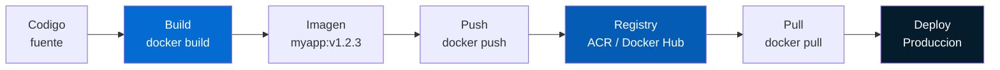
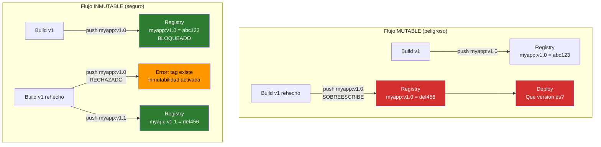
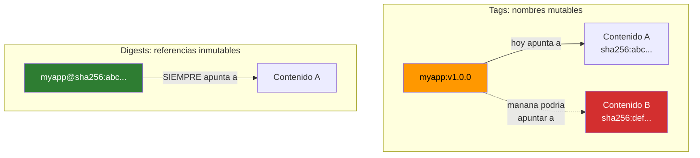
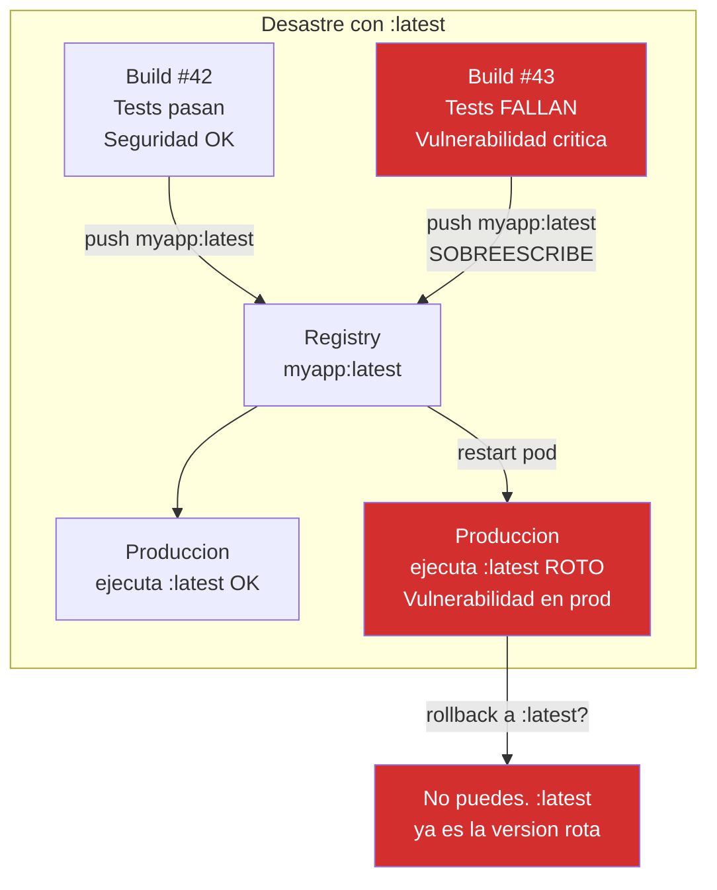
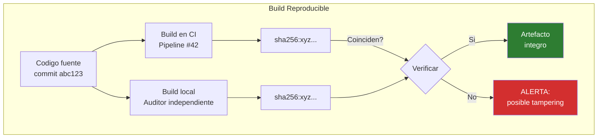
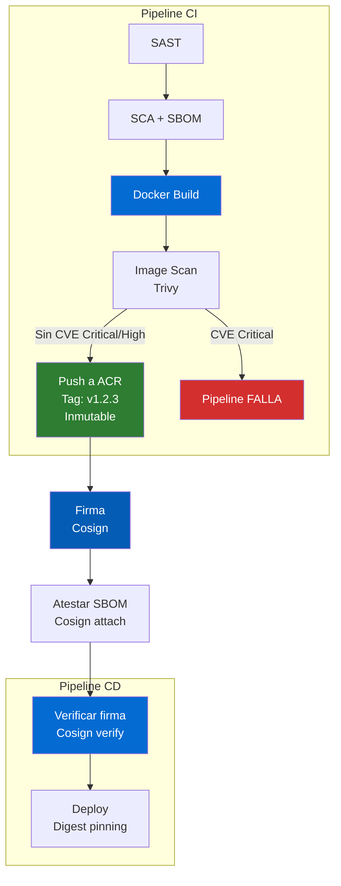
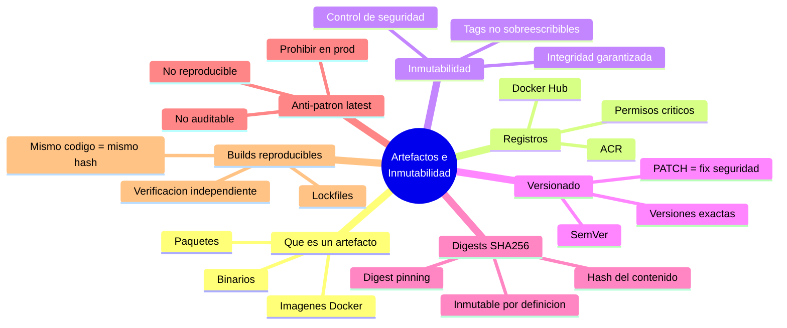

# Concepto 6 — Artefactos e Inmutabilidad

## Objetivo de aprendizaje

Al terminar este modulo entenderas que es un artefacto de build, como
funcionan los registros de artefactos, por que la inmutabilidad es fundamental
para la seguridad, como el versionado semantico impacta la seguridad,
que son los digests SHA256 y por que el tag `:latest` es un anti-patron
peligroso.

---

## Que es un artefacto de build

Un **artefacto** es el producto resultante de un proceso de build. Es lo que
realmente se despliega en produccion.

| Tipo de artefacto | Ejemplo | Formato |
|-------------------|---------|---------|
| **Imagen de contenedor** | `myapp:v1.2.3` | OCI / Docker image |
| **Paquete de aplicacion** | `myapp-1.2.3.whl` | Python wheel |
| **Binario compilado** | `myapp-linux-amd64` | ELF / PE |
| **Bundle frontend** | `dist/` | HTML/JS/CSS |
| **Chart de Helm** | `myapp-chart-1.2.3.tgz` | Helm chart |
| **Archivo de IaC** | `terraform-plan.json` | Terraform plan |

!!! info "Para equipos de seguridad"
    El artefacto es lo que **realmente corre en produccion**. Todo el
    analisis de seguridad previo (SAST, SCA, secretos) protege el codigo
    fuente. Pero si el artefacto se manipula entre el build y el despliegue,
    todas esas protecciones son inutiles. La **integridad del artefacto**
    es la ultima linea de defensa.

---

## Registros de artefactos

Un **registro** (registry) es el almacen donde se publican, versionan y
distribuyen artefactos.

| Registro | Tipo de artefactos | Proveedor |
|----------|-------------------|-----------|
| **Azure Container Registry (ACR)** | Imagenes OCI, Helm charts | Microsoft Azure |
| **Docker Hub** | Imagenes Docker | Docker Inc. |
| **GitHub Container Registry (GHCR)** | Imagenes OCI | GitHub |
| **Azure Artifacts** | npm, NuGet, Python, Maven | Microsoft Azure |
| **Artifactory** | Universal (todos los formatos) | JFrog |
| **Amazon ECR** | Imagenes OCI | AWS |

### Flujo: del build al registro



!!! warning "El registro es un activo critico"
    Quien tiene acceso de **push** al registro puede reemplazar cualquier
    imagen. Es equivalente a tener acceso de escritura a produccion. Los
    permisos del registro deben ser tan restrictivos como los permisos
    de despliegue.

---

## Inmutabilidad: por que importa

**Inmutabilidad** significa que una vez publicado un artefacto con una version
especifica, ese artefacto **no puede ser modificado ni sobreescrito**.

### Mutable vs inmutable



### Por que la inmutabilidad es un control de seguridad

| Sin inmutabilidad | Con inmutabilidad |
|------------------|-------------------|
| Un atacante con acceso al registro puede reemplazar una imagen | Un atacante no puede sobreescribir una version publicada |
| No puedes verificar que la imagen desplegada es la que se construyo | Cada version es unica y verificable |
| No hay trazabilidad del contenido real de cada version | Cada tag apunta siempre al mismo contenido |
| Un error en CI puede sobreescribir una version estable | Las versiones publicadas son permanentes |

!!! danger "Sin inmutabilidad, tu registro es una puerta trasera"
    Si alguien puede ejecutar `docker push myapp:v1.0` y sobreescribir la
    imagen que ya esta en produccion, todos los controles de seguridad
    anteriores son irrelevantes. La imagen que paso SAST, SCA y escaneo
    puede ser reemplazada silenciosamente por una imagen maliciosa.

### Habilitar inmutabilidad en ACR

```bash
# Habilitar inmutabilidad en Azure Container Registry
az acr repository update \
  --name myregistry \
  --image myapp:v1.0.0 \
  --write-enabled false

# O a nivel de repositorio completo:
az acr config retention update \
  --registry myregistry \
  --type UntaggedManifests \
  --days 30 \
  --status enabled
```

---

## Versionado semantico para seguridad

El **versionado semantico** (SemVer) usa el formato `MAJOR.MINOR.PATCH`:

| Componente | Cuando se incrementa | Ejemplo |
|-----------|---------------------|---------|
| **MAJOR** | Cambios incompatibles (breaking changes) | `1.0.0` → `2.0.0` |
| **MINOR** | Nueva funcionalidad compatible hacia atras | `1.0.0` → `1.1.0` |
| **PATCH** | Correccion de bugs (incluye fixes de seguridad) | `1.0.0` → `1.0.1` |

### Implicaciones de seguridad del versionado

| Practica | Riesgo | Recomendacion |
|----------|--------|---------------|
| Usar ranges (`>=1.0`, `^1.0`) | Actualizacion automatica puede introducir CVEs o breaking changes | Usar versiones exactas en produccion |
| Usar `:latest` | No sabes que version esta corriendo | Siempre especificar tag + digest |
| Saltar versiones PATCH | Perder fixes de seguridad | Aplicar PATCHes rapidamente |
| No seguir SemVer | Imposible evaluar riesgo de actualizacion | Exigir SemVer en politicas |

---

## SHA256 digests

Un **digest** es un hash criptografico del contenido exacto de un artefacto.
Mientras un tag es un nombre legible que puede cambiar, el digest es una
referencia **inmutable y unica** al contenido.

```
Tag:     myapp:v1.0.0                          ← Nombre legible, puede cambiar
Digest:  myapp@sha256:a3b5c7d9e1f2...          ← Hash del contenido, INMUTABLE
```

### Tag vs Digest

| Caracteristica | Tag | Digest |
|---------------|-----|--------|
| **Formato** | `myapp:v1.0.0` | `myapp@sha256:a3b5c7...` |
| **Mutable** | Si (puede ser reasignado) | No (el contenido define el hash) |
| **Legible** | Si | No (hash largo) |
| **Verificable** | No (puede apuntar a contenido diferente) | Si (el hash garantiza el contenido) |
| **Uso en produccion** | Solo si hay inmutabilidad de tags | Siempre seguro |



### Digest pinning en Kubernetes

```yaml title="deployment.yaml"
# MAL: usa tag mutable
containers:
  - name: myapp
    image: myregistry.azurecr.io/myapp:latest  # NO

# MEJOR: usa tag de version
containers:
  - name: myapp
    image: myregistry.azurecr.io/myapp:v1.0.0  # Mejor, pero aun mutable

# CORRECTO: usa digest
containers:
  - name: myapp
    image: myregistry.azurecr.io/myapp@sha256:a3b5c7d9e1f2...  # INMUTABLE
```

!!! tip "Obtener el digest de una imagen"
    ```bash
    # Despues de build y push:
    docker inspect --format='{{index .RepoDigests 0}}' myapp:v1.0.0
    # Salida: myregistry.azurecr.io/myapp@sha256:a3b5c7d9e1f2...

    # O desde el registro:
    az acr manifest show \
      --registry myregistry \
      --name myapp:v1.0.0 \
      --query "digest" -o tsv
    ```

---

## El peligro del tag `:latest`

El tag `:latest` es el **anti-patron mas peligroso** en la gestion de
artefactos.

| Problema | Explicacion |
|----------|-------------|
| **No sabes que version es** | `:latest` no indica la version del codigo |
| **Cambia sin aviso** | Cada `docker push myapp:latest` sobreescribe el anterior |
| **No es reproducible** | Dos pulls del mismo tag pueden dar contenido diferente |
| **Rompe el rollback** | Si `:latest` ya apunta a la version nueva, no puedes volver a la anterior |
| **Dificulta auditorias** | No puedes correlacionar la imagen en produccion con un commit |
| **Enmascara vulnerabilidades** | No puedes saber si la imagen actual paso los escaneos |



!!! danger "Prohibe `:latest` en produccion"
    Como control de seguridad, implementa una politica (OPA/Gatekeeper,
    Azure Policy) que **rechace despliegues con el tag `:latest`** en
    entornos de staging y produccion. Solo permite tags de version
    especificos (ej: `v1.2.3`) o, mejor aun, digests SHA256.

---

## Builds reproducibles

Un **build reproducible** es aquel que, dado el mismo codigo fuente y la misma
configuracion, produce un artefacto **identico bit a bit** cada vez.

### Por que importa para seguridad

| Aspecto | Build no reproducible | Build reproducible |
|---------|----------------------|-------------------|
| **Verificacion** | No puedes verificar que el artefacto corresponde al codigo | Cualquiera puede rebuildir y comparar |
| **Confianza** | Confias ciegamente en el pipeline | El artefacto se puede auditar independientemente |
| **Tampering** | No detectas manipulacion post-build | Si el hash no coincide, algo fue manipulado |
| **Regulacion** | Dificil demostrar integridad a auditores | Hash reproducible = evidencia solida |

### Obstaculos comunes

| Obstaculo | Ejemplo | Solucion |
|-----------|---------|----------|
| **Timestamps** | Fecha de build embebida en el binario | Usar `SOURCE_DATE_EPOCH` |
| **Orden de archivos** | Sistema de archivos ordena diferente | Forzar orden deterministico |
| **Dependencias flotantes** | `pip install flask` instala la ultima version | Lockfile con hashes |
| **Capas Docker** | Metadata del build varia | Multi-stage, `--build-arg` fijos |



---

## Resumen de controles para artefactos

| Control | Proposito | Implementacion |
|---------|-----------|----------------|
| **Inmutabilidad de tags** | Evitar sobreescritura de versiones | ACR tag immutability |
| **Digest pinning** | Referenciar artefactos por hash | `image@sha256:...` en YAML |
| **Prohibir `:latest`** | Evitar tags mutables en produccion | OPA policy, admission webhook |
| **SemVer estricto** | Versionado predecible y auditable | Convencion + CI validation |
| **Firma de artefactos** | Verificar origen y integridad | Cosign (Lab 7) |
| **SBOM vinculado** | Saber que contiene cada artefacto | SBOM atestado con Cosign |
| **Build reproducible** | Verificacion independiente | Lockfiles, timestamps fijos |
| **Escaneo pre-push** | No publicar imagenes vulnerables | Trivy scan antes de push |
| **Retencion y limpieza** | No acumular imagenes obsoletas | ACR retention policy |

---

## El artefacto en el contexto del pipeline



---

## Resumen



---

<div style="display: flex; justify-content: space-between; margin-top: 2rem;">
[:octicons-arrow-left-24: Anterior: Lab 5](../lab05-sca/index.md){ .md-button }
[Siguiente: Lab 6 — Build e Imagen :octicons-arrow-right-24:](../lab06-build/index.md){ .md-button .md-button--primary }
</div>
