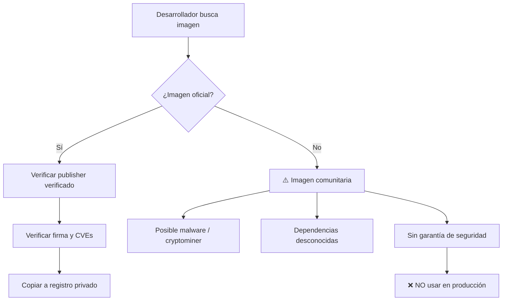
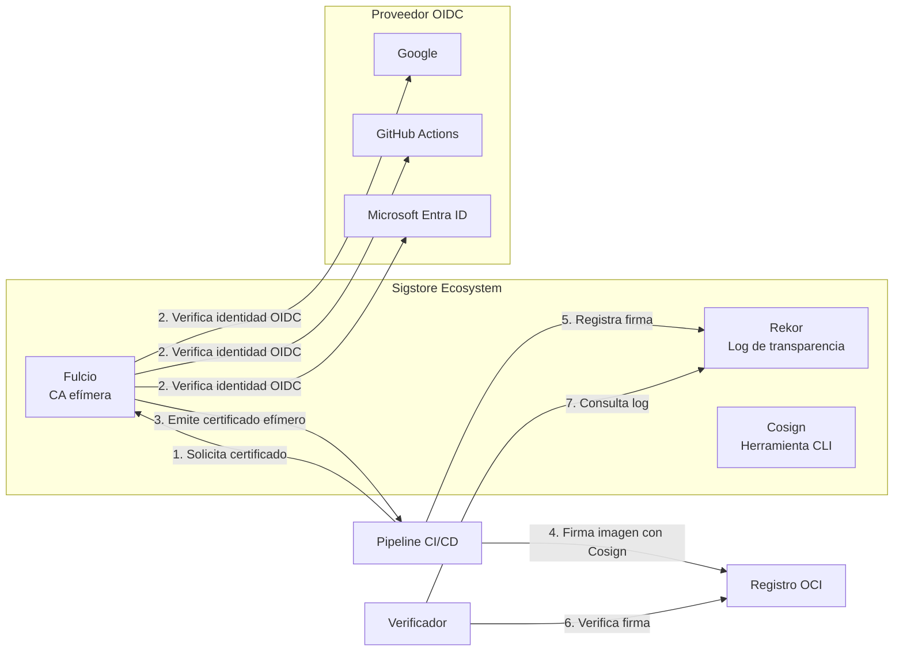
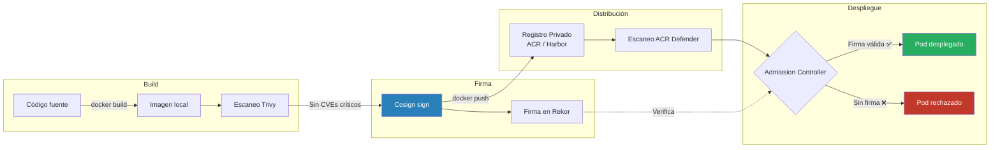
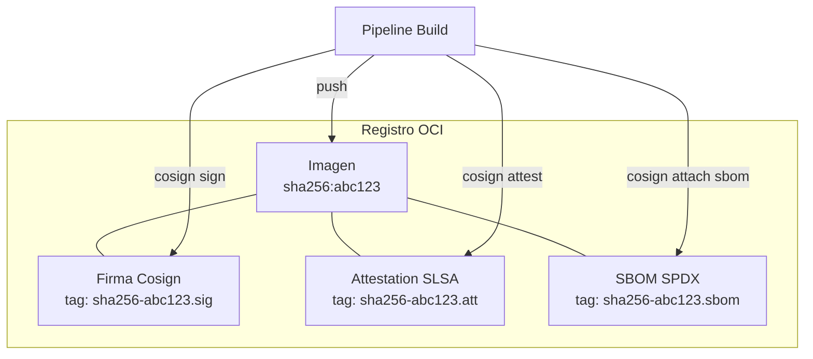

# Concepto 7 — Registros de Contenedores y Confianza en Imágenes

<div class="lab-meta">
  <div class="lab-meta-item">
    <strong>Duración estimada</strong>
    20 minutos de lectura
  </div>
  <div class="lab-meta-item">
    <strong>Audiencia</strong>
    Equipo de Seguridad
  </div>
  <div class="lab-meta-item">
    <strong>Relevancia</strong>
    Supply Chain Security
  </div>
</div>

---

## Introducción

Cada contenedor que se ejecuta en producción proviene de una **imagen almacenada en un registro**. Si ese registro no es confiable, si la imagen fue manipulada en tránsito, o si nadie verificó quién la construyó, estás ejecutando código de origen desconocido en tu infraestructura.

!!! danger "La analogía del equipo de seguridad"
    **Imagen sin firmar = cheque sin firma.** Nadie debería aceptar un cheque sin firma, y ningún cluster debería aceptar una imagen sin verificación de procedencia.

---

## Registros: Públicos vs Privados

Un **registro de contenedores** es un repositorio que almacena y distribuye imágenes OCI (Open Container Initiative). La elección entre público y privado tiene implicaciones directas de seguridad.

### Comparativa

| Aspecto | Registro Público (Docker Hub, ghcr.io) | Registro Privado (ACR, ECR, Harbor) |
|---|---|---|
| **Acceso** | Abierto a Internet | Restringido por red/identidad |
| **Control de contenido** | Cualquiera puede subir | Solo pipelines autorizados |
| **Escaneo de vulnerabilidades** | Limitado o de pago | Integrado (ACR Defender, Harbor Trivy) |
| **Firma de imágenes** | Opcional, rara vez aplicada | Puede ser obligatoria por política |
| **Rate limiting** | Docker Hub: 100 pulls/6h (anónimo) | Sin límites dentro de tu red |
| **Auditoría** | Logs mínimos | Logs completos de push/pull/delete |
| **Riesgo de typosquatting** | Alto (`ngimx` en vez de `nginx`) | Bajo (namespace controlado) |
| **Compliance** | Difícil de demostrar | Trazabilidad completa |

### Riesgos de los registros públicos



!!! warning "Incidente real: Imágenes maliciosas en Docker Hub (2020-2023)"
    Investigadores de Sysdig descubrieron más de **1,600 imágenes maliciosas** en Docker Hub que contenían cryptominers, backdoors y credential stealers. Algunas tenían **millones de pulls**. Las imágenes usaban nombres similares a proyectos populares (typosquatting) y permanecieron activas durante meses antes de ser detectadas.

### Mejores prácticas para registros

1. **Usar un registro privado** como fuente única de verdad para producción
2. **Espejar imágenes base** desde registros públicos a tu registro privado
3. **Habilitar escaneo automático** en cada push
4. **Implementar políticas de retención** para eliminar imágenes antiguas
5. **Restringir quién puede hacer push** (solo el pipeline, nunca desarrolladores individuales)

---

## Firma de Imágenes: ¿Qué demuestra?

La firma de imágenes es un mecanismo criptográfico que vincula una imagen con una identidad verificable. Responde a tres preguntas fundamentales:

| Pregunta | Sin firma | Con firma |
|---|---|---|
| **¿Quién construyó esta imagen?** | No se sabe | Identidad verificada (persona, pipeline, servicio) |
| **¿Se modificó después del build?** | No se puede saber | Cualquier cambio invalida la firma |
| **¿Cuándo se construyó?** | Metadato editable | Timestamp criptográfico en log de transparencia |

### ¿Qué NO demuestra la firma?

!!! info "Limitaciones importantes"
    - **No demuestra que el código sea seguro** — una imagen firmada puede contener vulnerabilidades
    - **No demuestra que las dependencias sean seguras** — el SBOM es un complemento necesario
    - **No reemplaza el escaneo de vulnerabilidades** — firma y escaneo son controles complementarios

---

## Cosign y Sigstore: Firma Keyless

**Sigstore** es un proyecto de la Linux Foundation que proporciona firma criptográfica gratuita para artefactos de software. **Cosign** es la herramienta de Sigstore para firmar y verificar imágenes de contenedores.

### Arquitectura de Sigstore



### Firma Keyless: Cómo funciona

El modelo **keyless** elimina la necesidad de gestionar claves privadas de larga duración, que es uno de los mayores retos operativos de la firma tradicional.

| Paso | Acción | Detalle |
|---|---|---|
| 1 | **Autenticación OIDC** | El firmante se autentica con un proveedor de identidad (GitHub Actions, Google, Azure AD) |
| 2 | **Certificado efímero** | Fulcio emite un certificado X.509 de corta duración (~20 minutos) vinculado a la identidad OIDC |
| 3 | **Firma del digest** | Cosign firma el SHA256 de la imagen con la clave privada efímera |
| 4 | **Registro en Rekor** | La firma se registra en el log de transparencia inmutable (append-only) |
| 5 | **Clave descartada** | La clave privada efímera se destruye; solo queda el registro público |

!!! tip "¿Por qué keyless es mejor para equipos de seguridad?"
    - **Sin secretos que rotar**: no hay claves privadas de larga duración que gestionar o que puedan filtrarse
    - **Identidad vinculada**: sabes *exactamente* qué pipeline o persona firmó, vinculado a su identidad corporativa
    - **Auditabilidad**: cada firma queda en el log público de transparencia de Rekor
    - **Sin key ceremony**: no necesitas HSMs ni procesos complejos de gestión de claves

### Comandos clave de Cosign

```bash
# Firmar una imagen (keyless, en GitHub Actions / Azure Pipelines)
cosign sign --yes myregistry.azurecr.io/myapp:v1.2.3

# Verificar una imagen firmada por una identidad específica
cosign verify \
  --certificate-identity "https://github.com/jhonsanchez/workshop-devsecops-pipelines/.github/workflows/build.yml@refs/heads/main" \
  --certificate-oidc-issuer "https://token.actions.githubusercontent.com" \
  myregistry.azurecr.io/myapp:v1.2.3

# Firmar con clave (modelo tradicional)
cosign generate-key-pair
cosign sign --key cosign.key myregistry.azurecr.io/myapp:v1.2.3

# Adjuntar un SBOM a la imagen
cosign attach sbom --sbom sbom.spdx myregistry.azurecr.io/myapp:v1.2.3

# Verificar que una imagen tiene un SBOM adjunto
cosign verify-attestation --type spdxjson \
  myregistry.azurecr.io/myapp:v1.2.3
```

---

## Ciclo de Vida de una Imagen Segura



---

## Políticas de Admisión

Las políticas de admisión son el **último control de seguridad** antes de que una imagen se ejecute. Actúan como un guardia en la puerta del cluster.

### Herramientas de Admission Control

| Herramienta | Tipo | Verifica firma | Políticas custom | Ecosistema |
|---|---|---|---|---|
| **Kyverno** | Kubernetes-native | Sí (Cosign) | YAML declarativo | CNCF |
| **OPA Gatekeeper** | Kubernetes-native | Con extensiones | Rego | CNCF |
| **Connaisseur** | Webhook | Sí (Notary, Cosign) | Config YAML | Open source |
| **Ratify** | Kubernetes-native | Sí (Notary v2, Cosign) | Plugins | Microsoft / CNCF |
| **Azure Policy (AKS)** | Cloud-native | Sí (ACR + Notary) | Built-in + custom | Azure |

### Ejemplo: Política Kyverno para requerir firma

```yaml
apiVersion: kyverno.io/v1
kind: ClusterPolicy
metadata:
  name: require-image-signature
spec:
  validationFailureAction: Enforce  # Bloquea, no solo avisa
  background: false
  rules:
    - name: verify-cosign-signature
      match:
        any:
          - resources:
              kinds:
                - Pod
      verifyImages:
        - imageReferences:
            - "myregistry.azurecr.io/*"
          attestors:
            - entries:
                - keyless:
                    issuer: "https://token.actions.githubusercontent.com"
                    subject: "https://github.com/jhonsanchez/workshop-devsecops-pipelines/*"
                    rekor:
                      url: https://rekor.sigstore.dev
```

!!! danger "Sin Admission Controller = puerta abierta"
    De nada sirve firmar imágenes si el cluster no verifica las firmas antes de ejecutarlas. La firma sin verificación es como poner una cerradura sin cerrar la puerta.

---

## Content Trust y Notary v2

### Docker Content Trust (DCT)

Docker Content Trust fue el primer mecanismo de firma de imágenes, basado en **The Update Framework (TUF)**. Aunque pionero, tiene limitaciones:

| Aspecto | DCT / Notary v1 | Notary v2 (ORAS) | Cosign / Sigstore |
|---|---|---|---|
| **Madurez** | Legacy | En desarrollo activo | Producción |
| **Gestión de claves** | Manual, compleja | Simplificada | Keyless disponible |
| **Almacenamiento de firmas** | Servidor Notary separado | Dentro del registro OCI | Dentro del registro OCI |
| **Estándar** | Propietario Docker | OCI Distribution Spec | Sigstore Spec |
| **Adopción** | En declive | Creciente (Microsoft) | Alta (Google, Red Hat, GitHub) |
| **CI/CD friendly** | Difícil | Moderado | Excelente |

### Notary v2 y ORAS

**Notary v2** (ahora parte del proyecto ORAS — OCI Registry As Storage) permite adjuntar firmas, SBOMs y attestations directamente al registro OCI como artefactos vinculados. Es la dirección que está tomando Microsoft para Azure Container Registry.



---

## Log de Transparencia: Rekor

Rekor es un **log inmutable append-only** que registra todas las firmas realizadas con Sigstore. Funciona de manera similar a Certificate Transparency para TLS.

!!! info "¿Por qué importa la transparencia?"
    Si un atacante compromete un pipeline y firma una imagen maliciosa, esa firma quedará registrada en Rekor. Los equipos de seguridad pueden:
    
    - **Monitorizar** firmas inesperadas para sus artefactos
    - **Detectar** compromiso de identidades OIDC
    - **Auditar** toda la actividad de firma históricamente
    - **Demostrar** ante reguladores la cadena de custodia de cada imagen

### Consultar Rekor

```bash
# Buscar todas las firmas para una imagen
rekor-cli search --sha sha256:abc123def456...

# Ver los detalles de una entrada específica
rekor-cli get --uuid 12345678901234567890

# Verificar la integridad del log
rekor-cli verify --artifact myapp.tar
```

---

## Incidentes Reales

!!! example "Caso 1: Codecov Supply Chain Attack (2021)"
    Un atacante modificó el script de bash uploader de Codecov insertando código que exfiltraba variables de entorno (incluyendo tokens CI/CD y credenciales). El script modificado estuvo activo **2 meses** sin ser detectado. Si Codecov hubiera firmado sus artefactos y los usuarios hubieran verificado las firmas, el ataque se habría detectado inmediatamente.

!!! example "Caso 2: ua-parser-js (2021)"
    El paquete npm `ua-parser-js` (8M descargas/semana) fue comprometido cuando un atacante obtuvo acceso a la cuenta del mantenedor. Las versiones maliciosas incluían cryptominers y credential stealers. La firma de artefactos vinculada a identidad habría evidenciado que el publicador no era el habitual.

!!! example "Caso 3: Dependency Confusion — Alex Birsan (2021)"
    Investigador de seguridad demostró que podía ejecutar código en empresas como Apple, Microsoft y Tesla publicando paquetes maliciosos en registros públicos con el mismo nombre que paquetes internos. La causa raíz: los build systems priorizaban el registro público sobre el privado.

---

## Resumen para el Equipo de Seguridad

| Control | Qué resuelve | Herramienta recomendada |
|---|---|---|
| Registro privado | Controla qué imágenes están disponibles | Azure Container Registry |
| Escaneo de imágenes | Detecta CVEs conocidos | Trivy + Microsoft Defender |
| Firma de imágenes | Verifica procedencia e integridad | Cosign (keyless) |
| Log de transparencia | Auditoría inmutable de firmas | Rekor |
| Admission controller | Bloquea imágenes no firmadas | Kyverno / Ratify |
| Política de retención | Reduce superficie de ataque | ACR lifecycle policies |

!!! abstract "Regla de oro"
    **Build → Scan → Sign → Push → Verify → Deploy.** Cada paso es obligatorio. Saltarse uno es como dejar una puerta abierta en la cadena de custodia.

---


[Anterior: Artefactos e Inmutabilidad :octicons-arrow-left-24:](../concepto06-artefactos/index.md){ .md-button }
[Siguiente: Pruebas Dinamicas :octicons-arrow-right-24:](../concepto08-dast/index.md){ .md-button .md-button--primary }
