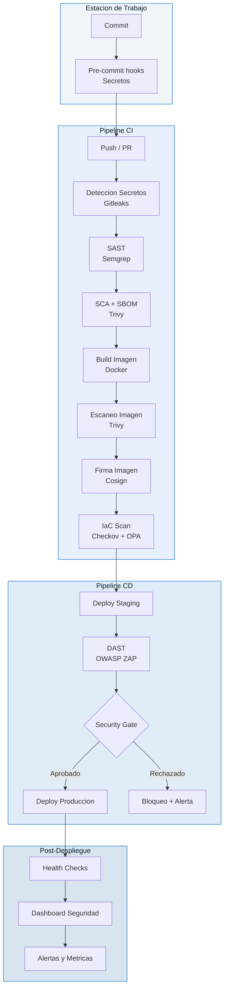

# DevSecOps Pipelines Workshop

**Entiende el pipeline como un analista de seguridad.**
Aprende a auditar, instrumentar y gobernar pipelines CI/CD con controles
automatizados en cada etapa — desde el commit hasta produccion. Pensado para
equipos de seguridad que necesitan hablar el idioma de DevOps sin convertirse
en desarrolladores.

[Comenzar el Workshop](modulo0/index.md){ .md-button .md-button--primary }
[Ver en GitHub](https://github.com/jhonsanchez/workshop-devsecops-pipelines){ .md-button }

---

## El Workshop de un Vistazo

  

    <strong>Duracion</strong>
    8–10 horas
  

  

    <strong>Audiencia</strong>
    Equipos de Seguridad
  

  

    <strong>Nivel</strong>
    Intermedio
  

  

    <strong>Conceptos</strong>
    11 modulos teoricos
  

  

    <strong>Labs</strong>
    11 practicos
  

  

    <strong>Idioma</strong>
    Espanol
  

  

    <strong>Plataforma</strong>
    GitHub Actions
  

  

    <strong>Formato</strong>
    Presencial / Autoguiado
  

---

## Estructura: Concepto + Lab

Este workshop alterna **modulos de concepto** (teoria con diagramas, incidentes reales y tablas) con **labs practicos** donde aplicas cada control en un pipeline real de GitHub Actions.

---

## Conceptos que cubriras

- :material-pipe: **Concepto 1 — CI/CD y Seguridad**

    Que es CI/CD, por que le importa al equipo de seguridad, shift-left y el
    pipeline como control de seguridad. Incidentes: SolarWinds, CodeCov.

    [:octicons-arrow-right-24: Ir al concepto](concepto01-cicd/index.md)

- :material-sitemap-outline: **Concepto 2 — Anatomia del Pipeline**

    Jerarquia de GitHub Actions: Pipeline > Stages > Jobs > Steps. Agentes,
    YAML, variables, secretos y service connections como vectores de ataque.

    [:octicons-arrow-right-24: Ir al concepto](concepto02-anatomia-pipeline/index.md)

- :material-key-alert: **Concepto 3 — Secretos en Codigo**

    Permanencia en Git, ciclo de vida de una fuga, gestion de secretos con
    Azure Key Vault e identidades gestionadas. Casos: Uber 2016, CircleCI.

    [:octicons-arrow-right-24: Ir al concepto](concepto03-secretos/index.md)

- :material-magnify-scan: **Concepto 4 — Analisis Estatico (SAST)**

    Pattern matching, ASTs, taint analysis. OWASP Top 10 mapeado a SAST.
    Como leer un reporte SAST: CWE, severidad, confianza.

    [:octicons-arrow-right-24: Ir al concepto](concepto04-sast/index.md)

- :material-package-variant-closed: **Concepto 5 — SCA y Cadena de Suministro**

    Dependencias transitivas, bases de datos CVE, SBOM. Ataques: typosquatting,
    dependency confusion. Casos: Log4Shell, event-stream, colors.js.

    [:octicons-arrow-right-24: Ir al concepto](concepto05-sca/index.md)

- :material-archive-lock: **Concepto 6 — Artefactos e Inmutabilidad**

    Registros, inmutabilidad, versionado semantico para seguridad, digests
    SHA256, builds reproducibles. Peligro del tag `:latest`.

    [:octicons-arrow-right-24: Ir al concepto](concepto06-artefactos/index.md)

- :material-certificate: **Concepto 7 — Registros y Confianza**

    Firma de imagenes con Cosign/Notation, politicas de admision, cadena de
    custodia digital, provenance y atestaciones SLSA.

    [:octicons-arrow-right-24: Ir al concepto](concepto07-registros-confianza/index.md)

- :material-web-check: **Concepto 8 — Pruebas Dinamicas (DAST)**

    Escaneo de aplicaciones en ejecucion, OWASP ZAP, diferencias con SAST,
    integracion en pipeline, manejo de falsos positivos.

    [:octicons-arrow-right-24: Ir al concepto](concepto08-dast/index.md)

- :material-terraform: **Concepto 9 — IaC y Seguridad**

    Infraestructura como Codigo, Checkov, OPA/Conftest, misconfiguraciones
    comunes en Terraform y Kubernetes.

    [:octicons-arrow-right-24: Ir al concepto](concepto09-iac/index.md)

- :material-rocket-launch: **Concepto 10 — Despliegues Seguros**

    Estrategias de despliegue (blue-green, canary), aprobaciones, environments,
    gates de seguridad y rollback automatico.

    [:octicons-arrow-right-24: Ir al concepto](concepto10-despliegues/index.md)

- :material-chart-timeline-variant-shimmer: **Concepto 11 — Monitorizacion**

    Observabilidad post-despliegue, alertas de seguridad, dashboards,
    metricas DORA desde la perspectiva de seguridad.

    [:octicons-arrow-right-24: Ir al concepto](concepto11-monitorizacion/index.md)

---

## Labs practicos

- :octicons-terminal-24: **Lab 1** — Proyecto GitHub Actions

    [:octicons-arrow-right-24: Ir al lab](lab01-setup/index.md)

- :octicons-terminal-24: **Lab 2** — Pipeline Base

    [:octicons-arrow-right-24: Ir al lab](lab02-pipeline-base/index.md)

- :octicons-terminal-24: **Lab 3** — Deteccion de Secretos

    [:octicons-arrow-right-24: Ir al lab](lab03-secretos/index.md)

- :octicons-terminal-24: **Lab 4** — SAST con Semgrep

    [:octicons-arrow-right-24: Ir al lab](lab04-sast/index.md)

- :octicons-terminal-24: **Lab 5** — SCA y SBOM

    [:octicons-arrow-right-24: Ir al lab](lab05-sca/index.md)

- :octicons-terminal-24: **Lab 6** — Build e Imagen

    [:octicons-arrow-right-24: Ir al lab](lab06-build/index.md)

- :octicons-terminal-24: **Lab 7** — Firma de Imagen

    [:octicons-arrow-right-24: Ir al lab](lab07-image-signing/index.md)

- :octicons-terminal-24: **Lab 8** — DAST con OWASP ZAP

    [:octicons-arrow-right-24: Ir al lab](lab08-dast/index.md)

- :octicons-terminal-24: **Lab 9** — Escaneo de IaC

    [:octicons-arrow-right-24: Ir al lab](lab09-iac/index.md)

- :octicons-terminal-24: **Lab 10** — Deploy con Aprobaciones

    [:octicons-arrow-right-24: Ir al lab](lab10-deploy/index.md)

- :octicons-terminal-24: **Lab 11** — Monitorizacion

    [:octicons-arrow-right-24: Ir al lab](lab11-monitorizacion/index.md)

---

## Arquitectura del Pipeline Final

El pipeline DevSecOps completo que construiras abarca once capas de seguridad:

---

## Prerequisitos

Antes de comenzar, asegurate de tener:

- [x] Una cuenta de **GitHub Actions** (gratuita)
- [ ] Una cuenta de **GitHub** con un repositorio personal
- [ ] **Docker Desktop** instalado y funcionando
- [ ] **Terraform** >= 1.6 instalado
- [ ] **Azure CLI** (`az`) instalado y autenticado
- [ ] **Python** >= 3.10 y `pip` disponibles
- [ ] **Git** >= 2.40 instalado
- [ ] Familiaridad basica con YAML y la linea de comandos

!!! tip "Guia de instalacion completa"
    Sigue la [Guia de Prerequisitos](modulo0/prerequisites.md) para instrucciones
    paso a paso en macOS, Linux y WSL2 antes de comenzar los labs.

---

## Impartido por Entelgy

Este workshop es impartido por [Entelgy](https://www.entelgy.com), consultora
europea especializada en transformacion digital, ciberseguridad y entrega
cloud-native.
