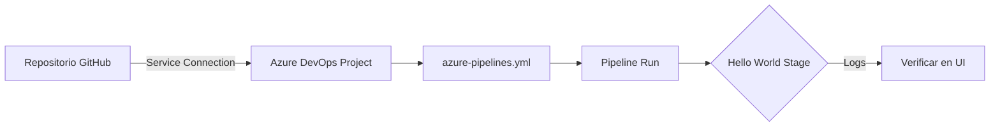

---
tags:
  - lab
  - azure-devops
  - setup
---

# Lab 1 -- Proyecto Azure DevOps

<div class="lab-meta" markdown>
<div class="lab-meta-item" markdown>
<strong>Duracion</strong>
30 minutos
</div>
<div class="lab-meta-item" markdown>
<strong>Nivel</strong>
Principiante
</div>
<div class="lab-meta-item" markdown>
<strong>Herramientas</strong>
Azure DevOps
</div>
<div class="lab-meta-item" markdown>
<strong>Resultado</strong>
Pipeline conectado al repositorio
</div>
</div>

!!! abstract "Objetivo"
    Crear una organizacion y proyecto en Azure DevOps, conectar el repositorio de GitHub donde vive `vulnerable-app/`, y verificar que un pipeline basico se ejecuta correctamente con cada push a `main`.

## Que vamos a construir

En este laboratorio sentamos las bases de todo el workshop: un proyecto en Azure DevOps con un pipeline YAML conectado al repositorio. A partir de aqui, cada laboratorio posterior agregara un **stage** al mismo pipeline.



## Pasos del laboratorio

<div class="steps" markdown>

1. **[Crear proyecto y conectar repositorio](step1.md)** -- Crear la organizacion en Azure DevOps, el proyecto, la service connection a GitHub y el archivo `azure-pipelines.yml` inicial con un stage "Hello World".

2. **[Verificar el pipeline](step2.md)** -- Ejecutar el pipeline, inspeccionar logs, entender la interfaz de Azure DevOps Pipelines y confirmar que el trigger automatico funciona.

</div>

## Prerequisitos

- Cuenta de Azure DevOps (se puede crear gratis en [dev.azure.com](https://dev.azure.com))
- Repositorio en GitHub con el contenido del workshop (incluyendo `vulnerable-app/`)
- Navegador web moderno

!!! info "Repositorio del workshop"
    Todo el codigo fuente de la aplicacion vulnerable esta en la carpeta `vulnerable-app/` del mismo repositorio. No necesitas clonar nada adicional.

## Arquitectura del pipeline

Al finalizar este lab, tu pipeline tendra una estructura minima:

```yaml
trigger:
  branches:
    include:
      - main

pool:
  vmImage: 'ubuntu-latest'

stages:
  - stage: HelloWorld
    jobs:
      - job: Greet
        steps:
          - script: echo "Pipeline conectado correctamente"
```

A lo largo del workshop, reemplazaremos este stage por la cadena completa de seguridad DevSecOps.
