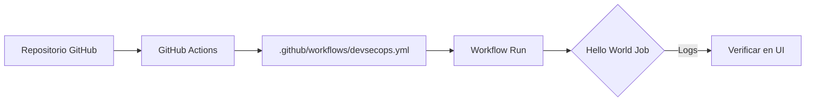

---
tags:
  - lab
  - github-actions
  - setup
---

# Lab 1 -- Proyecto GitHub Actions

<div class="lab-meta" markdown>
<div class="lab-meta-item" markdown>
<strong>Duracion</strong>
30 minutos
</div>
<div class="lab-meta-item" markdown>
<strong>Nivel</strong>
Principiante
</div>
<div class="lab-meta-item" markdown>
<strong>Herramientas</strong>
GitHub Actions
</div>
<div class="lab-meta-item" markdown>
<strong>Resultado</strong>
Pipeline conectado al repositorio
</div>
</div>

!!! abstract "Objetivo"
    Configurar GitHub Actions en el repositorio donde vive `vulnerable-app/`, y verificar que un workflow basico se ejecuta correctamente con cada push a `main`.

## Que vamos a construir

En este laboratorio sentamos las bases de todo el workshop: un workflow de GitHub Actions en el repositorio. A partir de aqui, cada laboratorio posterior agregara un **job** al mismo workflow.



## Pasos del laboratorio

<div class="steps" markdown>

1. **[Crear workflow y configurar repositorio](step1.md)** -- Configurar GitHub Actions en el repositorio y crear el archivo `.github/workflows/devsecops.yml` inicial con un job "Hello World".

2. **[Verificar el workflow](step2.md)** -- Ejecutar el workflow, inspeccionar logs, entender la interfaz de GitHub Actions y confirmar que el trigger automatico funciona.

</div>

## Prerequisitos

- Cuenta de GitHub (se puede crear gratis en [github.com](https://github.com))
- Repositorio en GitHub con el contenido del workshop (incluyendo `vulnerable-app/`)
- Navegador web moderno

!!! info "Repositorio del workshop"
    Todo el codigo fuente de la aplicacion vulnerable esta en la carpeta `vulnerable-app/` del mismo repositorio. No necesitas clonar nada adicional.

## Arquitectura del pipeline

Al finalizar este lab, tu pipeline tendra una estructura minima:

```yaml
trigger:
  branches:
    include:
      - main

pool:
  vmImage: 'ubuntu-latest'

jobs:
  hello-world:
    runs-on: ubuntu-latest
    steps:
      - run: echo "Workflow conectado correctamente"
```

A lo largo del workshop, reemplazaremos este job por la cadena completa de seguridad DevSecOps.
