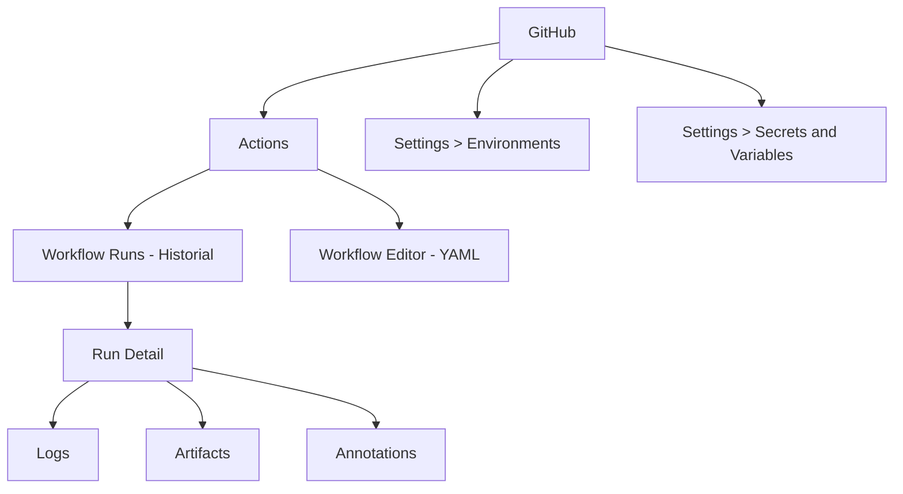

---
tags:
  - lab
  - github-actions
  - setup
---

# Paso 2 -- Verificar el Workflow

!!! abstract "Objetivo"
    Confirmar que el workflow se ejecuta correctamente, entender la interfaz de GitHub Actions y verificar que el trigger automatico funciona con cada push a `main`.

## 2.1 Inspeccionar la ejecucion del workflow

Despues de hacer push en el paso anterior, GitHub Actions deberia haber iniciado una ejecucion automatica. Navega a la interfaz:

1. Ve a la pestana **Actions** en tu repositorio
2. Haz clic en el workflow run mas reciente
3. Veras la lista de **Jobs** y su estado

!!! info "Anatomia de una ejecucion"
    Cada ejecucion tiene:

    - **Run ID** -- Numero unico incremental
    - **Status** -- Queued, Running, Succeeded, Failed, Cancelled
    - **Branch** -- La rama que disparo la ejecucion
    - **Commit** -- El SHA del commit que la provoco
    - **Duration** -- Tiempo total de ejecucion

## 2.2 Explorar los logs

Haz clic en la ejecucion activa para ver el detalle:

1. Veras los **jobs** del workflow (por ahora solo "Hello World - Verificacion")
2. Haz clic en el job **Hello World - Verificacion**
3. Aqui puedes ver cada **step** y sus logs:

Los logs deberian mostrar algo similar a:

```text title="Salida esperada del workflow"
=========================================
  DevSecOps Pipeline - Workshop Entelgy
=========================================

Repositorio: mi-usuario/devsecops-workshop
Branch:      main
Commit:      a1b2c3d4e5f6...
Run Number:  42
Runner:      GitHub Actions 2

Workflow conectado correctamente!
=========================================
```

Y la verificacion de estructura:

```text title="Salida - Verificar estructura del repo"
Verificando estructura del repositorio...

--- Contenido raiz ---
total 24
drwxr-xr-x  6 vsts vsts 4096 ... .
drwxr-xr-x  3 runner runner 4096 ... .github
drwxr-xr-x  5 vsts vsts 4096 ... vulnerable-app

--- Contenido de vulnerable-app/ ---
total 32
-rw-r--r--  1 vsts vsts  ... Dockerfile
-rw-r--r--  1 vsts vsts  ... Dockerfile.secure
-rw-r--r--  1 vsts vsts  ... app.py
-rw-r--r--  1 vsts vsts  ... docker-compose.yml
-rw-r--r--  1 vsts vsts  ... requirements.txt
drwxr-xr-x  5 vsts vsts 4096 ... src
```

!!! success "Paso Completado"
    Si ves los logs con la informacion del repositorio y la estructura de archivos de `vulnerable-app/`, tu workflow esta correctamente conectado.

## 2.3 Entender la interfaz de Actions

Familiarizate con las secciones principales de la UI:

### Pagina de Workflows

| Elemento | Descripcion |
|----------|-------------|
| **All workflows** | Lista de workflows definidos en el repositorio |
| **Workflow runs** | Lista de las ultimas ejecuciones con su estado |
| **Branch filter** | Filtro para ver ejecuciones por rama |
| **Event filter** | Filtro por tipo de evento (push, PR, etc.) |

### Detalle de un Run

| Seccion | Que muestra |
|---------|-------------|
| **Summary** | Vista general con jobs, duracion y commit |
| **Jobs** | Lista de jobs con estado individual |
| **Logs** | Output paso a paso de cada step |
| **Annotations** | Warnings y errores destacados |
| **Artifacts** | Artefactos publicados (SARIF, SBOM, etc.) |

!!! tip "Atajos utiles"
    - Haz clic en un **step** para expandir/colapsar sus logs
    - Usa **Ctrl+F** en los logs para buscar texto
    - El boton **Re-run all jobs** permite re-ejecutar un workflow con el mismo commit

## 2.4 Verificar el trigger automatico

Ahora vamos a comprobar que el workflow se ejecuta automaticamente al hacer push:

1. Haz un cambio menor en el repositorio:

```bash title="Terminal"
# Agrega un comentario al workflow
echo "" >> .github/workflows/devsecops.yml
echo "# Trigger test - $(date)" >> .github/workflows/devsecops.yml
git add .github/workflows/devsecops.yml
git commit -m "lab01: verificar trigger automatico"
git push origin main
```

2. Vuelve a GitHub > **Actions**
3. Deberia aparecer una nueva ejecucion en estado **Queued** o **In progress**

!!! warning "Si el trigger no funciona"
    Posibles causas:

    1. **Actions deshabilitadas** -- Verifica en Settings > Actions > General que las Actions estan habilitadas.
    2. **Branch incorrecto** -- El trigger esta configurado para `main`. Si tu rama se llama `master`, cambia el YAML.
    3. **Archivo en ubicacion incorrecta** -- Verifica que el archivo esta en `.github/workflows/devsecops.yml` (la carpeta `.github` con punto al inicio).
    4. **Workflow deshabilitado** -- En la pestana Actions, verifica que el workflow no este deshabilitado.

## 2.5 Estructura de la UI para referencia futura

A lo largo del workshop, usaremos estas secciones constantemente:



!!! info "Que sigue"
    En el **Lab 2** reemplazaremos el job "Hello World" por la estructura completa de jobs que formaran nuestro workflow DevSecOps. Cada lab posterior rellenara uno de esos jobs con herramientas reales de seguridad.

---

<div style="display: flex; justify-content: space-between; margin-top: 2rem;">
  <a href="../step1/" class="md-button">Anterior: Paso 1</a>
  <a href="../../lab02-pipeline-base/" class="md-button md-button--primary">Siguiente: Lab 2</a>
</div>
