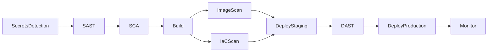

---
tags:
  - lab
  - github-actions
  - pipeline
  - yaml
---

# Lab 2 -- Pipeline Base

<strong>Duracion</strong>
30 minutos

<strong>Nivel</strong>
Principiante

<strong>Herramientas</strong>
GitHub Actions YAML

<strong>Resultado</strong>
Workflow con 10 jobs vacios

!!! abstract "Objetivo"
    Reemplazar el job "Hello World" del Lab 1 por la estructura completa del workflow DevSecOps: 10 jobs vacios con dependencias definidas, variables de workflow y secretos en GitHub Secrets.

## Que vamos a construir

En este laboratorio definimos el **esqueleto completo** del workflow. Cada lab posterior rellenara uno de los jobs con herramientas reales de seguridad.

## Pasos del laboratorio

1. **[Estructura de Jobs](step1.md)** -- Definir los 10 jobs como placeholders vacios con relaciones `needs`, creando la cadena completa del workflow DevSecOps.

2. **[Variables y Secretos](step2.md)** -- Configurar variables de workflow y configurar GitHub Secrets para gestionar credenciales de forma segura.

## Prerequisitos

- Lab 1 completado (workflow "Hello World" funcionando)
- Acceso al repositorio en GitHub

## Los 10 jobs del workflow

| # | Job | Descripcion | Lab |
|---|-------|-------------|-----|
| 1 | **SecretsDetection** | Detectar credenciales en el codigo | Lab 3 |
| 2 | **SAST** | Analisis estatico de seguridad | Lab 4 |
| 3 | **SCA** | Analisis de composicion de software | Lab 5 |
| 4 | **Build** | Construir imagen Docker | Lab 6 |
| 5 | **ImageScan** | Escanear imagen + firma | Lab 7 |
| 6 | **IaCScan** | Escanear infraestructura como codigo | Lab 9 |
| 7 | **DeployStaging** | Desplegar a staging | Lab 8/10 |
| 8 | **DAST** | Pruebas dinamicas contra staging | Lab 8 |
| 9 | **DeployProduction** | Desplegar a produccion | Lab 10 |
| 10 | **Monitor** | Monitorizacion post-despliegue | Lab 11 |
