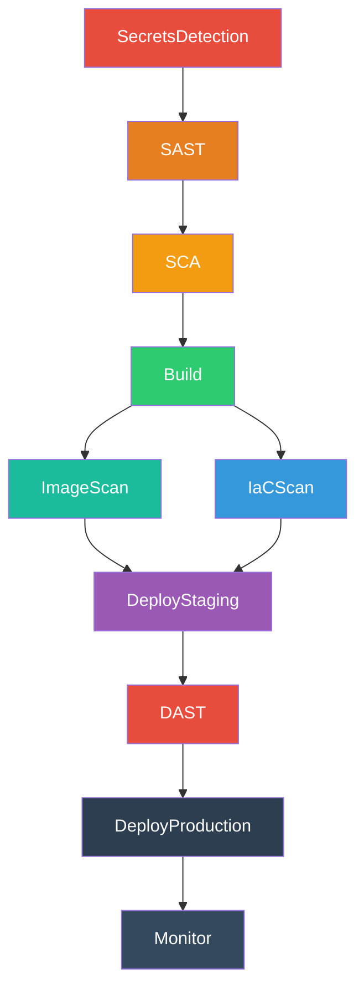

---
tags:
  - lab
  - github-actions
  - pipeline
  - yaml
---

# Paso 1 -- Estructura de Jobs

!!! abstract "Objetivo"
    Reemplazar el job "Hello World" por los 10 jobs del workflow DevSecOps, definiendo las dependencias entre ellos con `needs`.

## 1.1 Entender las dependencias

Antes de escribir el YAML, entendamos la cadena de dependencias:



La logica es:

- **secrets-detection** se ejecuta primero (sin dependencias)
- **sast** depende de secrets-detection
- **sca** depende de sast
- **build** depende de sca (solo construimos si pasan los escaneos)
- **image-scan** e **iac-scan** dependen de build (se ejecutan en paralelo)
- **deploy-staging** depende de image-scan **y** iac-scan (ambos deben pasar)
- **dast** depende de deploy-staging (necesita la app desplegada)
- **deploy-production** depende de dast
- **monitor** depende de deploy-production

## 1.2 Reemplazar el workflow completo

Abre `.github/workflows/devsecops.yml` y reemplaza **todo** su contenido con el siguiente YAML:

```yaml title=".github/workflows/devsecops.yml"
# ============================================================
# DevSecOps Workflow — Workshop Entelgy
# ============================================================
# Este workflow se construye incrementalmente a lo largo
# de los Labs 1-11. Cada lab rellena un job.
# ============================================================

name: DevSecOps Pipeline

on:
  push:
    branches:
      - main
    paths-ignore:
      - 'docs/**'
      - '*.md'

# --- Variables (Lab 2, Paso 2) ---
# env:
#   IMAGE_NAME: 'vulnerable-app'

jobs:
  # ──────────────────────────────────────────────
  # Job 1: Deteccion de Secretos (Lab 3)
  # ──────────────────────────────────────────────
  secrets-detection:
    name: 'Deteccion de Secretos'
    runs-on: ubuntu-latest
    steps:
      - run: |
          echo "=== Job: SecretsDetection ==="
          echo "Este job se implementara en Lab 3 con Gitleaks"
          echo "Herramienta: Gitleaks"
          echo "Objetivo: Detectar credenciales y secretos en el codigo fuente"
        name: 'Placeholder - Gitleaks'

  # ──────────────────────────────────────────────
  # Job 2: SAST - Analisis Estatico (Lab 4)
  # ──────────────────────────────────────────────
  sast:
    name: 'SAST - Analisis Estatico'
    needs: secrets-detection
    runs-on: ubuntu-latest
    steps:
      - run: |
          echo "=== Job: SAST ==="
          echo "Este job se implementara en Lab 4 con Semgrep"
          echo "Herramienta: Semgrep"
          echo "Objetivo: Encontrar vulnerabilidades en el codigo (SQLi, XSS, etc.)"
        name: 'Placeholder - Semgrep'

  # ──────────────────────────────────────────────
  # Job 3: SCA - Composicion de Software (Lab 5)
  # ──────────────────────────────────────────────
  sca:
    name: 'SCA - Dependencias'
    needs: sast
    runs-on: ubuntu-latest
    steps:
      - run: |
          echo "=== Job: SCA ==="
          echo "Este job se implementara en Lab 5 con Trivy"
          echo "Herramienta: Trivy fs"
          echo "Objetivo: Detectar CVEs en dependencias y generar SBOM"
        name: 'Placeholder - Trivy fs'

  # ──────────────────────────────────────────────
  # Job 4: Build - Imagen Docker (Lab 6)
  # ──────────────────────────────────────────────
  build:
    name: 'Build - Imagen Docker'
    needs: sca
    runs-on: ubuntu-latest
    steps:
      - run: |
          echo "=== Job: Build ==="
          echo "Este job se implementara en Lab 6"
          echo "Herramienta: Docker + GHCR"
          echo "Objetivo: Construir y publicar imagen Docker segura"
        name: 'Placeholder - Docker Build'

  # ──────────────────────────────────────────────
  # Job 5: Image Scan + Firma (Lab 7)
  # ──────────────────────────────────────────────
  image-scan:
    name: 'Escaneo de Imagen'
    needs: build
    runs-on: ubuntu-latest
    steps:
      - run: |
          echo "=== Job: ImageScan ==="
          echo "Este job se implementara en Lab 7"
          echo "Herramienta: Trivy image + Cosign"
          echo "Objetivo: Escanear vulnerabilidades en la imagen y firmarla"
        name: 'Placeholder - Trivy Image + Cosign'

  # ──────────────────────────────────────────────
  # Job 6: IaC Scan (Lab 9)
  # ──────────────────────────────────────────────
  iac-scan:
    name: 'Escaneo de IaC'
    needs: build
    runs-on: ubuntu-latest
    steps:
      - run: |
          echo "=== Job: IaCScan ==="
          echo "Este job se implementara en Lab 9"
          echo "Herramienta: Checkov + OPA"
          echo "Objetivo: Detectar misconfiguraciones en Terraform"
        name: 'Placeholder - Checkov'

  # ──────────────────────────────────────────────
  # Job 7: Deploy Staging (Lab 8/10)
  # ──────────────────────────────────────────────
  deploy-staging:
    name: 'Deploy a Staging'
    needs:
      - image-scan
      - iac-scan
    runs-on: ubuntu-latest
    steps:
      - run: |
          echo "=== Job: DeployStaging ==="
          echo "Este job se implementara en Lab 10"
          echo "Objetivo: Desplegar la aplicacion en entorno de staging"
        name: 'Placeholder - Deploy Staging'

  # ──────────────────────────────────────────────
  # Job 8: DAST (Lab 8)
  # ──────────────────────────────────────────────
  dast:
    name: 'DAST - Pruebas Dinamicas'
    needs: deploy-staging
    runs-on: ubuntu-latest
    steps:
      - run: |
          echo "=== Job: DAST ==="
          echo "Este job se implementara en Lab 8 con OWASP ZAP"
          echo "Herramienta: OWASP ZAP"
          echo "Objetivo: Pruebas dinamicas contra la aplicacion desplegada"
        name: 'Placeholder - OWASP ZAP'

  # ──────────────────────────────────────────────
  # Job 9: Deploy Production (Lab 10)
  # ──────────────────────────────────────────────
  deploy-production:
    name: 'Deploy a Produccion'
    needs: dast
    runs-on: ubuntu-latest
    steps:
      - run: |
          echo "=== Job: DeployProduction ==="
          echo "Este job se implementara en Lab 10"
          echo "Objetivo: Desplegar a produccion con aprobaciones manuales"
        name: 'Placeholder - Deploy Production'

  # ──────────────────────────────────────────────
  # Job 10: Monitorizacion (Lab 11)
  # ──────────────────────────────────────────────
  monitor:
    name: 'Monitorizacion'
    needs: deploy-production
    runs-on: ubuntu-latest
    steps:
      - run: |
          echo "=== Job: Monitor ==="
          echo "Este job se implementara en Lab 11"
          echo "Objetivo: Health checks y monitorizacion post-despliegue"
        name: 'Placeholder - Monitor'
```

## 1.3 Analizar el YAML

Observa los puntos clave del workflow:

### Trigger

```yaml
on:
  push:
    branches:
      - main
    paths-ignore:
      - 'docs/**'
      - '*.md'
```

Hemos agregado exclusion de paths: cambios en documentacion no disparan el workflow.

### needs

La directiva `needs` controla el orden de ejecucion:

- **Sin `needs`** -- El job se ejecuta inmediatamente (secrets-detection)
- **`needs: job-x`** -- Espera a que job-x termine con exito
- **`needs: [job-x, job-y]`** -- Espera a **ambos** jobs (paralelismo previo converge)

!!! tip "Paralelismo"
    Observa que `image-scan` e `iac-scan` ambos dependen de `build` pero **no dependen entre si**. GitHub Actions los ejecutara en paralelo si hay runners disponibles. `deploy-staging` espera a que **ambos** terminen.

### Ejecucion en cascada

Si un job falla, todos los jobs dependientes se **omiten automaticamente** (status: "Skipped"). Esto es el comportamiento por defecto y es exactamente lo que queremos: si Gitleaks encuentra secretos, no queremos construir ni desplegar.

## 1.4 Hacer push y verificar

```bash title="Terminal"
git add .github/workflows/devsecops.yml
git commit -m "lab02: definir 10 jobs del workflow DevSecOps"
git push origin main
```

Ve a GitHub > **Actions** > tu workflow y verifica:

1. Todos los 10 jobs aparecen en el diagrama visual
2. Las lineas de dependencia coinciden con el diagrama mermaid de arriba
3. Todos los jobs terminan con exito (los placeholders solo hacen `echo`)
4. Los jobs `image-scan` e `iac-scan` se ejecutan **en paralelo**

!!! success "Paso Completado"
    Tu workflow deberia mostrar los 10 jobs ejecutandose en secuencia (con el par image-scan/iac-scan en paralelo). Cada job muestra su mensaje placeholder. La estructura esta lista para recibir herramientas reales.

---

<div style="display: flex; justify-content: space-between; margin-top: 2rem;">
  <a href="../" class="md-button">Volver al Lab 2</a>
  <a href="../step2/" class="md-button md-button--primary">Paso 2: Variables y Secretos</a>
</div>
