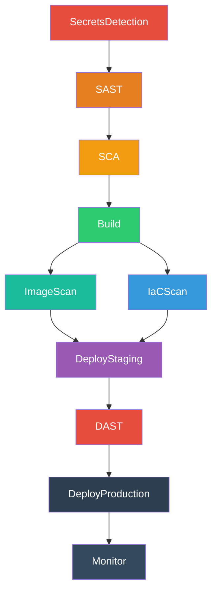

---
tags:
  - lab
  - azure-devops
  - pipeline
  - yaml
---

# Paso 1 -- Estructura de Stages

!!! abstract "Objetivo"
    Reemplazar el stage "Hello World" por los 10 stages del pipeline DevSecOps, definiendo las dependencias entre ellos con `dependsOn`.

## 1.1 Entender las dependencias

Antes de escribir el YAML, entendamos la cadena de dependencias:



La logica es:

- **SecretsDetection** se ejecuta primero (sin dependencias)
- **SAST** depende de SecretsDetection
- **SCA** depende de SAST
- **Build** depende de SCA (solo construimos si pasan los escaneos)
- **ImageScan** e **IaCScan** dependen de Build (se ejecutan en paralelo)
- **DeployStaging** depende de ImageScan **y** IaCScan (ambos deben pasar)
- **DAST** depende de DeployStaging (necesita la app desplegada)
- **DeployProduction** depende de DAST
- **Monitor** depende de DeployProduction

## 1.2 Reemplazar el pipeline completo

Abre `azure-pipelines.yml` y reemplaza **todo** su contenido con el siguiente YAML:

```yaml title="azure-pipelines.yml"
# ============================================================
# DevSecOps Pipeline — Workshop Entelgy
# ============================================================
# Este pipeline se construye incrementalmente a lo largo
# de los Labs 1-11. Cada lab rellena un stage.
# ============================================================

trigger:
  branches:
    include:
      - main
  paths:
    exclude:
      - 'docs/**'
      - '*.md'

pool:
  vmImage: 'ubuntu-latest'

# --- Variables (Lab 2, Paso 2) ---
# variables:
#   - group: devsecops-workshop-secrets
#   - name: imageName
#     value: 'vulnerable-app'

stages:
  # ──────────────────────────────────────────────
  # Stage 1: Deteccion de Secretos (Lab 3)
  # ──────────────────────────────────────────────
  - stage: SecretsDetection
    displayName: 'Deteccion de Secretos'
    jobs:
      - job: Placeholder
        displayName: 'Pendiente - Lab 3'
        steps:
          - script: |
              echo "=== Stage: SecretsDetection ==="
              echo "Este stage se implementara en Lab 3 con Gitleaks"
              echo "Herramienta: Gitleaks"
              echo "Objetivo: Detectar credenciales y secretos en el codigo fuente"
            displayName: 'Placeholder - Gitleaks'

  # ──────────────────────────────────────────────
  # Stage 2: SAST - Analisis Estatico (Lab 4)
  # ──────────────────────────────────────────────
  - stage: SAST
    displayName: 'SAST - Analisis Estatico'
    dependsOn: SecretsDetection
    jobs:
      - job: Placeholder
        displayName: 'Pendiente - Lab 4'
        steps:
          - script: |
              echo "=== Stage: SAST ==="
              echo "Este stage se implementara en Lab 4 con Semgrep"
              echo "Herramienta: Semgrep"
              echo "Objetivo: Encontrar vulnerabilidades en el codigo (SQLi, XSS, etc.)"
            displayName: 'Placeholder - Semgrep'

  # ──────────────────────────────────────────────
  # Stage 3: SCA - Composicion de Software (Lab 5)
  # ──────────────────────────────────────────────
  - stage: SCA
    displayName: 'SCA - Dependencias'
    dependsOn: SAST
    jobs:
      - job: Placeholder
        displayName: 'Pendiente - Lab 5'
        steps:
          - script: |
              echo "=== Stage: SCA ==="
              echo "Este stage se implementara en Lab 5 con Trivy"
              echo "Herramienta: Trivy fs"
              echo "Objetivo: Detectar CVEs en dependencias y generar SBOM"
            displayName: 'Placeholder - Trivy fs'

  # ──────────────────────────────────────────────
  # Stage 4: Build - Imagen Docker (Lab 6)
  # ──────────────────────────────────────────────
  - stage: Build
    displayName: 'Build - Imagen Docker'
    dependsOn: SCA
    jobs:
      - job: Placeholder
        displayName: 'Pendiente - Lab 6'
        steps:
          - script: |
              echo "=== Stage: Build ==="
              echo "Este stage se implementara en Lab 6"
              echo "Herramienta: Docker + ACR"
              echo "Objetivo: Construir y publicar imagen Docker segura"
            displayName: 'Placeholder - Docker Build'

  # ──────────────────────────────────────────────
  # Stage 5: Image Scan + Firma (Lab 7)
  # ──────────────────────────────────────────────
  - stage: ImageScan
    displayName: 'Escaneo de Imagen'
    dependsOn: Build
    jobs:
      - job: Placeholder
        displayName: 'Pendiente - Lab 7'
        steps:
          - script: |
              echo "=== Stage: ImageScan ==="
              echo "Este stage se implementara en Lab 7"
              echo "Herramienta: Trivy image + Cosign"
              echo "Objetivo: Escanear vulnerabilidades en la imagen y firmarla"
            displayName: 'Placeholder - Trivy Image + Cosign'

  # ──────────────────────────────────────────────
  # Stage 6: IaC Scan (Lab 9)
  # ──────────────────────────────────────────────
  - stage: IaCScan
    displayName: 'Escaneo de IaC'
    dependsOn: Build
    jobs:
      - job: Placeholder
        displayName: 'Pendiente - Lab 9'
        steps:
          - script: |
              echo "=== Stage: IaCScan ==="
              echo "Este stage se implementara en Lab 9"
              echo "Herramienta: Checkov + OPA"
              echo "Objetivo: Detectar misconfiguraciones en Terraform"
            displayName: 'Placeholder - Checkov'

  # ──────────────────────────────────────────────
  # Stage 7: Deploy Staging (Lab 8/10)
  # ──────────────────────────────────────────────
  - stage: DeployStaging
    displayName: 'Deploy a Staging'
    dependsOn:
      - ImageScan
      - IaCScan
    jobs:
      - job: Placeholder
        displayName: 'Pendiente - Lab 10'
        steps:
          - script: |
              echo "=== Stage: DeployStaging ==="
              echo "Este stage se implementara en Lab 10"
              echo "Objetivo: Desplegar la aplicacion en entorno de staging"
            displayName: 'Placeholder - Deploy Staging'

  # ──────────────────────────────────────────────
  # Stage 8: DAST (Lab 8)
  # ──────────────────────────────────────────────
  - stage: DAST
    displayName: 'DAST - Pruebas Dinamicas'
    dependsOn: DeployStaging
    jobs:
      - job: Placeholder
        displayName: 'Pendiente - Lab 8'
        steps:
          - script: |
              echo "=== Stage: DAST ==="
              echo "Este stage se implementara en Lab 8 con OWASP ZAP"
              echo "Herramienta: OWASP ZAP"
              echo "Objetivo: Pruebas dinamicas contra la aplicacion desplegada"
            displayName: 'Placeholder - OWASP ZAP'

  # ──────────────────────────────────────────────
  # Stage 9: Deploy Production (Lab 10)
  # ──────────────────────────────────────────────
  - stage: DeployProduction
    displayName: 'Deploy a Produccion'
    dependsOn: DAST
    jobs:
      - job: Placeholder
        displayName: 'Pendiente - Lab 10'
        steps:
          - script: |
              echo "=== Stage: DeployProduction ==="
              echo "Este stage se implementara en Lab 10"
              echo "Objetivo: Desplegar a produccion con aprobaciones manuales"
            displayName: 'Placeholder - Deploy Production'

  # ──────────────────────────────────────────────
  # Stage 10: Monitorizacion (Lab 11)
  # ──────────────────────────────────────────────
  - stage: Monitor
    displayName: 'Monitorizacion'
    dependsOn: DeployProduction
    jobs:
      - job: Placeholder
        displayName: 'Pendiente - Lab 11'
        steps:
          - script: |
              echo "=== Stage: Monitor ==="
              echo "Este stage se implementara en Lab 11"
              echo "Objetivo: Health checks y monitorizacion post-despliegue"
            displayName: 'Placeholder - Monitor'
```

## 1.3 Analizar el YAML

Observa los puntos clave del pipeline:

### Trigger

```yaml
trigger:
  branches:
    include:
      - main
  paths:
    exclude:
      - 'docs/**'
      - '*.md'
```

Hemos agregado exclusion de paths: cambios en documentacion no disparan el pipeline.

### dependsOn

La directiva `dependsOn` controla el orden de ejecucion:

- **Sin `dependsOn`** -- El stage se ejecuta inmediatamente (SecretsDetection)
- **`dependsOn: StageX`** -- Espera a que StageX termine con exito
- **`dependsOn: [StageX, StageY]`** -- Espera a **ambos** stages (paralelismo previo converge)

!!! tip "Paralelismo"
    Observa que `ImageScan` e `IaCScan` ambos dependen de `Build` pero **no dependen entre si**. Azure DevOps los ejecutara en paralelo si hay agentes disponibles. `DeployStaging` espera a que **ambos** terminen.

### Ejecucion en cascada

Si un stage falla, todos los stages dependientes se **omiten automaticamente** (status: "Skipped"). Esto es el comportamiento por defecto y es exactamente lo que queremos: si Gitleaks encuentra secretos, no queremos construir ni desplegar.

## 1.4 Hacer push y verificar

```bash title="Terminal"
git add azure-pipelines.yml
git commit -m "lab02: definir 10 stages del pipeline DevSecOps"
git push origin main
```

Ve a Azure DevOps > **Pipelines** > tu pipeline y verifica:

1. Todos los 10 stages aparecen en el diagrama visual
2. Las lineas de dependencia coinciden con el diagrama mermaid de arriba
3. Todos los stages terminan con exito (los placeholders solo hacen `echo`)
4. Los stages `ImageScan` e `IaCScan` se ejecutan **en paralelo**

!!! success "Paso Completado"
    Tu pipeline deberia mostrar los 10 stages ejecutandose en secuencia (con el par ImageScan/IaCScan en paralelo). Cada stage muestra su mensaje placeholder. La estructura esta lista para recibir herramientas reales.

---

<div style="display: flex; justify-content: space-between; margin-top: 2rem;">
  <a href="../" class="md-button">Volver al Lab 2</a>
  <a href="../step2/" class="md-button md-button--primary">Paso 2: Variables y Secretos</a>
</div>
