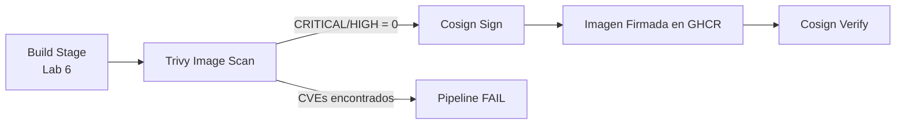

---
tags:
  - lab
  - trivy
  - cosign
  - container-security
---

# Lab 7 -- Escaneo y Firma de Imagen

<div class="lab-meta" markdown>
<div class="lab-meta-item" markdown>
<strong>Duracion</strong>
45-60 minutos
</div>
<div class="lab-meta-item" markdown>
<strong>Nivel</strong>
Intermedio
</div>
<div class="lab-meta-item" markdown>
<strong>Herramientas</strong>
Trivy + Cosign
</div>
<div class="lab-meta-item" markdown>
<strong>Resultado</strong>
Imagen escaneada y firmada en GHCR
</div>
</div>

!!! abstract "Objetivo"
    Escanear la imagen de contenedor almacenada en GHCR con Trivy para detectar vulnerabilidades conocidas (CVEs), y luego firmar la imagen con Cosign para garantizar su integridad y procedencia antes de cualquier despliegue.

## Que vamos a construir

En el laboratorio anterior (Lab 6) construimos la imagen de contenedor y la subimos a GitHub Container Registry. Ahora agregaremos dos pasos criticos de seguridad: **escaneo de vulnerabilidades** en la imagen y **firma criptografica** para establecer una cadena de confianza.



## Por que es importante

| Amenaza | Control |
|---------|---------|
| Imagen con CVEs conocidos en produccion | Trivy bloquea el despliegue si encuentra vulnerabilidades CRITICAL o HIGH |
| Imagen manipulada en transito o en el registro | Cosign firma la imagen; solo imagenes firmadas se despliegan |
| Supply chain attack en la imagen base | Trivy detecta vulnerabilidades en capas base del SO |

## Pasos del laboratorio

<div class="steps" markdown>

1. **[Escaneo con Trivy Image](step1.md)** -- Agregar un paso al pipeline que escanea la imagen construida en GHCR con Trivy, configurar el gate de severidad (CRITICAL,HIGH) y analizar los hallazgos esperados.

2. **[Firma con Cosign](step2.md)** -- Instalar Cosign en el pipeline, generar un par de claves, firmar la imagen en GHCR tras pasar el escaneo de Trivy y subir la firma al registro.

3. **[Verificacion de Firmas](step3.md)** -- Verificar la firma localmente con `cosign verify`, y discutir como aplicar politicas de "solo imagenes firmadas" con Azure Policy u OPA Gatekeeper.

</div>

## Prerequisitos

- Lab 6 completado (imagen construida y subida a ACR)
- Pipeline con los jobs: `Checkout`, `SecretsDetection`, `SAST`, `SCA`, `Build`
- GitHub Container Registry configurado con la GITHUB_TOKEN
- GitHub Secrets con las credenciales de GHCR

!!! info "Continuidad del pipeline"
    Este laboratorio agrega el stage `ImageScan` al pipeline existente en `vulnerable-app/.github/workflows/devsecops.yml`. El stage se ejecuta **despues** del stage `Build` y es prerequisito para los stages de despliegue posteriores.

## Arquitectura del pipeline

Al finalizar este lab, tu pipeline tendra esta estructura:

```yaml title="vulnerable-app/.github/workflows/devsecops.yml (estructura acumulada)"
jobs:
  # Checkout           # Lab 1
  # SecretsDetection   # Lab 3
  # SAST               # Lab 4
  # SCA                # Lab 5
  # Build              # Lab 6
  # ImageScan          # Lab 7 (NUEVO)
  # # job: DAST             # Lab 8
  # # job: IaCScan          # Lab 9
  # # job: DeployStaging    # Lab 10
  # # job: DeployProduction # Lab 10
  # # job: Monitor          # Lab 11
```
