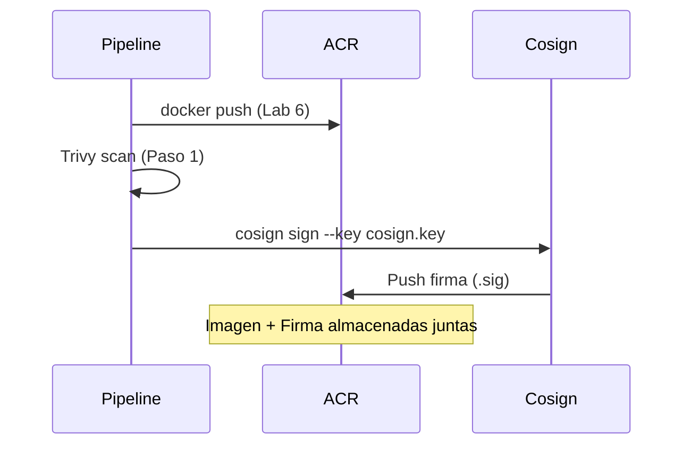

---
tags:
  - lab
  - cosign
  - container-security
  - signing
---

# Paso 2 -- Firma de Imagen con Cosign

!!! abstract "Objetivo"
    Instalar Cosign en el pipeline, generar un par de claves, firmar la imagen de contenedor en ACR despues de que pase el escaneo de Trivy, y subir la firma al registro.

## Contexto

La firma de imagenes establece una **cadena de confianza**: solo las imagenes que han pasado los controles de seguridad y han sido firmadas por el pipeline autorizado pueden desplegarse. Cosign (parte del proyecto Sigstore) es la herramienta estandar para firmar imagenes OCI.



## 2.1 Generar par de claves Cosign

Primero, genera un par de claves que el pipeline usara para firmar. Esto se hace **una sola vez** y las claves se almacenan como secretos.

```bash title="Generar claves Cosign (ejecutar localmente)"
# Instalar cosign
# macOS:
brew install cosign

# Linux:
# curl -fsSL https://github.com/sigstore/cosign/releases/latest/download/cosign-linux-amd64 -o /usr/local/bin/cosign
# chmod +x /usr/local/bin/cosign

# Generar par de claves
cosign generate-key-pair

# Esto genera:
#   cosign.key  (clave privada - SECRETA)
#   cosign.pub  (clave publica - se puede compartir)
```

!!! warning "Proteger la clave privada"
    La clave privada (`cosign.key`) y su password **nunca** deben estar en el repositorio. Las almacenaremos como secretos en Azure DevOps.

## 2.2 Almacenar claves como secretos en Azure DevOps

1. Ve a **Pipelines** > **Library** > grupo de variables `devsecops-workshop-secrets`
2. Agrega las siguientes variables:

| Variable | Valor | Tipo |
|----------|-------|------|
| `COSIGN_KEY` | Contenido de `cosign.key` (base64 encoded) | Secreto |
| `COSIGN_PASSWORD` | Password que usaste al generar las claves | Secreto |
| `COSIGN_PUB` | Contenido de `cosign.pub` | Normal |

Para codificar la clave privada en base64:

```bash title="Codificar clave en base64"
# Codificar la clave privada
cat cosign.key | base64 -w 0 > cosign.key.b64

# Copiar el contenido y pegarlo en Azure DevOps
cat cosign.key.b64

# La clave publica se puede almacenar tal cual
cat cosign.pub
```

!!! tip "Alternativa: Azure Key Vault"
    En produccion, es mejor almacenar las claves en Azure Key Vault y referenciarlas desde el pipeline con una tarea de Key Vault. Para el workshop usamos variables de grupo por simplicidad.

## 2.3 Agregar la firma al pipeline

Agrega los siguientes steps al job del stage `ImageScan`, **despues** del gate de Trivy:

```yaml title="vulnerable-app/azure-pipelines.yml -- Steps de Cosign (dentro de ImageScan)"
          # ============================================================
          # Cosign: Firma de imagen
          # ============================================================

          # --- Instalar Cosign ---
          - script: |
              echo "=== Instalando Cosign ==="
              COSIGN_VERSION="v2.2.4"
              curl -fsSL "https://github.com/sigstore/cosign/releases/download/${COSIGN_VERSION}/cosign-linux-amd64" \
                -o /usr/local/bin/cosign
              chmod +x /usr/local/bin/cosign
              cosign version
            displayName: 'Instalar Cosign'

          # --- Decodificar clave privada ---
          - script: |
              echo "=== Preparando clave de firma ==="
              echo "$(COSIGN_KEY)" | base64 -d > $(Agent.TempDirectory)/cosign.key
              echo "Clave privada preparada"
            displayName: 'Preparar clave Cosign'
            env:
              COSIGN_KEY: $(COSIGN_KEY)

          # --- Firmar la imagen ---
          - script: |
              echo "=== Firmando imagen en ACR ==="
              echo "Imagen: $(imageRef)"

              COSIGN_PASSWORD="$(COSIGN_PASSWORD)" cosign sign \
                --key $(Agent.TempDirectory)/cosign.key \
                --yes \
                $(imageRef)

              echo ""
              echo "=== Imagen firmada exitosamente ==="
              echo "La firma se almaceno junto a la imagen en ACR"
            displayName: 'Cosign Sign'
            env:
              COSIGN_PASSWORD: $(COSIGN_PASSWORD)

          # --- Verificar la firma inmediatamente ---
          - script: |
              echo "=== Verificando firma de la imagen ==="

              cosign verify \
                --key $(Agent.TempDirectory)/cosign.key \
                $(imageRef)

              echo ""
              echo "=== Firma verificada correctamente ==="
            displayName: 'Cosign Verify (post-firma)'
            env:
              COSIGN_PASSWORD: $(COSIGN_PASSWORD)

          # --- Limpiar clave privada ---
          - script: |
              rm -f $(Agent.TempDirectory)/cosign.key
              echo "Clave privada eliminada del agente"
            displayName: 'Limpiar clave privada'
            condition: always()
```

## 2.4 Stage completo (referencia)

Para referencia, asi queda el stage `ImageScan` completo con Trivy y Cosign:

```yaml title="vulnerable-app/azure-pipelines.yml -- Stage ImageScan completo"
  - stage: ImageScan
    displayName: 'Image Scan + Signing'
    dependsOn: Build
    variables:
      imageRef: '$(ACR_LOGIN_SERVER)/workshop-app:$(Build.BuildId)'
    jobs:
      - job: TrivyImageScan
        displayName: 'Trivy Image Scan + Cosign'
        steps:
          # --- Login ACR ---
          - task: Docker@2
            displayName: 'Login en ACR'
            inputs:
              command: login
              containerRegistry: 'acr-service-connection'

          - script: |
              docker pull $(imageRef)
            displayName: 'Pull imagen desde ACR'

          # --- Trivy ---
          - script: |
              sudo apt-get install -y wget apt-transport-https gnupg lsb-release
              wget -qO - https://aquasecurity.github.io/trivy-repo/deb/public.key | \
                gpg --dearmor | sudo tee /usr/share/keyrings/trivy.gpg > /dev/null
              echo "deb [signed-by=/usr/share/keyrings/trivy.gpg] https://aquasecurity.github.io/trivy-repo/deb \
                $(lsb_release -sc) main" | sudo tee /etc/apt/sources.list.d/trivy.list
              sudo apt-get update && sudo apt-get install -y trivy
            displayName: 'Instalar Trivy'

          - script: |
              trivy image --severity CRITICAL,HIGH --format table $(imageRef)
            displayName: 'Trivy Scan (tabla)'
            continueOnError: true

          - script: |
              trivy image --severity CRITICAL,HIGH --format json \
                --output $(Build.ArtifactStagingDirectory)/trivy-image-report.json \
                $(imageRef)
            displayName: 'Trivy Scan (JSON)'
            continueOnError: true

          - script: |
              trivy image --severity CRITICAL,HIGH --exit-code 1 --format table $(imageRef)
            displayName: 'Trivy Gate (CRITICAL,HIGH)'
            continueOnError: true

          - task: PublishBuildArtifacts@1
            displayName: 'Publicar reporte Trivy Image'
            inputs:
              PathtoPublish: '$(Build.ArtifactStagingDirectory)/trivy-image-report.json'
              ArtifactName: 'trivy-image-report'
              publishLocation: 'Container'
            condition: always()

          # --- Cosign ---
          - script: |
              COSIGN_VERSION="v2.2.4"
              curl -fsSL "https://github.com/sigstore/cosign/releases/download/${COSIGN_VERSION}/cosign-linux-amd64" \
                -o /usr/local/bin/cosign
              chmod +x /usr/local/bin/cosign
              cosign version
            displayName: 'Instalar Cosign'

          - script: |
              echo "$(COSIGN_KEY)" | base64 -d > $(Agent.TempDirectory)/cosign.key
            displayName: 'Preparar clave Cosign'
            env:
              COSIGN_KEY: $(COSIGN_KEY)

          - script: |
              COSIGN_PASSWORD="$(COSIGN_PASSWORD)" cosign sign \
                --key $(Agent.TempDirectory)/cosign.key \
                --yes \
                $(imageRef)
              echo "Imagen firmada: $(imageRef)"
            displayName: 'Cosign Sign'
            env:
              COSIGN_PASSWORD: $(COSIGN_PASSWORD)

          - script: |
              cosign verify \
                --key $(Agent.TempDirectory)/cosign.key \
                $(imageRef)
            displayName: 'Cosign Verify (post-firma)'
            env:
              COSIGN_PASSWORD: $(COSIGN_PASSWORD)

          - script: |
              rm -f $(Agent.TempDirectory)/cosign.key
            displayName: 'Limpiar clave privada'
            condition: always()
```

## 2.5 Que ocurre durante la firma

Cuando Cosign firma una imagen:

1. **Calcula el digest** de la imagen (SHA256)
2. **Firma el digest** con la clave privada
3. **Sube la firma** al registro como un artefacto OCI adjunto
4. La firma queda almacenada junto a la imagen en ACR con el tag `sha256-<digest>.sig`

```text title="Artefactos en ACR despues de la firma"
entelgyworkshopacr.azurecr.io/workshop-app
  - Tag: 42          (imagen)
  - Tag: sha256-abc123...sig  (firma de Cosign)
```

!!! info "Firmas transparentes con Sigstore"
    Cosign tambien soporta firma "keyless" usando Sigstore Rekor (un log de transparencia publico). En un entorno enterprise, las claves locales ofrecen mas control. Para proyectos open source, la firma keyless con OIDC es mas conveniente.

## 2.6 Verificar en Azure DevOps

1. Haz commit y push de los cambios
2. Observa el pipeline -- los steps de Cosign se ejecutan despues de Trivy
3. En los logs de "Cosign Sign" deberias ver:

```text
Pushing signature to: entelgyworkshopacr.azurecr.io/workshop-app
```

4. En Azure Portal > ACR > Repositorios, veras el tag de firma junto al tag de la imagen

!!! success "Paso Completado"
    Has firmado la imagen de contenedor con Cosign. Solo las imagenes que pasan el escaneo de Trivy son firmadas, y la firma queda almacenada en ACR para verificacion posterior.

---

<div style="display: flex; justify-content: space-between; margin-top: 2rem;">
  <a href="step1.md" class="md-button">Anterior: Escaneo con Trivy</a>
  <a href="step3.md" class="md-button md-button--primary">Siguiente: Verificacion de Firmas</a>
</div>
