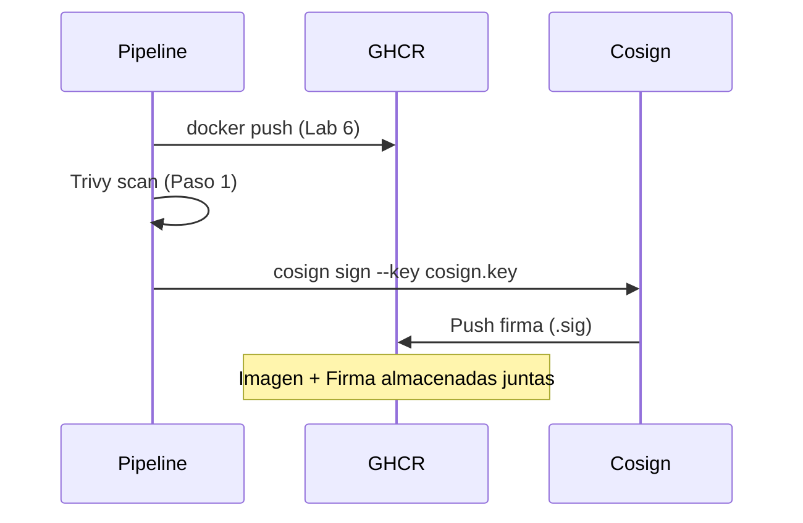

---
tags:
  - lab
  - cosign
  - container-security
  - signing
---

# Paso 2 -- Firma de Imagen con Cosign

!!! abstract "Objetivo"
    Instalar Cosign en el pipeline, generar un par de claves, firmar la imagen de contenedor en GHCR despues de que pase el escaneo de Trivy, y subir la firma al registro.

## Contexto

La firma de imagenes establece una **cadena de confianza**: solo las imagenes que han pasado los controles de seguridad y han sido firmadas por el pipeline autorizado pueden desplegarse. Cosign (parte del proyecto Sigstore) es la herramienta estandar para firmar imagenes OCI.



## 2.1 Generar par de claves Cosign

Primero, genera un par de claves que el pipeline usara para firmar. Esto se hace **una sola vez** y las claves se almacenan como secretos.

```bash title="Generar claves Cosign (ejecutar localmente)"
# Instalar cosign
# macOS:
brew install cosign

# Linux:
# curl -fsSL https://github.com/sigstore/cosign/releases/latest/download/cosign-linux-amd64 -o /usr/local/bin/cosign
# chmod +x /usr/local/bin/cosign

# Generar par de claves
cosign generate-key-pair

# Esto genera:
#   cosign.key  (clave privada - SECRETA)
#   cosign.pub  (clave publica - se puede compartir)
```

!!! warning "Proteger la clave privada"
    La clave privada (`cosign.key`) y su password **nunca** deben estar en el repositorio. Las almacenaremos como secretos en GitHub Actions.

## 2.2 Almacenar claves como secretos en GitHub Actions

1. Ve a **Pipelines** > **Library** > grupo de variables `devsecops-workshop-secrets`
2. Agrega las siguientes variables:

| Variable | Valor | Tipo |
|----------|-------|------|
| `COSIGN_KEY` | Contenido de `cosign.key` (base64 encoded) | Secreto |
| `COSIGN_PASSWORD` | Password que usaste al generar las claves | Secreto |
| `COSIGN_PUB` | Contenido de `cosign.pub` | Normal |

Para codificar la clave privada en base64:

```bash title="Codificar clave en base64"
# Codificar la clave privada
cat cosign.key | base64 -w 0 > cosign.key.b64

# Copiar el contenido y pegarlo en GitHub Actions
cat cosign.key.b64

# La clave publica se puede almacenar tal cual
cat cosign.pub
```

!!! tip "Alternativa: GitHub Secrets"
    En produccion, es mejor almacenar las claves en GitHub Secrets y referenciarlas desde el pipeline con una tarea de Key Vault. Para el workshop usamos variables de grupo por simplicidad.

## 2.3 Agregar la firma al pipeline

Agrega los siguientes steps al job del stage `ImageScan`, **despues** del gate de Trivy:

```yaml title=".github/workflows/devsecops.yml -- Steps de Cosign (dentro de image-scan)"
      # ============================================================
      # Cosign: Firma de imagen
      # ============================================================

      # --- Instalar Cosign ---
      - name: Instalar Cosign
        uses: sigstore/cosign-installer@v3

      # --- Login a GHCR (para firmar) ---
      - name: Login a GHCR (para firmar)
        uses: docker/login-action@v3
        with:
          registry: ${{ env.REGISTRY }}
          username: ${{ github.actor }}
          password: ${{ secrets.GITHUB_TOKEN }}

      # --- Firmar la imagen (keyless con Sigstore) ---
      - name: Cosign — Firma de Imagen (keyless)
        run: |
          echo "=== Firmando imagen en GHCR ==="
          cosign sign --yes \
            ${{ env.REGISTRY }}/${{ env.IMAGE_NAME }}@${{ needs.build.outputs.image-digest }}

          echo ""
          echo "=== Imagen firmada exitosamente ==="
          echo "La firma se almaceno junto a la imagen en GHCR"

      # --- Registrar firma ---
      - name: Registrar firma
        run: |
          echo "### Imagen firmada :lock:" >> $GITHUB_STEP_SUMMARY
          echo "- **Digest:** ${{ needs.build.outputs.image-digest }}" >> $GITHUB_STEP_SUMMARY
          echo "- **Método:** Cosign keyless (Sigstore)" >> $GITHUB_STEP_SUMMARY
```

## 2.4 Stage completo (referencia)

Para referencia, asi queda el stage `ImageScan` completo con Trivy y Cosign:

```yaml title=".github/workflows/devsecops.yml -- Job image-scan completo"
  image-scan:
    name: '5. Escaneo de Imagen + Firma'
    runs-on: ubuntu-latest
    needs: build
    steps:
      # --- Trivy Image Scan ---
      - name: Trivy — Image Scan
        uses: aquasecurity/trivy-action@master
        with:
          image-ref: ${{ env.REGISTRY }}/${{ env.IMAGE_NAME }}:${{ env.IMAGE_TAG }}
          severity: CRITICAL,HIGH
          exit-code: "0"
          format: sarif
          output: trivy-image.sarif

      - name: Upload SARIF a GitHub Security
        uses: github/codeql-action/upload-sarif@v3
        if: always()
        with:
          sarif_file: trivy-image.sarif
          category: trivy-image

      # --- Cosign ---
      - name: Instalar Cosign
        uses: sigstore/cosign-installer@v3

      - name: Login a GHCR (para firmar)
        uses: docker/login-action@v3
        with:
          registry: ${{ env.REGISTRY }}
          username: ${{ github.actor }}
          password: ${{ secrets.GITHUB_TOKEN }}

      - name: Cosign — Firma de Imagen (keyless)
        run: |
          cosign sign --yes \
            ${{ env.REGISTRY }}/${{ env.IMAGE_NAME }}@${{ needs.build.outputs.image-digest }}

      - name: Registrar firma
        run: |
          echo "### Imagen firmada :lock:" >> $GITHUB_STEP_SUMMARY
          echo "- **Digest:** ${{ needs.build.outputs.image-digest }}" >> $GITHUB_STEP_SUMMARY
          echo "- **Método:** Cosign keyless (Sigstore)" >> $GITHUB_STEP_SUMMARY
```

## 2.5 Que ocurre durante la firma

Cuando Cosign firma una imagen:

1. **Calcula el digest** de la imagen (SHA256)
2. **Firma el digest** con la clave privada
3. **Sube la firma** al registro como un artefacto OCI adjunto
4. La firma queda almacenada junto a la imagen en GHCR con el tag `sha256-<digest>.sig`

```text title="Artefactos en GHCR despues de la firma"
ghcr.io/entelgy/workshop-app
  - Tag: 42          (imagen)
  - Tag: sha256-abc123...sig  (firma de Cosign)
```

!!! info "Firmas transparentes con Sigstore"
    Cosign tambien soporta firma "keyless" usando Sigstore Rekor (un log de transparencia publico). En un entorno enterprise, las claves locales ofrecen mas control. Para proyectos open source, la firma keyless con OIDC es mas conveniente.

## 2.6 Verificar en GitHub Actions

1. Haz commit y push de los cambios
2. Observa el pipeline -- los steps de Cosign se ejecutan despues de Trivy
3. En los logs de "Cosign Sign" deberias ver:

```text
Pushing signature to: ghcr.io/entelgy/workshop-app
```

4. En Azure Portal > GHCR > Repositorios, veras el tag de firma junto al tag de la imagen

!!! success "Paso Completado"
    Has firmado la imagen de contenedor con Cosign. Solo las imagenes que pasan el escaneo de Trivy son firmadas, y la firma queda almacenada en GHCR para verificacion posterior.

---

<div style="display: flex; justify-content: space-between; margin-top: 2rem;">
  <a href="step1.md" class="md-button">Anterior: Escaneo con Trivy</a>
  <a href="step3.md" class="md-button md-button--primary">Siguiente: Verificacion de Firmas</a>
</div>
