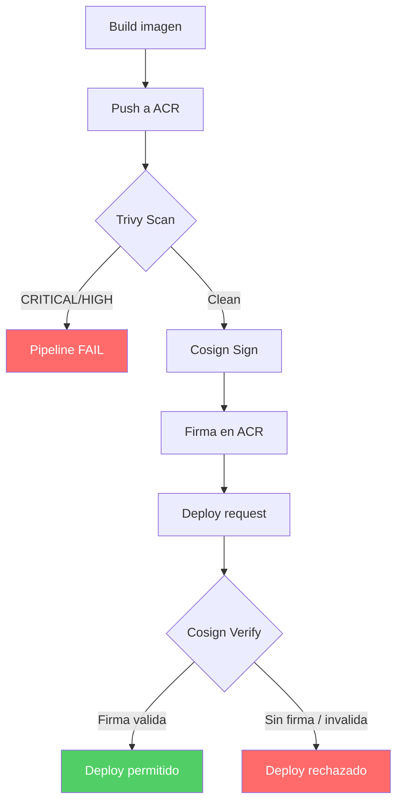

---
tags:
  - lab
  - cosign
  - opa
  - azure-policy
---

# Paso 3 -- Verificacion de Firmas

!!! abstract "Objetivo"
    Verificar la firma de la imagen localmente con `cosign verify`, y discutir las estrategias para aplicar politicas de "solo imagenes firmadas se despliegan" usando Azure Policy u OPA Gatekeeper.

## Contexto

Firmar la imagen es solo la mitad de la ecuacion. El verdadero valor aparece cuando el entorno de despliegue **rechaza** imagenes no firmadas. En este paso verificamos la firma y exploramos como automatizar esa verificacion.

## 3.1 Verificar la firma localmente

Usando la clave publica (`cosign.pub`) que generaste en el paso anterior:

```bash title="Verificar firma con cosign verify"
# Verificar la firma de la imagen en ACR
cosign verify \
  --key cosign.pub \
  entelgyworkshopacr.azurecr.io/workshop-app:42

# Salida esperada:
# Verification for entelgyworkshopacr.azurecr.io/workshop-app:42 --
# The following checks were performed on each of these signatures:
#   - The cosign claims were validated
#   - The signatures were verified against the specified public key
#
# [{"critical":{"identity":{"docker-reference":"entelgyworkshopacr.azurecr.io/workshop-app"},
#   "image":{"docker-manifest-digest":"sha256:abc123..."},
#   "type":"cosign container image signature"},
#   "optional":null}]
```

Si la imagen **no** esta firmada o la firma no coincide:

```bash title="Verificacion fallida (imagen no firmada)"
cosign verify \
  --key cosign.pub \
  entelgyworkshopacr.azurecr.io/workshop-app:latest

# Error: no matching signatures
# main.go:62: error during command execution: no matching signatures
```

!!! tip "Distribuir la clave publica"
    La clave publica (`cosign.pub`) se puede distribuir libremente. Cualquier persona o sistema que necesite verificar la autenticidad de tus imagenes solo necesita esta clave.

## 3.2 Agregar anotaciones a la firma

Puedes enriquecer las firmas con metadatos utiles para auditoria:

```bash title="Firma con anotaciones"
COSIGN_PASSWORD="tu-password" cosign sign \
  --key cosign.key \
  --yes \
  -a "pipeline=$(Build.BuildId)" \
  -a "commit=$(Build.SourceVersion)" \
  -a "branch=$(Build.SourceBranchName)" \
  -a "trivy-scan=passed" \
  -a "signed-by=devsecops-pipeline" \
  entelgyworkshopacr.azurecr.io/workshop-app:$(Build.BuildId)
```

Para verificar incluyendo las anotaciones:

```bash title="Verificar con anotaciones"
cosign verify \
  --key cosign.pub \
  -a "trivy-scan=passed" \
  entelgyworkshopacr.azurecr.io/workshop-app:42

# Solo pasa si la firma tiene la anotacion trivy-scan=passed
```

## 3.3 Aplicar politicas: Azure Policy

Azure Policy puede restringir que AKS solo ejecute imagenes firmadas. Se configura a nivel de suscripcion o cluster:

```json title="Azure Policy: Solo imagenes firmadas (ejemplo conceptual)"
{
  "mode": "Microsoft.Kubernetes.Data",
  "policyRule": {
    "if": {
      "field": "type",
      "equals": "Microsoft.ContainerService/managedClusters"
    },
    "then": {
      "effect": "deny",
      "details": {
        "templateRef": "K8sImageVerification",
        "constraint": {
          "properties": {
            "allowedRegistries": [
              "entelgyworkshopacr.azurecr.io"
            ],
            "requiredSignature": {
              "publicKey": "<contenido de cosign.pub>"
            }
          }
        }
      }
    }
  }
}
```

!!! info "Azure Policy + Ratify"
    Microsoft utiliza el proyecto [Ratify](https://ratify.dev/) como verificador de firmas. Se integra con Azure Policy para verificar firmas Cosign/Notation en clusters AKS de forma nativa.

## 3.4 Aplicar politicas: OPA Gatekeeper

OPA Gatekeeper permite crear politicas de admision personalizadas en Kubernetes:

```yaml title="gatekeeper-constraint-template.yaml"
apiVersion: templates.gatekeeper.sh/v1
kind: ConstraintTemplate
metadata:
  name: k8simagecosignsigned
spec:
  crd:
    spec:
      names:
        kind: K8sImageCosignSigned
      validation:
        openAPIV3Schema:
          type: object
          properties:
            registries:
              type: array
              items:
                type: string
  targets:
    - target: admission.k8s.gatekeeper.sh
      rego: |
        package k8simagecosignsigned

        violation[{"msg": msg}] {
          container := input.review.object.spec.containers[_]
          registry := input.parameters.registries[_]
          startswith(container.image, registry)
          not image_is_signed(container.image)
          msg := sprintf("La imagen %v no esta firmada con Cosign", [container.image])
        }

        image_is_signed(image) {
          # En produccion, esto se integra con un webhook externo
          # que ejecuta cosign verify
          true
        }
```

```yaml title="gatekeeper-constraint.yaml"
apiVersion: constraints.gatekeeper.sh/v1beta1
kind: K8sImageCosignSigned
metadata:
  name: require-cosign-signature
spec:
  match:
    kinds:
      - apiGroups: [""]
        kinds: ["Pod"]
    namespaces:
      - production
      - staging
  parameters:
    registries:
      - "entelgyworkshopacr.azurecr.io"
```

## 3.5 Flujo completo de confianza

El flujo completo de confianza que hemos construido en este lab:



## 3.6 Resumen de seguridad del Lab 7

| Control | Herramienta | Que protege |
|---------|-------------|-------------|
| Escaneo de imagen | Trivy image | Detecta CVEs en SO base y dependencias |
| Gate de severidad | `--exit-code 1` | Bloquea imagenes con vulnerabilidades criticas |
| Firma de imagen | Cosign sign | Garantiza integridad y procedencia |
| Verificacion de firma | Cosign verify | Solo imagenes autorizadas se despliegan |
| Anotaciones | `-a key=value` | Trazabilidad: pipeline, commit, estado del scan |
| Politica de admision | Azure Policy / OPA | Enforcement automatico en el cluster |

!!! success "Paso Completado"
    Has completado el Lab 7. Tu pipeline ahora escanea imagenes con Trivy y las firma con Cosign. En el Lab 10, el stage de deploy verificara la firma antes de desplegar, cerrando el ciclo de confianza.

---

<div style="display: flex; justify-content: space-between; margin-top: 2rem;">
  <a href="step2.md" class="md-button">Anterior: Firma con Cosign</a>
  <a href="../lab08-dast/index.md" class="md-button md-button--primary">Siguiente: Lab 8 -- DAST</a>
</div>
