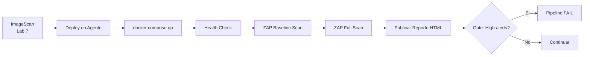

---
tags:
  - lab
  - dast
  - owasp-zap
  - seguridad-dinamica
---

# Lab 8 -- DAST con OWASP ZAP

<div class="lab-meta" markdown>
<div class="lab-meta-item" markdown>
<strong>Duracion</strong>
45-60 minutos
</div>
<div class="lab-meta-item" markdown>
<strong>Nivel</strong>
Intermedio
</div>
<div class="lab-meta-item" markdown>
<strong>Herramientas</strong>
OWASP ZAP
</div>
<div class="lab-meta-item" markdown>
<strong>Resultado</strong>
Escaneo DAST integrado en el pipeline
</div>
</div>

!!! abstract "Objetivo"
    Desplegar la aplicacion vulnerable dentro del agente del pipeline usando Docker Compose, ejecutar un escaneo DAST (Dynamic Application Security Testing) con OWASP ZAP contra la aplicacion en ejecucion, y configurar gates basados en los hallazgos.

## Que vamos a construir

Hasta ahora todos nuestros analisis de seguridad han sido **estaticos**: revisamos codigo fuente (SAST), dependencias (SCA) e imagenes (Trivy). El analisis dinamico ejecuta la aplicacion y la ataca desde fuera, como lo haria un adversario real.



## Por que DAST es diferente

| Aspecto | SAST/SCA | DAST |
|---------|----------|------|
| Que analiza | Codigo fuente / dependencias | Aplicacion en ejecucion |
| Cuando se ejecuta | Sin ejecutar la app | Con la app corriendo |
| Que encuentra | Patrones de codigo inseguro | Vulnerabilidades explotables |
| Falsos positivos | Mas frecuentes | Menos (confirma explotabilidad) |
| Cobertura | Todo el codigo | Solo endpoints accesibles |

## Pasos del laboratorio

<div class="steps" markdown>

1. **[Desplegar Staging en Pipeline](step1.md)** -- Agregar un paso que levante la aplicacion vulnerable con Docker Compose dentro del agente, verificar que responde en localhost.

2. **[Escaneo ZAP](step2.md)** -- Agregar el stage DAST al pipeline. Ejecutar ZAP en modo baseline y full scan contra la aplicacion. Publicar el reporte HTML como artefacto.

3. **[Analisis y Ajuste](step3.md)** -- Interpretar el reporte ZAP, configurar reglas de exclusion para falsos positivos, y establecer el gate de seguridad.

</div>

## Prerequisitos

- Lab 7 completado (pipeline con stages hasta ImageScan)
- `vulnerable-app/docker-compose.yml` configurado
- La aplicacion vulnerable responde en el puerto 8080

!!! info "ZAP encuentra vulnerabilidades reales"
    Nuestra aplicacion vulnerable tiene SQL Injection, XSS reflejado, endpoints sin autenticacion y mas. ZAP detectara varias de estas vulnerabilidades al escanear la aplicacion en ejecucion.

## Arquitectura del pipeline

Al finalizar este lab:

```yaml title="vulnerable-app/.github/workflows/devsecops.yml (estructura acumulada)"
jobs:
  # job: Checkout           # Lab 1
  # job: SecretsDetection   # Lab 3
  # job: SAST               # Lab 4
  # job: SCA                # Lab 5
  # job: Build              # Lab 6
  # job: ImageScan          # Lab 7
  # job: DAST               # Lab 8 (NUEVO)
  # # job: IaCScan          # Lab 9
  # # job: DeployStaging    # Lab 10
  # # job: DeployProduction # Lab 10
  # # job: Monitor          # Lab 11
```
