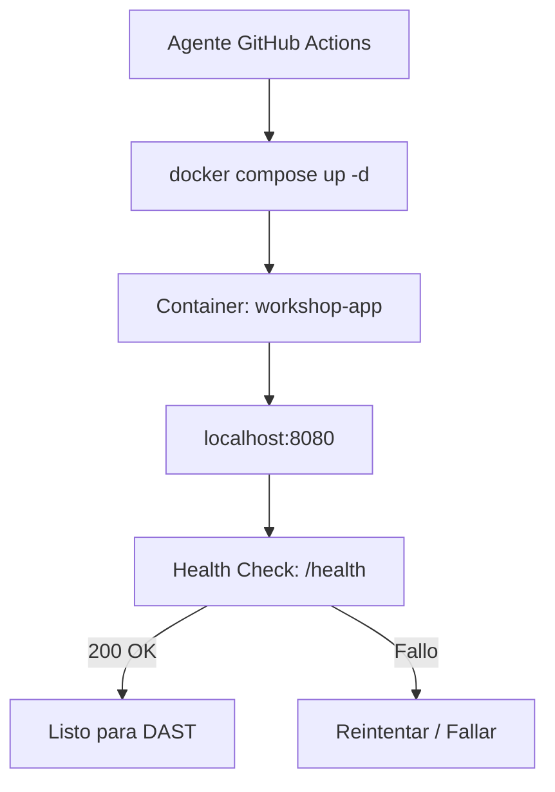

---
tags:
  - lab
  - dast
  - docker-compose
---

# Paso 1 -- Desplegar la Aplicacion en el Agente

!!! abstract "Objetivo"
    Agregar un paso al pipeline que levante la aplicacion vulnerable usando Docker Compose dentro del agente de GitHub Actions, y verificar que responde correctamente en localhost antes de ejecutar el escaneo DAST.

## Contexto

Para realizar un escaneo DAST necesitamos que la aplicacion este en ejecucion y accesible. En lugar de desplegar a un entorno externo (que agregarla complejidad y costos), levantamos la aplicacion **dentro del propio agente** del pipeline usando Docker Compose.



## 1.1 Revisar el docker-compose.yml

La aplicacion ya tiene un archivo Docker Compose listo:

```yaml title="vulnerable-app/docker-compose.yml"
services:
  app:
    build: .
    ports:
      - "8080:8080"
    environment:
      - FLASK_ENV=development
      - DATABASE_URL=sqlite:///app.db
    healthcheck:
      test: ["CMD", "curl", "-f", "http://localhost:8080/health"]
      interval: 10s
      timeout: 5s
      retries: 3
```

!!! info "Imagen vulnerable a proposito"
    Usamos el `Dockerfile` vulnerable (no el `Dockerfile.secure`) para que ZAP encuentre mas vulnerabilidades. En un pipeline real usarias la imagen segura.

## 1.2 Probar localmente (opcional)

```bash title="Probar Docker Compose localmente"
cd vulnerable-app/

# Levantar la aplicacion
docker compose up -d

# Esperar a que este lista
sleep 5

# Verificar health check
curl -s http://localhost:8080/health
# {"status": "ok"}

# Verificar endpoints
curl -s http://localhost:8080/
# {"app": "DevSecOps Vulnerable App", "version": "1.0.0", ...}

# Verificar que el search funciona (para que ZAP lo encuentre)
curl -s "http://localhost:8080/search?q=test"

# Limpiar
docker compose down
```

## 1.3 Agregar el stage DAST al pipeline

Abre `vulnerable-app/.github/workflows/devsecops.yml` y agrega el stage `DAST` despues de `ImageScan`:

```yaml title="vulnerable-app/.github/workflows/devsecops.yml -- Stage DAST (inicio)"
  # ============================================================
  # Lab 8: DAST con OWASP ZAP
  # ============================================================
  # job: DAST
    name: 'DAST — OWASP ZAP'
    dependsOn: ImageScan
    jobs:
      # job: ZAPScan
        name: 'OWASP ZAP Scan'
        timeout-minutes: 30
        steps:
          - uses: actions/checkout@v4

          # --- Levantar la aplicacion con Docker Compose ---
          - run: |
              echo "=== Levantando aplicacion para DAST ==="
              cd vulnerable-app/

              # Construir y levantar
              docker compose up -d --build

              echo "Esperando a que la aplicacion este lista..."

              # Esperar hasta 60 segundos con reintentos
              MAX_RETRIES=12
              RETRY_COUNT=0
              until curl -sf http://localhost:8080/health > /dev/null 2>&1; do
                RETRY_COUNT=$((RETRY_COUNT + 1))
                if [ $RETRY_COUNT -ge $MAX_RETRIES ]; then
                  echo "ERROR: La aplicacion no respondio despues de ${MAX_RETRIES} intentos"
                  docker compose logs
                  exit 1
                fi
                echo "  Intento ${RETRY_COUNT}/${MAX_RETRIES} - esperando 5s..."
                sleep 5
              done

              echo ""
              echo "=== Aplicacion lista ==="
              curl -s http://localhost:8080/health
              echo ""
              curl -s http://localhost:8080/
            name: 'Docker Compose Up + Health Check'

          # --- Verificar endpoints disponibles ---
          - run: |
              echo "=== Verificando endpoints de la aplicacion ==="
              echo ""

              echo "--- GET / ---"
              curl -s http://localhost:8080/ | python3 -m json.tool
              echo ""

              echo "--- GET /health ---"
              curl -s http://localhost:8080/health | python3 -m json.tool
              echo ""

              echo "--- GET /api/users ---"
              curl -s http://localhost:8080/api/users | python3 -m json.tool
              echo ""

              echo "--- GET /search?q=test ---"
              curl -s "http://localhost:8080/search?q=test" | head -20
              echo ""

              echo "=== Todos los endpoints responden ==="
            name: 'Verificar endpoints'
```

## 1.4 Entender el flujo

El paso clave es el health check con reintentos. Docker Compose levanta el contenedor, pero la aplicacion Flask tarda unos segundos en inicializar la base de datos y empezar a escuchar. El bucle `until` reintenta cada 5 segundos hasta un maximo de 60 segundos.

| Paso | Que hace | Por que |
|------|----------|---------|
| `docker compose up -d` | Levanta el contenedor en background | No bloquea el script |
| `--build` | Reconstruye la imagen | Asegura que usamos el codigo mas reciente |
| Health check loop | Espera a que `/health` responda 200 | La app necesita tiempo para iniciar |
| `docker compose logs` | Muestra logs si falla | Diagnostico en caso de error |

!!! warning "Timeout del job"
    Configuramos `timeout-minutes: 30` en el job porque el escaneo ZAP puede tardar. Si la aplicacion no levanta en 60 segundos, el pipeline falla inmediatamente sin esperar al timeout.

## 1.5 Limpieza al final del stage

Es importante detener Docker Compose al finalizar, incluso si el escaneo falla. Esto se agrega al final del stage (lo veremos completo en el Paso 2):

```yaml title="Limpieza (se agrega al final del stage)"
          # --- Limpiar Docker Compose ---
          - run: |
              echo "=== Deteniendo aplicacion ==="
              cd vulnerable-app/
              docker compose down -v
              echo "Aplicacion detenida y volumenes eliminados"
            name: 'Docker Compose Down'
            if: always()
```

## 1.6 Verificar en GitHub Actions

1. Si haces commit solo con los pasos de deploy (sin ZAP aun), el pipeline deberia:
    - Levantar la aplicacion en Docker Compose
    - Pasar el health check
    - Mostrar la respuesta de cada endpoint en los logs
2. Verifica en los logs que ves `{"status": "ok"}` del health check

!!! success "Paso Completado"
    La aplicacion vulnerable esta corriendo dentro del agente del pipeline y responde en `http://localhost:8080`. En el siguiente paso agregaremos el escaneo OWASP ZAP contra estos endpoints.

---

<div style="display: flex; justify-content: space-between; margin-top: 2rem;">
  <a href="index.md" class="md-button">Anterior: Introduccion</a>
  <a href="step2.md" class="md-button md-button--primary">Siguiente: Escaneo ZAP</a>
</div>
