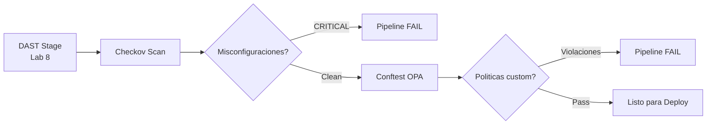

---
tags:
  - lab
  - iac
  - checkov
  - conftest
  - opa
---

# Lab 9 -- Escaneo de Infraestructura como Codigo

<div class="lab-meta" markdown>
<div class="lab-meta-item" markdown>
<strong>Duracion</strong>
45-60 minutos
</div>
<div class="lab-meta-item" markdown>
<strong>Nivel</strong>
Intermedio
</div>
<div class="lab-meta-item" markdown>
<strong>Herramientas</strong>
Checkov + Conftest (OPA)
</div>
<div class="lab-meta-item" markdown>
<strong>Resultado</strong>
Escaneo de Terraform integrado en el pipeline
</div>
</div>

!!! abstract "Objetivo"
    Escanear los archivos Terraform de `vulnerable-app/infrastructure/` con Checkov para detectar misconfiguraciones de seguridad, integrar el escaneo en el pipeline, y escribir politicas personalizadas con OPA/Conftest para validar requisitos especificos de la organizacion.

## Que vamos a construir

La Infraestructura como Codigo (IaC) define los recursos cloud de forma declarativa. Si el Terraform tiene misconfiguraciones, esas misconfiguraciones se despliegan automaticamente. El escaneo de IaC detecta estos problemas **antes** del `terraform apply`.



## Vulnerabilidades en nuestra infraestructura

El archivo `vulnerable-app/infrastructure/main.tf` contiene misconfiguraciones intencionales:

| Recurso | Problema | ID Checkov |
|---------|----------|------------|
| Storage Account | Acceso publico habilitado | CKV_AZURE_35 |
| Storage Account | HTTPS no forzado | CKV_AZURE_3 |
| Container Registry | Admin habilitado | CKV_AZURE_137 |
| Web App | HTTPS no forzado | CKV_AZURE_14 |
| NSG | SSH abierto a 0.0.0.0/0 | CKV_AZURE_9 |
| NSG | Todos los puertos abiertos | CKV_AZURE_77 |
| Todos los recursos | Sin tags de compliance | CKV_AZURE_tag |

## Pasos del laboratorio

<div class="steps" markdown>

1. **[Checkov Local](step1.md)** -- Instalar Checkov localmente, escanear `vulnerable-app/infrastructure/main.tf`, analizar los hallazgos de acceso publico, NSG abierto, admin habilitado y falta de HTTPS.

2. **[Anadir Stage IaC al Pipeline](step2.md)** -- Agregar el stage `IaCScan` al pipeline usando Checkov en Docker, configurar el gate para fallar en CRITICAL, y publicar el reporte SARIF.

3. **[Politicas OPA con Conftest](step3.md)** -- Escribir politicas personalizadas con OPA/Conftest (tags obligatorios, HTTPS forzado) e integrar Conftest como paso adicional en el pipeline.

</div>

## Prerequisitos

- Lab 8 completado (pipeline con stages hasta DAST)
- Archivos Terraform en `vulnerable-app/infrastructure/`
- Python 3.x instalado (para Checkov local)

!!! info "No necesitas cuenta de Azure"
    El escaneo de IaC analiza los archivos Terraform de forma estatica, sin ejecutar `terraform plan` ni `terraform apply`. No necesitas credenciales de Azure para este laboratorio.

## Arquitectura del pipeline

Al finalizar este lab:

```yaml title="vulnerable-app/azure-pipelines.yml (estructura acumulada)"
stages:
  - stage: Checkout           # Lab 1
  - stage: SecretsDetection   # Lab 3
  - stage: SAST               # Lab 4
  - stage: SCA                # Lab 5
  - stage: Build              # Lab 6
  - stage: ImageScan          # Lab 7
  - stage: DAST               # Lab 8
  - stage: IaCScan            # Lab 9 (NUEVO)
  # - stage: DeployStaging    # Lab 10
  # - stage: DeployProduction # Lab 10
  # - stage: Monitor          # Lab 11
```
