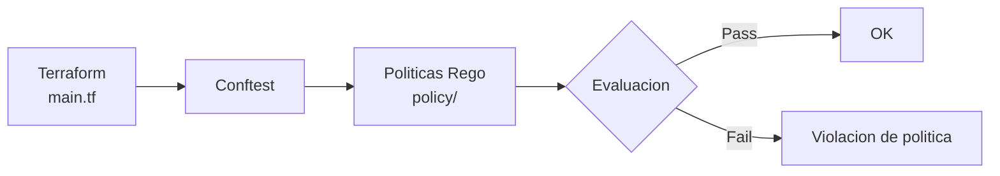

---
tags:
  - lab
  - opa
  - conftest
  - rego
  - terraform
---

# Paso 3 -- Politicas OPA con Conftest

!!! abstract "Objetivo"
    Escribir politicas personalizadas con OPA (Open Policy Agent) y Conftest para validar requisitos especificos de la organizacion: todos los recursos deben tener tags y HTTPS debe estar forzado. Integrar Conftest como paso adicional en el pipeline.

## Contexto

Checkov tiene reglas predefinidas, pero cada organizacion tiene requisitos unicos. OPA (Open Policy Agent) permite escribir politicas en lenguaje Rego que validan exactamente lo que tu equipo necesita. Conftest es una herramienta que usa OPA para validar archivos de configuracion (Terraform, Kubernetes, etc.).



## 3.1 Instalar Conftest localmente

```bash title="Instalar Conftest"
# macOS
brew install conftest

# Linux
LATEST_VERSION=$(wget -qO - "https://api.github.com/repos/open-policy-agent/conftest/releases/latest" | grep -Po '"tag_name": "v\K[0-9.]+')
wget -qO - "https://github.com/open-policy-agent/conftest/releases/download/v${LATEST_VERSION}/conftest_${LATEST_VERSION}_Linux_x86_64.tar.gz" | tar xz
sudo mv conftest /usr/local/bin/

# Verificar
conftest --version
```

## 3.2 Crear la estructura de politicas

```bash title="Crear estructura de politicas"
mkdir -p vulnerable-app/policy
```

## 3.3 Politica: Todos los recursos deben tener tags

```rego title="vulnerable-app/policy/tags.rego"
package main

# Regla: Todos los recursos de Azure deben tener tags
# Los tags son esenciales para:
# - Asignacion de costos
# - Identificacion de propietario
# - Clasificacion de seguridad
# - Automatizacion de operaciones

# Tags obligatorios
required_tags := {"environment", "owner", "project"}

# Tipos de recursos que deben tener tags
taggable_resources := [
    "azurerm_storage_account",
    "azurerm_container_registry",
    "azurerm_linux_web_app",
    "azurerm_network_security_group",
    "azurerm_resource_group",
    "azurerm_service_plan",
]

# Denegar recursos sin tags
deny[msg] {
    resource := input.resource[type][name]
    type == taggable_resources[_]
    not resource.tags
    msg := sprintf(
        "TAGS_REQUIRED: El recurso '%s.%s' no tiene tags definidos. Tags requeridos: %v",
        [type, name, required_tags]
    )
}

# Denegar recursos con tags incompletos
deny[msg] {
    resource := input.resource[type][name]
    type == taggable_resources[_]
    resource.tags
    required := required_tags[_]
    not resource.tags[required]
    msg := sprintf(
        "TAG_MISSING: El recurso '%s.%s' no tiene el tag obligatorio '%s'",
        [type, name, required]
    )
}
```

## 3.4 Politica: HTTPS debe estar forzado

```rego title="vulnerable-app/policy/https.rego"
package main

# Regla: HTTPS debe estar forzado en todos los servicios web
# El trafico sin cifrar expone datos sensibles en transito

# Storage accounts deben requerir HTTPS
deny[msg] {
    resource := input.resource.azurerm_storage_account[name]
    resource.enable_https_traffic_only == false
    msg := sprintf(
        "HTTPS_REQUIRED: Storage account '%s' debe tener enable_https_traffic_only = true",
        [name]
    )
}

# Web apps deben forzar HTTPS
deny[msg] {
    resource := input.resource.azurerm_linux_web_app[name]
    resource.https_only == false
    msg := sprintf(
        "HTTPS_REQUIRED: Web app '%s' debe tener https_only = true",
        [name]
    )
}

# ACR no debe tener admin habilitado
deny[msg] {
    resource := input.resource.azurerm_container_registry[name]
    resource.admin_enabled == true
    msg := sprintf(
        "ACR_ADMIN_DISABLED: Container registry '%s' no debe tener admin_enabled = true. Usar managed identity.",
        [name]
    )
}
```

## 3.5 Politica: Reglas de red seguras

```rego title="vulnerable-app/policy/network.rego"
package main

# Regla: No se permite acceso SSH/RDP abierto desde Internet
# source_address_prefix = "*" con puertos 22 o 3389 es peligroso

# No permitir SSH abierto
deny[msg] {
    resource := input.resource.azurerm_network_security_group[name]
    rule := resource.security_rule[_]
    rule.access == "Allow"
    rule.direction == "Inbound"
    rule.source_address_prefix == "*"
    rule.destination_port_range == "22"
    msg := sprintf(
        "OPEN_SSH: NSG '%s' tiene SSH (puerto 22) abierto a Internet. Restringir source_address_prefix.",
        [name]
    )
}

# No permitir todos los puertos abiertos
deny[msg] {
    resource := input.resource.azurerm_network_security_group[name]
    rule := resource.security_rule[_]
    rule.access == "Allow"
    rule.direction == "Inbound"
    rule.source_address_prefix == "*"
    rule.destination_port_range == "*"
    msg := sprintf(
        "OPEN_ALL_PORTS: NSG '%s' tiene TODOS los puertos abiertos a Internet. Esto es inaceptable.",
        [name]
    )
}

# Storage no debe tener acceso publico a blobs
deny[msg] {
    resource := input.resource.azurerm_storage_account[name]
    resource.allow_nested_items_to_be_public == true
    msg := sprintf(
        "PUBLIC_BLOB: Storage account '%s' tiene acceso publico a blobs habilitado. Desactivar allow_nested_items_to_be_public.",
        [name]
    )
}
```

## 3.6 Probar las politicas localmente

Conftest necesita los archivos Terraform convertidos a JSON. Usamos `terraform` o `conftest` directamente con archivos HCL:

```bash title="Probar politicas con Conftest"
cd vulnerable-app/

# Conftest puede leer HCL directamente con el parser de Terraform
conftest test infrastructure/main.tf --policy policy/ --parser hcl2

# Salida esperada:
# FAIL - infrastructure/main.tf - main - TAGS_REQUIRED: El recurso 'azurerm_storage_account.data' no tiene tags definidos. Tags requeridos: {"environment", "owner", "project"}
# FAIL - infrastructure/main.tf - main - TAGS_REQUIRED: El recurso 'azurerm_container_registry.acr' no tiene tags definidos. Tags requeridos: {"environment", "owner", "project"}
# FAIL - infrastructure/main.tf - main - HTTPS_REQUIRED: Storage account 'data' debe tener enable_https_traffic_only = true
# FAIL - infrastructure/main.tf - main - HTTPS_REQUIRED: Web app 'app' debe tener https_only = true
# FAIL - infrastructure/main.tf - main - ACR_ADMIN_DISABLED: Container registry 'acr' no debe tener admin_enabled = true. Usar managed identity.
# FAIL - infrastructure/main.tf - main - OPEN_SSH: NSG 'nsg' tiene SSH (puerto 22) abierto a Internet.
# FAIL - infrastructure/main.tf - main - OPEN_ALL_PORTS: NSG 'nsg' tiene TODOS los puertos abiertos a Internet.
# FAIL - infrastructure/main.tf - main - PUBLIC_BLOB: Storage account 'data' tiene acceso publico a blobs habilitado.
#
# 8 tests, 0 passed, 0 warnings, 8 failures
```

!!! tip "Alternativa: convertir a JSON con terraform"
    Si `conftest` no parsea HCL correctamente, puedes convertir el plan a JSON:
    ```bash
    cd infrastructure/
    terraform init
    terraform plan -out=tfplan
    terraform show -json tfplan > tfplan.json
    conftest test tfplan.json --policy ../policy/
    ```

## 3.7 Integrar Conftest en el pipeline

Agrega los steps de Conftest al job del stage `IaCScan`:

```yaml title="vulnerable-app/azure-pipelines.yml -- Conftest en el pipeline (agregar al stage IaCScan)"
      - job: ConftestScan
        displayName: 'Conftest OPA Policy Check'
        dependsOn: CheckovScan
        condition: succeededOrFailed()
        steps:
          - checkout: self

          # --- Instalar Conftest ---
          - script: |
              echo "=== Instalando Conftest ==="
              CONFTEST_VERSION="0.46.0"
              wget -qO - "https://github.com/open-policy-agent/conftest/releases/download/v${CONFTEST_VERSION}/conftest_${CONFTEST_VERSION}_Linux_x86_64.tar.gz" | tar xz
              sudo mv conftest /usr/local/bin/
              conftest --version
            displayName: 'Instalar Conftest'

          # --- Ejecutar politicas OPA ---
          - script: |
              echo "=== Conftest: Evaluando politicas OPA ==="
              echo "Terraform: vulnerable-app/infrastructure/main.tf"
              echo "Politicas: vulnerable-app/policy/"
              echo ""

              cd $(Build.SourcesDirectory)/vulnerable-app

              conftest test \
                infrastructure/main.tf \
                --policy policy/ \
                --parser hcl2 \
                --output table

              EXIT_CODE=$?

              echo ""
              echo "Exit code: $EXIT_CODE"

              if [ $EXIT_CODE -ne 0 ]; then
                echo "##vso[task.logissue type=warning]Conftest encontro violaciones de politica"
              fi
            displayName: 'Conftest Policy Check (tabla)'
            continueOnError: true

          # --- Conftest: reporte JSON ---
          - script: |
              cd $(Build.SourcesDirectory)/vulnerable-app

              conftest test \
                infrastructure/main.tf \
                --policy policy/ \
                --parser hcl2 \
                --output json > $(Build.ArtifactStagingDirectory)/conftest-report.json 2>&1 || true

              echo "Reporte Conftest generado"
            displayName: 'Conftest Policy Check (JSON)'
            continueOnError: true

          # --- Publicar reporte ---
          - task: PublishBuildArtifacts@1
            displayName: 'Publicar reporte Conftest'
            inputs:
              PathtoPublish: '$(Build.ArtifactStagingDirectory)/conftest-report.json'
              ArtifactName: 'conftest-report'
              publishLocation: 'Container'
            condition: always()
```

## 3.8 Stage IaCScan completo (referencia)

```yaml title="vulnerable-app/azure-pipelines.yml -- Stage IaCScan completo"
  - stage: IaCScan
    displayName: 'IaC Scan — Checkov + Conftest'
    dependsOn: DAST
    jobs:
      # --- Job 1: Checkov ---
      - job: CheckovScan
        displayName: 'Checkov Terraform Scan'
        steps:
          - checkout: self

          - script: |
              docker run --rm \
                -v $(Build.SourcesDirectory)/vulnerable-app/infrastructure:/tf:ro \
                -w /tf \
                bridgecrew/checkov \
                  -d /tf \
                  --framework terraform \
                  --output cli \
                  --compact
            displayName: 'Checkov Scan (tabla)'
            continueOnError: true

          - script: |
              docker run --rm \
                -v $(Build.SourcesDirectory)/vulnerable-app/infrastructure:/tf:ro \
                -v $(Build.ArtifactStagingDirectory):/output \
                -w /tf \
                bridgecrew/checkov \
                  -d /tf \
                  --framework terraform \
                  --output json \
                  --output sarif \
                  --output-file-path /output,/output
            displayName: 'Checkov Scan (JSON + SARIF)'
            continueOnError: true

          - script: |
              docker run --rm \
                -v $(Build.SourcesDirectory)/vulnerable-app/infrastructure:/tf:ro \
                -w /tf \
                bridgecrew/checkov \
                  -d /tf \
                  --framework terraform \
                  --check-severity HIGH \
                  --compact
            displayName: 'Checkov Gate (HIGH)'
            continueOnError: true

          - task: PublishBuildArtifacts@1
            displayName: 'Publicar reportes Checkov'
            inputs:
              PathtoPublish: '$(Build.ArtifactStagingDirectory)'
              ArtifactName: 'checkov-reports'
              publishLocation: 'Container'
            condition: always()

      # --- Job 2: Conftest ---
      - job: ConftestScan
        displayName: 'Conftest OPA Policy Check'
        dependsOn: CheckovScan
        condition: succeededOrFailed()
        steps:
          - checkout: self

          - script: |
              CONFTEST_VERSION="0.46.0"
              wget -qO - "https://github.com/open-policy-agent/conftest/releases/download/v${CONFTEST_VERSION}/conftest_${CONFTEST_VERSION}_Linux_x86_64.tar.gz" | tar xz
              sudo mv conftest /usr/local/bin/
              conftest --version
            displayName: 'Instalar Conftest'

          - script: |
              cd $(Build.SourcesDirectory)/vulnerable-app
              conftest test \
                infrastructure/main.tf \
                --policy policy/ \
                --parser hcl2 \
                --output table
            displayName: 'Conftest Policy Check'
            continueOnError: true

          - script: |
              cd $(Build.SourcesDirectory)/vulnerable-app
              conftest test \
                infrastructure/main.tf \
                --policy policy/ \
                --parser hcl2 \
                --output json > $(Build.ArtifactStagingDirectory)/conftest-report.json 2>&1 || true
            displayName: 'Conftest Report (JSON)'

          - task: PublishBuildArtifacts@1
            displayName: 'Publicar reporte Conftest'
            inputs:
              PathtoPublish: '$(Build.ArtifactStagingDirectory)/conftest-report.json'
              ArtifactName: 'conftest-report'
              publishLocation: 'Container'
            condition: always()
```

## 3.9 Checkov vs Conftest: cuando usar cada uno

| Aspecto | Checkov | Conftest (OPA) |
|---------|---------|----------------|
| **Reglas** | 1000+ predefinidas | Tu las escribes |
| **Lenguaje** | Python (interno) | Rego |
| **Curva de aprendizaje** | Baja (funciona out-of-the-box) | Media (necesitas aprender Rego) |
| **Personalizacion** | Custom checks en Python | Politicas Rego completas |
| **Mejor para** | Compliance estandar (CIS, SOC2) | Requisitos especificos de la org |
| **Resultado** | PASSED/FAILED por check | PASS/FAIL/WARN por politica |

!!! tip "Usa ambos"
    Checkov cubre las best practices generales. Conftest cubre las politicas especificas de tu organizacion. Juntos proporcionan cobertura completa.

## 3.10 Resumen de seguridad del Lab 9

| Control | Herramienta | Politicas |
|---------|-------------|-----------|
| Best practices Azure | Checkov | CKV_AZURE_* (1000+ reglas) |
| Tags obligatorios | Conftest/OPA | `policy/tags.rego` |
| HTTPS forzado | Conftest/OPA | `policy/https.rego` |
| Red segura | Conftest/OPA | `policy/network.rego` |
| Gate automatico | Pipeline | Fail en HIGH/CRITICAL |
| Reportes | SARIF + JSON | Artefactos descargables |

!!! success "Paso Completado"
    Has completado el Lab 9. Tu pipeline ahora escanea la infraestructura como codigo con Checkov (reglas predefinidas) y Conftest (politicas personalizadas). Las misconfiguraciones se detectan antes de que el Terraform se aplique en cualquier entorno.

---

<div style="display: flex; justify-content: space-between; margin-top: 2rem;">
  <a href="step2.md" class="md-button">Anterior: Stage IaC en Pipeline</a>
  <a href="../lab10-deploy/index.md" class="md-button md-button--primary">Siguiente: Lab 10 -- Deploy</a>
</div>
