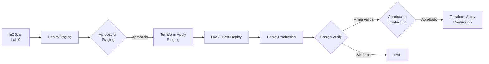

---
tags:
  - lab
  - deploy
  - terraform
  - environments
  - approvals
---

# Lab 10 -- Deploy con Aprobaciones

<div class="lab-meta" markdown>
<div class="lab-meta-item" markdown>
<strong>Duracion</strong>
45-60 minutos
</div>
<div class="lab-meta-item" markdown>
<strong>Nivel</strong>
Avanzado
</div>
<div class="lab-meta-item" markdown>
<strong>Herramientas</strong>
Terraform + Azure DevOps Environments
</div>
<div class="lab-meta-item" markdown>
<strong>Resultado</strong>
Pipeline completo con despliegue aprobado
</div>
</div>

!!! abstract "Objetivo"
    Crear entornos Staging y Production en Azure DevOps con gates de aprobacion, agregar los stages de despliegue al pipeline usando Terraform, y verificar la firma de la imagen con Cosign antes de desplegar a produccion.

## Que vamos a construir

Este laboratorio une todo lo que hemos construido: los stages de seguridad (Labs 3-9) alimentan un proceso de despliegue controlado con aprobaciones humanas, verificacion de firma y despliegue progresivo (staging -> produccion).



## Flujo de aprobaciones

| Entorno | Aprobador | Condiciones | Timeout |
|---------|-----------|-------------|---------|
| **Staging** | Lider tecnico | Todos los stages de seguridad pasan | 24 horas |
| **Production** | Miembro del equipo de seguridad | Staging OK + Firma verificada | 48 horas |

## Pasos del laboratorio

<div class="steps" markdown>

1. **[Crear Environments](step1.md)** -- Crear los entornos Staging y Production en Azure DevOps, configurar las gates de aprobacion con el equipo de seguridad como aprobador de produccion.

2. **[Stages de Deploy](step2.md)** -- Agregar los stages `DeployStaging` y `DeployProduction` al pipeline usando Terraform para desplegar. El stage de produccion verifica la firma de la imagen con Cosign antes de desplegar.

3. **[Pipeline Completo](step3.md)** -- Ejecutar el pipeline completo de extremo a extremo. Aprobar staging, observar DAST, aprobar produccion, verificar que la aplicacion esta corriendo.

</div>

## Prerequisitos

- Labs 7-9 completados (pipeline con todos los stages de seguridad)
- Par de claves Cosign configurado (Lab 7)
- Azure Container Registry con la imagen firmada
- Permisos de administrador en el proyecto de Azure DevOps

!!! warning "Permisos necesarios"
    Para crear environments y configurar aprobaciones necesitas el rol **Project Administrator** o **Environment Administrator** en Azure DevOps.

## Arquitectura del pipeline

Al finalizar este lab:

```yaml title="vulnerable-app/azure-pipelines.yml (estructura acumulada)"
stages:
  - stage: Checkout           # Lab 1
  - stage: SecretsDetection   # Lab 3
  - stage: SAST               # Lab 4
  - stage: SCA                # Lab 5
  - stage: Build              # Lab 6
  - stage: ImageScan          # Lab 7
  - stage: DAST               # Lab 8
  - stage: IaCScan            # Lab 9
  - stage: DeployStaging      # Lab 10 (NUEVO)
  - stage: DeployProduction   # Lab 10 (NUEVO)
  # - stage: Monitor          # Lab 11
```
