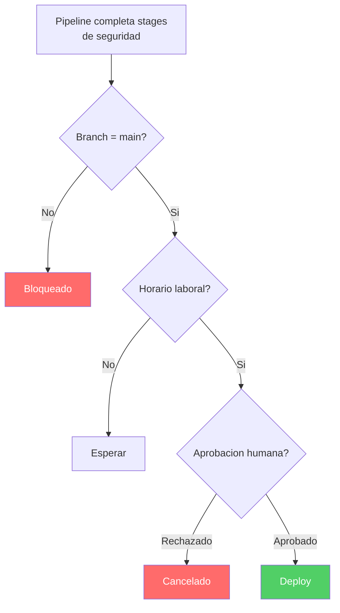

---
tags:
  - lab
  - environments
  - approvals
  - azure-devops
---

# Paso 1 -- Crear Environments en Azure DevOps

!!! abstract "Objetivo"
    Crear los entornos Staging y Production en Azure DevOps y configurar gates de aprobacion para que un miembro del equipo de seguridad deba aprobar el despliegue a produccion.

## Contexto

Los Environments de Azure DevOps son la forma nativa de representar entornos de despliegue (dev, staging, production). Permiten:

- **Aprobaciones**: un humano debe aprobar antes de que el stage se ejecute
- **Checks**: validaciones automaticas (ej: Business Hours, Branch Control)
- **Historial**: registro de todos los despliegues a cada entorno
- **Seguridad**: permisos granulares sobre quien puede desplegar donde

## 1.1 Crear el entorno Staging

1. Ve a **Pipelines** > **Environments** en Azure DevOps
2. Click en **New environment**
3. Configura:

| Campo | Valor |
|-------|-------|
| Name | `Staging` |
| Description | `Entorno de staging para validacion pre-produccion` |
| Resource | None (lo configuraremos despues) |

4. Click en **Create**

## 1.2 Configurar aprobacion en Staging

1. En el entorno **Staging**, click en los tres puntos (**...**) > **Approvals and checks**
2. Click en **+** > **Approvals**
3. Configura:

| Campo | Valor |
|-------|-------|
| Approvers | Tu usuario (o el lider tecnico del equipo) |
| Instructions | `Verificar que todos los stages de seguridad han pasado. Revisar reportes de Trivy, ZAP y Checkov.` |
| Timeout | `24 hours` |
| Allow approvers to approve their own runs | Activar (para el workshop) |

4. Click en **Create**

!!! tip "Aprobar tus propios runs"
    En el workshop activamos "Allow approvers to approve their own runs" para agilizar. En produccion real, el que ejecuta el pipeline no deberia ser el mismo que aprueba.

## 1.3 Crear el entorno Production

1. Ve a **Pipelines** > **Environments**
2. Click en **New environment**
3. Configura:

| Campo | Valor |
|-------|-------|
| Name | `Production` |
| Description | `Entorno de produccion. Requiere aprobacion del equipo de seguridad.` |
| Resource | None |

4. Click en **Create**

## 1.4 Configurar aprobacion en Production

1. En el entorno **Production**, click en **...** > **Approvals and checks**
2. Click en **+** > **Approvals**
3. Configura:

| Campo | Valor |
|-------|-------|
| Approvers | Equipo de seguridad (o tu usuario para el workshop) |
| Instructions | `OBLIGATORIO: Verificar que la imagen esta firmada con Cosign. Revisar todos los reportes de seguridad. Confirmar que DAST no encontro vulnerabilidades High sin mitigacion.` |
| Minimum number of approvers | `1` |
| Timeout | `48 hours` |
| Allow approvers to approve their own runs | Activar (solo para workshop) |

4. Click en **Create**

## 1.5 Agregar checks adicionales (opcional)

Azure DevOps ofrece otros checks que puedes agregar:

### Branch Control

Solo permite despliegues desde la rama `main`:

1. En el entorno **Production** > **Approvals and checks**
2. Click en **+** > **Branch control**
3. Configura: `refs/heads/main`
4. Verificar "Verify branch protection"

### Business Hours

Solo permite despliegues en horario laboral:

1. Click en **+** > **Business Hours**
2. Configura: Lunes-Viernes, 09:00-18:00, timezone Europe/Madrid



## 1.6 Verificar la configuracion

1. Ve a **Pipelines** > **Environments**
2. Deberias ver dos entornos: **Staging** y **Production**
3. Cada uno con su icono de aprobacion (candado)
4. Click en cada entorno para verificar los checks configurados

Deberias ver algo asi en la interfaz:

```text title="Environments en Azure DevOps"
Environments
+------------------+-------------------+----------------+
| Name             | Checks            | Last deployed  |
+------------------+-------------------+----------------+
| Staging          | 1 Approval        | Never          |
| Production       | 1 Approval        | Never          |
|                  | (+ Branch Control)| (si lo config) |
+------------------+-------------------+----------------+
```

## 1.7 Permisos de entornos

Configura los permisos para que solo el equipo adecuado pueda gestionar cada entorno:

1. En cada entorno, click en **...** > **Security**
2. Para **Staging**:
    - `[Project]\Contributors` > Reader
    - `[Project]\Project Administrators` > Administrator
3. Para **Production**:
    - `[Project]\Contributors` > Reader (solo ver, no modificar)
    - `[Project]\Security Team` > User (puede aprobar)
    - `[Project]\Project Administrators` > Administrator

!!! warning "Principio de minimo privilegio"
    En produccion real, los desarrolladores no deberian tener permisos para crear ni modificar checks en el entorno de Production. Solo el equipo de seguridad y los administradores.

!!! success "Paso Completado"
    Has creado los entornos Staging y Production con gates de aprobacion. En el siguiente paso los referenciaremos desde los stages de deploy en el pipeline.

---

<div style="display: flex; justify-content: space-between; margin-top: 2rem;">
  <a href="index.md" class="md-button">Anterior: Introduccion</a>
  <a href="step2.md" class="md-button md-button--primary">Siguiente: Stages de Deploy</a>
</div>
