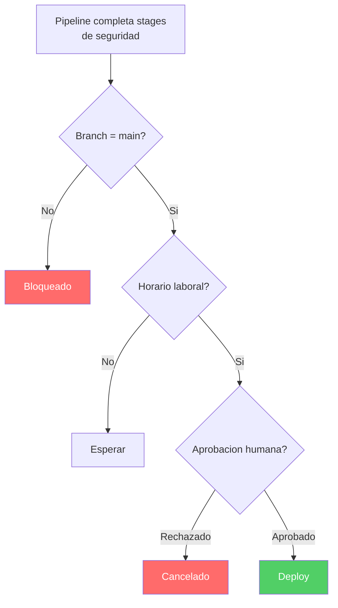

---
tags:
  - lab
  - environments
  - approvals
  - github-actions
---

# Paso 1 -- Crear Environments en GitHub Actions

!!! abstract "Objetivo"
    Crear los entornos Staging y Production en GitHub Actions y configurar gates de aprobacion para que un miembro del equipo de seguridad deba aprobar el despliegue a produccion.

## Contexto

Los Environments de GitHub Actions son la forma nativa de representar entornos de despliegue (dev, staging, production). Permiten:

- **Aprobaciones**: un humano debe aprobar antes de que el stage se ejecute
- **Checks**: validaciones automaticas (ej: Business Hours, Branch Control)
- **Historial**: registro de todos los despliegues a cada entorno
- **Seguridad**: permisos granulares sobre quien puede desplegar donde

## 1.1 Crear el entorno Staging

1. Ve a **Settings** > **Environments** en tu repositorio de GitHub
2. Click en **New environment**
3. Escribe el nombre:

| Campo | Valor |
|-------|-------|
| Name | `staging` |

4. Click en **Configure environment**

## 1.2 Configurar aprobacion en Staging

1. En la pagina de configuracion del entorno **staging**, marca la casilla **Required reviewers**
2. Configura:

| Campo | Valor |
|-------|-------|
| Reviewers | Tu usuario (o el lider tecnico del equipo) |
| Timer | `1440` minutos (24 horas) |

3. Click en **Save protection rules**

!!! tip "Aprobar tus propios runs"
    En GitHub Actions, el usuario que activa el workflow puede aprobar su propio despliegue si esta en la lista de reviewers. En produccion real, asigna revisores diferentes al autor del push.

## 1.3 Crear el entorno Production

1. Ve a **Settings** > **Environments** en tu repositorio de GitHub
2. Click en **New environment**
3. Escribe el nombre:

| Campo | Valor |
|-------|-------|
| Name | `production` |

4. Click en **Configure environment**

## 1.4 Configurar aprobacion en Production

1. En la pagina de configuracion del entorno **production**, marca la casilla **Required reviewers**
2. Configura:

| Campo | Valor |
|-------|-------|
| Reviewers | Equipo de seguridad (o tu usuario para el workshop) |
| Timer | `2880` minutos (48 horas) |

3. Click en **Save protection rules**

!!! note "Instrucciones para revisores"
    Indica al equipo de seguridad que antes de aprobar deben: verificar que la imagen esta firmada con Cosign, revisar todos los reportes de seguridad, y confirmar que DAST no encontro vulnerabilidades High sin mitigacion.

## 1.5 Agregar checks adicionales (opcional)

GitHub Actions ofrece otros checks que puedes agregar:

### Deployment branches

Solo permite despliegues desde la rama `main`:

1. En el entorno **production**, en la seccion **Deployment branches and tags**
2. Cambia el dropdown de **All branches** a **Selected branches and tags**
3. Click en **Add deployment branch or tag rule**
4. Escribe `main` y selecciona la rama

### Wait timer (opcional)

Agrega un retraso antes del despliegue (simula ventana de mantenimiento):

1. En el entorno **production**, marca la casilla **Wait timer**
2. Configura el numero de minutos de espera (ej: 5 para el workshop)



## 1.6 Verificar la configuracion

1. Ve a **Settings** > **Environments** en tu repositorio de GitHub
2. Deberias ver dos entornos: **staging** y **production**
3. Cada uno con sus protection rules configuradas
4. Click en cada entorno para verificar las reglas

Deberias ver algo asi en la interfaz:

```text title="Environments en GitHub Settings"
Environments
+------------------+------------------------+
| Name             | Protection rules       |
+------------------+------------------------+
| staging          | Required reviewers     |
| production       | Required reviewers     |
|                  | Deployment branches    |
+------------------+------------------------+
```

## 1.7 Permisos de entornos

En GitHub, los permisos de entornos se gestionan a traves de los **Required reviewers** y los **Deployment branches**:

- **staging**: Solo los reviewers configurados pueden aprobar despliegues
- **production**: Solo los reviewers del equipo de seguridad pueden aprobar, y solo se permite deploy desde `main`

Para repositorios en organizaciones con GitHub Enterprise, puedes asignar **teams** como reviewers en lugar de usuarios individuales.

!!! warning "Principio de minimo privilegio"
    En produccion real, los desarrolladores no deberian tener permisos para crear ni modificar checks en el entorno de Production. Solo el equipo de seguridad y los administradores.

!!! success "Paso Completado"
    Has creado los entornos Staging y Production con gates de aprobacion. En el siguiente paso los referenciaremos desde los stages de deploy en el pipeline.

---

<div style="display: flex; justify-content: space-between; margin-top: 2rem;">
  <a href="index.md" class="md-button">Anterior: Introduccion</a>
  <a href="step2.md" class="md-button md-button--primary">Siguiente: Stages de Deploy</a>
</div>
