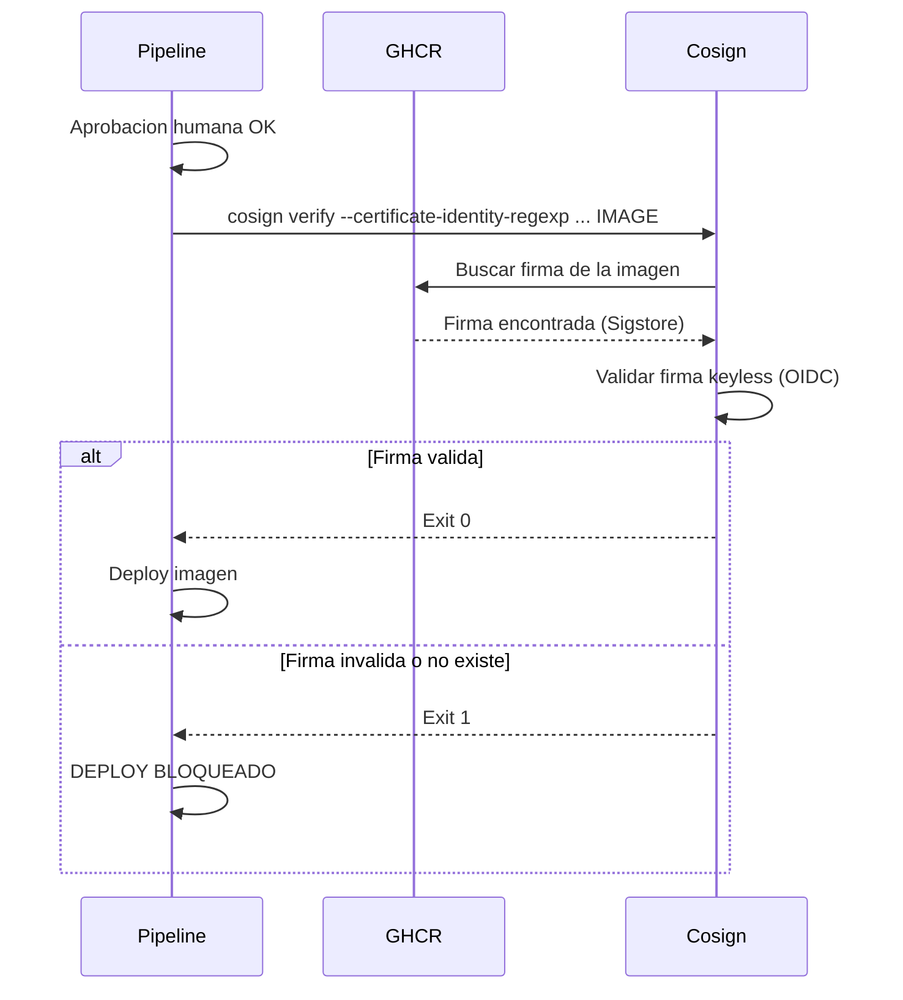

---
tags:
  - lab
  - deploy
  - terraform
  - cosign
---

# Paso 2 -- Stages de Deploy

!!! abstract "Objetivo"
    Agregar los stages `DeployStaging` y `DeployProduction` al pipeline, usando Terraform para desplegar la infraestructura y la aplicacion. El stage de produccion verifica la firma de la imagen con Cosign antes de desplegar.

## Contexto

Los jobs de deploy usan la clave `environment:` para conectarse con los Environments de GitHub configurados en el Paso 1. Esto activa automaticamente las protection rules (aprobaciones) antes de ejecutar el job.

## 2.1 Stage DeployStaging

```yaml title="vulnerable-app/.github/workflows/devsecops.yml -- Job deploy-staging"
  # ============================================================
  # Lab 10: Deploy con Aprobaciones
  # ============================================================

  # ── Job 7: Deploy a Staging ─────────────────────────────────
  deploy-staging:
    name: '7. Deploy a Staging'
    runs-on: ubuntu-latest
    needs: [image-scan, iac-scan]
    environment: staging    # Activa la aprobacion configurada
    steps:
      - uses: actions/checkout@v4

      # --- Deploy con Docker Compose ---
      - name: Deploy a Staging
        run: |
          echo "Desplegando a staging..."
          cd vulnerable-app && docker compose up -d --build
          sleep 10

      # --- Smoke test post-deploy ---
      - name: Verificar deploy staging
        run: |
          for i in $(seq 1 10); do
            STATUS=$(curl -s -o /dev/null -w "%{http_code}" http://localhost:8080/health 2>/dev/null || echo "000")
            if [ "$STATUS" = "200" ]; then
              echo "App lista en staging"
              exit 0
            fi
            echo "Intento $i/10 — status: $STATUS"
            sleep 5
          done
          echo "ERROR: App no respondio en staging"
          exit 1
```

## 2.2 Stage DeployProduction

El stage de produccion incluye un paso critico adicional: **verificar la firma de la imagen con Cosign** antes de desplegar.

```yaml title="vulnerable-app/.github/workflows/devsecops.yml -- Job deploy-production"
  # ── Job 9: Deploy a Produccion ──────────────────────────────
  deploy-production:
    name: '9. Deploy a Produccion'
    runs-on: ubuntu-latest
    needs: dast
    environment: production    # Activa la aprobacion del equipo de seguridad
    steps:
      - uses: actions/checkout@v4

      # --- Instalar Cosign ---
      - name: Instalar Cosign
        uses: sigstore/cosign-installer@v3

      # --- Login en GHCR ---
      - name: Login a GHCR
        uses: docker/login-action@v3
        with:
          registry: ${{ env.REGISTRY }}
          username: ${{ github.actor }}
          password: ${{ secrets.GITHUB_TOKEN }}

      # ============================================================
      # CRITICO: Verificar firma de imagen ANTES de desplegar
      # ============================================================
      - name: Verificar firma de imagen
        run: |
          cosign verify \
            --certificate-identity-regexp="https://github.com/${{ github.repository }}/*" \
            --certificate-oidc-issuer="https://token.actions.githubusercontent.com" \
            ${{ env.REGISTRY }}/${{ env.IMAGE_NAME }}:${{ env.IMAGE_TAG }}
          echo "Firma de imagen verificada correctamente"

      # --- Deploy a produccion ---
      - name: Deploy a Produccion
        run: |
          echo "Desplegando a produccion..."
          echo "### Deploy a Produccion" >> $GITHUB_STEP_SUMMARY
          echo "- **Imagen:** ${{ env.REGISTRY }}/${{ env.IMAGE_NAME }}:${{ env.IMAGE_TAG }}" >> $GITHUB_STEP_SUMMARY
          echo "- **Firma:** Verificada con Cosign keyless" >> $GITHUB_STEP_SUMMARY
```

## 2.3 El flujo de verificacion de firma

El paso de `Cosign Verify` es el control mas critico del stage de produccion:



!!! warning "Sin firma = Sin deploy"
    Si alguien sube una imagen directamente a GHCR sin pasar por el pipeline (que es el que firma con Cosign keyless via Sigstore), `cosign verify` fallara y el deploy se bloqueara. Esto protege contra:

    - Imagenes modificadas manualmente en GHCR
    - Imagenes subidas por pipelines no autorizados
    - Imagenes de registros externos no confiables

## 2.4 Variables y secretos necesarios

El pipeline usa las siguientes variables definidas a nivel de workflow en `env:`:

| Variable | Descripcion | Origen |
|----------|-------------|--------|
| `REGISTRY` | `ghcr.io` | Variable de entorno del workflow |
| `IMAGE_NAME` | `${{ github.repository }}/devsecops-vulnerable-app` | Variable de entorno del workflow |
| `IMAGE_TAG` | `${{ github.run_number }}` | Variable de entorno del workflow |
| `GITHUB_TOKEN` | Token automatico para autenticacion con GHCR | Secreto automatico de GitHub Actions |

!!! info "Autenticacion con GHCR"
    GitHub Actions provee automaticamente el secreto `GITHUB_TOKEN` con permisos para push/pull de imagenes en GHCR. No se necesita configurar credenciales adicionales. El workflow debe tener el permiso `packages: write` en la seccion `permissions`.

## 2.5 Jobs con y sin environment

En GitHub Actions, cualquier job puede referenciar un environment. La diferencia es si incluyes la clave `environment:` o no:

| Aspecto | Job sin environment | Job con environment |
|---------|--------------------|--------------------|
| Keyword | Solo `job-name:` bajo `jobs:` | `job-name:` + `environment: nombre` |
| Aprobaciones | No | Si (configuradas en Settings > Environments) |
| Historial | Solo en el workflow run | Workflow run + pagina del Environment |
| Secretos de entorno | No accesibles | Accesibles via `secrets` |
| Deployment branches | No aplica | Solo ramas permitidas pueden ejecutar |

!!! tip "environment en GitHub Actions"
    Agrega `environment: staging` o `environment: production` a cualquier job que despliega. Esto activa automaticamente las protection rules configuradas en **Settings > Environments** y registra el historial de despliegues.

## 2.6 Verificar en GitHub Actions

1. Haz commit y push del pipeline actualizado
2. El pipeline se ejecutara hasta los jobs previos y luego **se detendra** esperando aprobacion para `deploy-staging`
3. Ve a la pestana **Actions** > click en el workflow run activo
4. Veras un banner amarillo **Review deployments** para aprobar el despliegue a staging
5. Tras aprobar staging y que el deploy sea exitoso, el pipeline esperara aprobacion para production

!!! success "Paso Completado"
    Has agregado los stages de despliegue al pipeline con verificacion de firma y aprobaciones. En el siguiente paso ejecutaremos el pipeline completo de extremo a extremo.

---

<div style="display: flex; justify-content: space-between; margin-top: 2rem;">
  <a href="step1.md" class="md-button">Anterior: Crear Environments</a>
  <a href="step3.md" class="md-button md-button--primary">Siguiente: Pipeline Completo</a>
</div>
