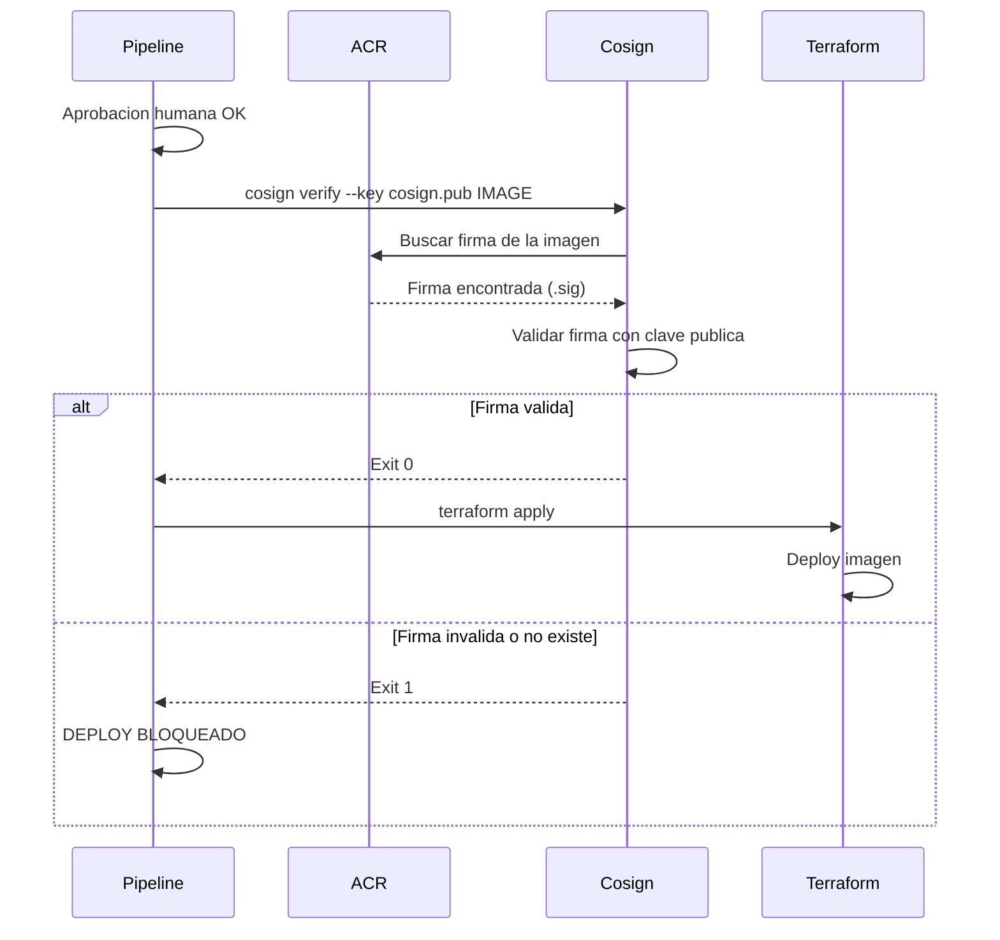

---
tags:
  - lab
  - deploy
  - terraform
  - cosign
---

# Paso 2 -- Stages de Deploy

!!! abstract "Objetivo"
    Agregar los stages `DeployStaging` y `DeployProduction` al pipeline, usando Terraform para desplegar la infraestructura y la aplicacion. El stage de produccion verifica la firma de la imagen con Cosign antes de desplegar.

## Contexto

Los stages de deploy usan `deployment` jobs en lugar de jobs normales. Esto los conecta con los Environments de Azure DevOps y activa automaticamente los checks de aprobacion configurados en el Paso 1.

## 2.1 Stage DeployStaging

```yaml title="vulnerable-app/azure-pipelines.yml -- Stage DeployStaging"
  # ============================================================
  # Lab 10: Deploy con Aprobaciones
  # ============================================================
  - stage: DeployStaging
    displayName: 'Deploy — Staging'
    dependsOn: IaCScan
    variables:
      environment: 'staging'
      imageRef: '$(ACR_LOGIN_SERVER)/workshop-app:$(Build.BuildId)'
    jobs:
      - deployment: DeployToStaging
        displayName: 'Deploy a Staging'
        environment: 'Staging'  # Activa la aprobacion configurada
        strategy:
          runOnce:
            deploy:
              steps:
                - checkout: self

                # --- Login en ACR ---
                - task: Docker@2
                  displayName: 'Login en ACR'
                  inputs:
                    command: login
                    containerRegistry: 'acr-service-connection'

                # --- Verificar que la imagen existe ---
                - script: |
                    echo "=== Verificando imagen en ACR ==="
                    echo "Imagen: $(imageRef)"

                    docker pull $(imageRef)
                    if [ $? -ne 0 ]; then
                      echo "ERROR: No se pudo descargar la imagen"
                      exit 1
                    fi
                    echo "Imagen verificada"
                  displayName: 'Verificar imagen en ACR'

                # --- Terraform Init + Plan ---
                - script: |
                    echo "=== Terraform Init (Staging) ==="
                    cd $(Build.SourcesDirectory)/vulnerable-app/infrastructure

                    terraform init \
                      -backend-config="resource_group_name=rg-workshop-tfstate" \
                      -backend-config="storage_account_name=workshoptfstate" \
                      -backend-config="container_name=tfstate" \
                      -backend-config="key=staging.terraform.tfstate"

                    echo ""
                    echo "=== Terraform Plan (Staging) ==="
                    terraform plan \
                      -var="environment=staging" \
                      -var="image_tag=$(Build.BuildId)" \
                      -out=tfplan-staging

                    echo "Plan generado: tfplan-staging"
                  displayName: 'Terraform Init + Plan (Staging)'
                  env:
                    ARM_CLIENT_ID: $(ARM_CLIENT_ID)
                    ARM_CLIENT_SECRET: $(ARM_CLIENT_SECRET)
                    ARM_SUBSCRIPTION_ID: $(ARM_SUBSCRIPTION_ID)
                    ARM_TENANT_ID: $(ARM_TENANT_ID)

                # --- Terraform Apply ---
                - script: |
                    echo "=== Terraform Apply (Staging) ==="
                    cd $(Build.SourcesDirectory)/vulnerable-app/infrastructure

                    terraform apply -auto-approve tfplan-staging

                    echo ""
                    echo "=== Deploy a Staging completado ==="

                    # Obtener la URL de la app
                    APP_URL=$(terraform output -raw app_url)
                    echo "URL de la aplicacion: ${APP_URL}"
                    echo "##vso[task.setvariable variable=STAGING_URL;isOutput=true]${APP_URL}"
                  name: terraformApply
                  displayName: 'Terraform Apply (Staging)'
                  env:
                    ARM_CLIENT_ID: $(ARM_CLIENT_ID)
                    ARM_CLIENT_SECRET: $(ARM_CLIENT_SECRET)
                    ARM_SUBSCRIPTION_ID: $(ARM_SUBSCRIPTION_ID)
                    ARM_TENANT_ID: $(ARM_TENANT_ID)

                # --- Smoke test post-deploy ---
                - script: |
                    echo "=== Smoke Test: Staging ==="
                    STAGING_URL="$(terraformApply.STAGING_URL)"

                    echo "Esperando a que la aplicacion este lista..."
                    MAX_RETRIES=12
                    RETRY_COUNT=0
                    until curl -sf "${STAGING_URL}/health" > /dev/null 2>&1; do
                      RETRY_COUNT=$((RETRY_COUNT + 1))
                      if [ $RETRY_COUNT -ge $MAX_RETRIES ]; then
                        echo "ERROR: La aplicacion no respondio en staging"
                        exit 1
                      fi
                      echo "  Intento ${RETRY_COUNT}/${MAX_RETRIES}..."
                      sleep 10
                    done

                    echo "Health check: OK"
                    curl -s "${STAGING_URL}/health" | python3 -m json.tool
                    echo ""
                    curl -s "${STAGING_URL}/" | python3 -m json.tool
                  displayName: 'Smoke Test (Staging)'
```

## 2.2 Stage DeployProduction

El stage de produccion incluye un paso critico adicional: **verificar la firma de la imagen con Cosign** antes de desplegar.

```yaml title="vulnerable-app/azure-pipelines.yml -- Stage DeployProduction"
  - stage: DeployProduction
    displayName: 'Deploy — Production'
    dependsOn: DeployStaging
    variables:
      environment: 'production'
      imageRef: '$(ACR_LOGIN_SERVER)/workshop-app:$(Build.BuildId)'
    jobs:
      - deployment: DeployToProduction
        displayName: 'Deploy a Production'
        environment: 'Production'  # Activa la aprobacion del equipo de seguridad
        strategy:
          runOnce:
            deploy:
              steps:
                - checkout: self

                # --- Login en ACR ---
                - task: Docker@2
                  displayName: 'Login en ACR'
                  inputs:
                    command: login
                    containerRegistry: 'acr-service-connection'

                # ============================================================
                # CRITICO: Verificar firma de imagen ANTES de desplegar
                # ============================================================
                - script: |
                    echo "=== Instalando Cosign ==="
                    COSIGN_VERSION="v2.2.4"
                    curl -fsSL "https://github.com/sigstore/cosign/releases/download/${COSIGN_VERSION}/cosign-linux-amd64" \
                      -o /usr/local/bin/cosign
                    chmod +x /usr/local/bin/cosign
                    cosign version
                  displayName: 'Instalar Cosign'

                - script: |
                    echo "=== Verificando firma de la imagen ==="
                    echo "Imagen: $(imageRef)"
                    echo ""

                    # Decodificar clave publica
                    echo "$(COSIGN_PUB)" > $(Agent.TempDirectory)/cosign.pub

                    # Verificar la firma
                    cosign verify \
                      --key $(Agent.TempDirectory)/cosign.pub \
                      $(imageRef)

                    VERIFY_EXIT=$?

                    if [ $VERIFY_EXIT -ne 0 ]; then
                      echo ""
                      echo "============================================="
                      echo "  DEPLOY BLOQUEADO: IMAGEN NO FIRMADA"
                      echo "============================================="
                      echo "La imagen $(imageRef) no tiene una firma valida."
                      echo "Solo imagenes firmadas por el pipeline autorizado"
                      echo "pueden desplegarse a produccion."
                      exit 1
                    fi

                    echo ""
                    echo "Firma verificada correctamente"
                    echo "La imagen fue firmada por el pipeline autorizado"

                    # Limpiar
                    rm -f $(Agent.TempDirectory)/cosign.pub
                  displayName: 'Cosign Verify (OBLIGATORIO)'
                  env:
                    COSIGN_PUB: $(COSIGN_PUB)

                # --- Terraform Init + Plan ---
                - script: |
                    echo "=== Terraform Init (Production) ==="
                    cd $(Build.SourcesDirectory)/vulnerable-app/infrastructure

                    terraform init \
                      -backend-config="resource_group_name=rg-workshop-tfstate" \
                      -backend-config="storage_account_name=workshoptfstate" \
                      -backend-config="container_name=tfstate" \
                      -backend-config="key=production.terraform.tfstate"

                    echo ""
                    echo "=== Terraform Plan (Production) ==="
                    terraform plan \
                      -var="environment=production" \
                      -var="image_tag=$(Build.BuildId)" \
                      -out=tfplan-production

                    echo "Plan generado: tfplan-production"
                  displayName: 'Terraform Init + Plan (Production)'
                  env:
                    ARM_CLIENT_ID: $(ARM_CLIENT_ID)
                    ARM_CLIENT_SECRET: $(ARM_CLIENT_SECRET)
                    ARM_SUBSCRIPTION_ID: $(ARM_SUBSCRIPTION_ID)
                    ARM_TENANT_ID: $(ARM_TENANT_ID)

                # --- Terraform Apply ---
                - script: |
                    echo "=== Terraform Apply (Production) ==="
                    cd $(Build.SourcesDirectory)/vulnerable-app/infrastructure

                    terraform apply -auto-approve tfplan-production

                    echo ""
                    echo "=== Deploy a Production completado ==="
                    APP_URL=$(terraform output -raw app_url)
                    echo "URL de produccion: ${APP_URL}"
                    echo "##vso[task.setvariable variable=PROD_URL;isOutput=true]${APP_URL}"
                  name: terraformApply
                  displayName: 'Terraform Apply (Production)'
                  env:
                    ARM_CLIENT_ID: $(ARM_CLIENT_ID)
                    ARM_CLIENT_SECRET: $(ARM_CLIENT_SECRET)
                    ARM_SUBSCRIPTION_ID: $(ARM_SUBSCRIPTION_ID)
                    ARM_TENANT_ID: $(ARM_TENANT_ID)

                # --- Verificacion post-deploy ---
                - script: |
                    echo "=== Verificacion Post-Deploy: Production ==="
                    PROD_URL="$(terraformApply.PROD_URL)"

                    MAX_RETRIES=12
                    RETRY_COUNT=0
                    until curl -sf "${PROD_URL}/health" > /dev/null 2>&1; do
                      RETRY_COUNT=$((RETRY_COUNT + 1))
                      if [ $RETRY_COUNT -ge $MAX_RETRIES ]; then
                        echo "ERROR: La aplicacion no respondio en produccion"
                        exit 1
                      fi
                      echo "  Intento ${RETRY_COUNT}/${MAX_RETRIES}..."
                      sleep 10
                    done

                    echo "Health check: OK"
                    curl -s "${PROD_URL}/health" | python3 -m json.tool
                    echo ""
                    echo "============================================="
                    echo "  DEPLOY A PRODUCCION EXITOSO"
                    echo "  URL: ${PROD_URL}"
                    echo "============================================="
                  displayName: 'Verificacion Post-Deploy (Production)'
```

## 2.3 El flujo de verificacion de firma

El paso de `Cosign Verify` es el control mas critico del stage de produccion:



!!! warning "Sin firma = Sin deploy"
    Si alguien sube una imagen directamente a ACR sin pasar por el pipeline (que es el que firma), `cosign verify` fallara y el deploy se bloqueara. Esto protege contra:

    - Imagenes modificadas manualmente en ACR
    - Imagenes subidas por pipelines no autorizados
    - Imagenes de registros externos no confiables

## 2.4 Variables de Terraform necesarias

Asegurate de tener estas variables en el grupo `devsecops-workshop-secrets`:

| Variable | Descripcion | Tipo |
|----------|-------------|------|
| `ARM_CLIENT_ID` | Service Principal Client ID | Secreto |
| `ARM_CLIENT_SECRET` | Service Principal Password | Secreto |
| `ARM_SUBSCRIPTION_ID` | Azure Subscription ID | Normal |
| `ARM_TENANT_ID` | Azure AD Tenant ID | Secreto |
| `COSIGN_PUB` | Clave publica de Cosign | Normal |
| `ACR_LOGIN_SERVER` | URL del ACR (ej: entelgyworkshopacr.azurecr.io) | Normal |

!!! info "Service Principal"
    El Service Principal necesita los roles **Contributor** y **AcrPush** en la suscripcion de Azure para ejecutar `terraform apply` y push/pull de imagenes en ACR.

## 2.5 Diferencias entre deployment jobs y jobs normales

| Aspecto | Job normal | Deployment job |
|---------|-----------|----------------|
| Keyword | `- job:` | `- deployment:` |
| Environment | No soporta | `environment:` activa checks |
| Strategy | No aplica | `runOnce`, `rolling`, `canary` |
| Historial | Solo en pipeline | Pipeline + Environment |
| Aprobaciones | No | Si (configuradas en el Environment) |
| Rollback | Manual | Soporte nativo (re-deploy anterior) |

!!! tip "deployment vs job"
    Usa `deployment` para stages que despliegan a un entorno. Usa `job` para stages que ejecutan tests o builds. La diferencia clave es que `deployment` se conecta con los Environments y sus aprobaciones.

## 2.6 Verificar en Azure DevOps

1. Haz commit y push del pipeline actualizado
2. El pipeline se ejecutara hasta `IaCScan` y luego **se detendra** esperando aprobacion para `DeployStaging`
3. Ve a **Pipelines** > tu pipeline > el run activo
4. Veras un boton **Review** para aprobar el despliegue a Staging
5. Tras aprobar Staging y que el deploy sea exitoso, el pipeline esperara aprobacion para Production

!!! success "Paso Completado"
    Has agregado los stages de despliegue al pipeline con verificacion de firma y aprobaciones. En el siguiente paso ejecutaremos el pipeline completo de extremo a extremo.

---

<div style="display: flex; justify-content: space-between; margin-top: 2rem;">
  <a href="step1.md" class="md-button">Anterior: Crear Environments</a>
  <a href="step3.md" class="md-button md-button--primary">Siguiente: Pipeline Completo</a>
</div>
