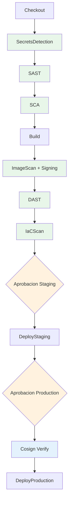

---
tags:
  - lab
  - pipeline
  - deploy
  - end-to-end
---

# Paso 3 -- Pipeline Completo End-to-End

!!! abstract "Objetivo"
    Ejecutar el pipeline DevSecOps completo de extremo a extremo: desde el checkout hasta el despliegue a produccion, pasando por todas las gates de seguridad y las aprobaciones humanas.

## 3.1 El pipeline completo

Despues de 10 laboratorios, tu pipeline tiene esta estructura:



## 3.2 Ejecutar el pipeline

1. Haz un cambio menor en el codigo (ej: actualizar un comentario en `vulnerable-app/app.py`)
2. Commit y push a `main`

```bash title="Trigger del pipeline"
cd vulnerable-app/
# Cualquier cambio activa el trigger
git add -A
git commit -m "chore: trigger pipeline completo DevSecOps"
git push origin main
```

## 3.3 Observar la ejecucion

Ve a **Pipelines** > tu pipeline y observa cada stage:

### Stages automaticos (sin intervencion)

| Stage | Duracion estimada | Que observar |
|-------|-------------------|--------------|
| **Checkout** | ~30s | Info del repositorio |
| **SecretsDetection** | ~1 min | Gitleaks encuentra credenciales hardcodeadas |
| **SAST** | ~2 min | Semgrep encuentra SQL injection, XSS, etc. |
| **SCA** | ~2 min | Trivy fs encuentra dependencias vulnerables |
| **Build** | ~3 min | Docker build + push a GHCR |
| **ImageScan** | ~5 min | Trivy image scan + Cosign sign |
| **DAST** | ~10 min | Docker compose up + ZAP scan |
| **IaCScan** | ~3 min | Checkov + Conftest |

### Gates de aprobacion

Despues de IaCScan, el pipeline se detiene:

```text title="Pipeline esperando aprobacion"
Stages:
  [OK] Checkout
  [OK] SecretsDetection
  [OK] SAST
  [OK] SCA
  [OK] Build
  [OK] ImageScan
  [OK] DAST
  [OK] IaCScan
  [WAITING] DeployStaging  <-- Esperando aprobacion
  [PENDING] DeployProduction
```

## 3.4 Aprobar Staging

1. Click en el stage **DeployStaging** > **Review**
2. Revisa los reportes de seguridad descargando los artefactos:
    - `trivy-image-report` -- CVEs en la imagen
    - `zap-reports` -- Hallazgos DAST
    - `checkov-reports` -- Misconfiguraciones de IaC
    - `conftest-report` -- Violaciones de politica OPA
3. Si los hallazgos son aceptables para staging, click en **Approve**
4. Opcionalmente agrega un comentario: "Hallazgos revisados. Aprobado para staging."

!!! info "Checklist de revision para staging"
    Antes de aprobar staging, verifica:

    - [ ] No hay secretos nuevos detectados por Gitleaks
    - [ ] Hallazgos SAST son conocidos y estan en el backlog
    - [ ] No hay CVEs CRITICAL nuevos en la imagen
    - [ ] Hallazgos DAST no incluyen vulnerabilidades High nuevas
    - [ ] Misconfiguraciones de IaC son las esperadas para staging

## 3.5 Observar el deploy a Staging

Tras la aprobacion:

1. Terraform Init se ejecuta con el backend de staging
2. Terraform Plan muestra los recursos a crear/modificar
3. Terraform Apply despliega la infraestructura
4. Smoke test verifica que la aplicacion responde

```text title="Logs de DeployStaging (ejemplo)"
=== Terraform Apply (Staging) ===
azurerm_resource_group.workshop: Creating...
azurerm_resource_group.workshop: Creation complete [id=...]
azurerm_service_plan.plan: Creating...
azurerm_container_registry.acr: Creating...
azurerm_linux_web_app.app: Creating...
...
Apply complete! Resources: 6 added, 0 changed, 0 destroyed.

=== Deploy a Staging completado ===
URL de la aplicacion: https://workshop-app-staging.azurewebsites.net
```

## 3.6 Aprobar Production

1. El pipeline se detiene de nuevo esperando aprobacion para **Production**
2. Esta vez el equipo de seguridad debe aprobar
3. Revisa los mismos artefactos + verifica que el deploy a staging fue exitoso
4. Click en **Review** > **Approve**

!!! warning "Verificacion de firma en Production"
    Despues de aprobar, el primer paso del deploy a produccion es `Cosign Verify`. Si la imagen no esta firmada, el deploy se cancela automaticamente **incluso despues de la aprobacion humana**. Esto es una capa adicional de seguridad.

## 3.7 Observar el deploy a Production

```text title="Logs de DeployProduction (ejemplo)"
=== Verificando firma de la imagen ===
Imagen: ghcr.io/entelgy/workshop-app:42

Verification for ghcr.io/entelgy/workshop-app:42 --
The following checks were performed on each of these signatures:
  - The cosign claims were validated
  - The signatures were verified against the specified public key

Firma verificada correctamente

=== Terraform Apply (Production) ===
...
Apply complete! Resources: 6 added, 0 changed, 0 destroyed.

=============================================
  DEPLOY A PRODUCCION EXITOSO
  URL: https://workshop-app-production.azurewebsites.net
=============================================
```

## 3.8 Verificar la aplicacion en produccion

```bash title="Verificar aplicacion desplegada"
# Health check
curl -s https://workshop-app-production.azurewebsites.net/health
# {"status": "ok"}

# Info de la app
curl -s https://workshop-app-production.azurewebsites.net/
# {"app": "DevSecOps Vulnerable App", "version": "1.0.0", ...}
```

## 3.9 Resumen del pipeline completo

| Stage | Tipo | Herramienta | Control de seguridad |
|-------|------|-------------|---------------------|
| Checkout | Automatico | Git | Validacion del repositorio |
| SecretsDetection | Automatico | Gitleaks | Detectar credenciales en codigo |
| SAST | Automatico | Semgrep | Encontrar vulnerabilidades en codigo fuente |
| SCA | Automatico | Trivy fs | Detectar dependencias vulnerables + SBOM |
| Build | Automatico | Docker + GHCR | Construir imagen segura |
| ImageScan | Automatico | Trivy image + Cosign | Escanear CVEs + firmar imagen |
| DAST | Automatico | OWASP ZAP | Encontrar vulnerabilidades en app corriendo |
| IaCScan | Automatico | Checkov + Conftest | Validar infraestructura como codigo |
| DeployStaging | Aprobacion | Terraform | Desplegar a staging |
| DeployProduction | Aprobacion + Firma | Terraform + Cosign | Verificar firma + desplegar a produccion |

## 3.10 Metricas del pipeline

Observa las metricas clave de tu pipeline:

| Metrica | Valor esperado |
|---------|----------------|
| Duracion total | ~30-40 minutos (incluyendo esperas de aprobacion) |
| Duracion automatica | ~25 minutos (sin contar aprobaciones) |
| Stages de seguridad | 6 (Secrets, SAST, SCA, ImageScan, DAST, IaC) |
| Gates de aprobacion | 2 (Staging, Production) |
| Artefactos generados | 5+ (reportes de cada herramienta) |
| Verificaciones de firma | 2 (post-build + pre-production) |

!!! success "Paso Completado"
    Has ejecutado el pipeline DevSecOps completo de extremo a extremo. Desde la deteccion de secretos hasta el despliegue a produccion, cada paso agrega una capa de seguridad. La aplicacion esta desplegada y verificada. En el Lab 11 agregaremos monitorizacion post-despliegue.

---

<div style="display: flex; justify-content: space-between; margin-top: 2rem;">
  <a href="step2.md" class="md-button">Anterior: Stages de Deploy</a>
  <a href="../lab11-monitorizacion/index.md" class="md-button md-button--primary">Siguiente: Lab 11 -- Monitorizacion</a>
</div>
