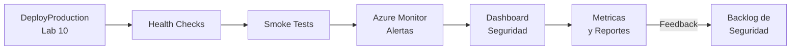

---
tags:
  - lab
  - monitoring
  - azure-monitor
  - dashboard
---

# Lab 11 -- Monitorizacion Post-Despliegue

<div class="lab-meta" markdown>
<div class="lab-meta-item" markdown>
<strong>Duracion</strong>
30-45 minutos
</div>
<div class="lab-meta-item" markdown>
<strong>Nivel</strong>
Intermedio
</div>
<div class="lab-meta-item" markdown>
<strong>Herramientas</strong>
Azure Monitor + GitHub Actions Dashboards
</div>
<div class="lab-meta-item" markdown>
<strong>Resultado</strong>
Monitorizacion y dashboard de seguridad
</div>
</div>

!!! abstract "Objetivo"
    Agregar un stage de monitorizacion al pipeline que ejecute health checks y smoke tests post-despliegue, configurar alertas en Azure Monitor para eventos de seguridad, y construir un dashboard en GitHub Actions que agregue los resultados de seguridad de todos los escaneos.

## Que vamos a construir

El pipeline DevSecOps no termina con el despliegue. La monitorizacion continua cierra el ciclo: detectamos problemas en produccion, alimentamos el backlog de seguridad, y medimos la postura de seguridad a lo largo del tiempo.



## El ciclo completo DevSecOps

Con este laboratorio completamos el ciclo:

| Fase | Labs | Herramientas |
|------|------|-------------|
| **Plan** | Lab 1-2 | GitHub Actions, Pipeline YAML |
| **Code** | Lab 3-4 | Gitleaks, Semgrep |
| **Build** | Lab 5-6 | Trivy SCA, Docker, GHCR |
| **Test** | Lab 7-8 | Trivy Image, Cosign, OWASP ZAP |
| **Release** | Lab 9-10 | Checkov, Conftest, Terraform, Approvals |
| **Monitor** | Lab 11 | Azure Monitor, Dashboards |

## Pasos del laboratorio

<div class="steps" markdown>

1. **[Health Checks y Alertas](step1.md)** -- Agregar el stage Monitor al pipeline con health checks post-despliegue, smoke tests, y configurar alertas en Azure Monitor para eventos de seguridad (spike de HTTP 500, tasa de autenticacion fallida).

2. **[Dashboard de Seguridad](step2.md)** -- Construir un dashboard en GitHub Actions que agregue resultados de escaneo a lo largo del tiempo, revisar el pipeline completo, y discutir metricas de seguridad para reportes ejecutivos.

</div>

## Prerequisitos

- Lab 10 completado (aplicacion desplegada en staging y/o produccion)
- Pipeline completo con todos los stages anteriores
- Acceso a Azure Portal (para Azure Monitor)

!!! info "Ultimo laboratorio"
    Este es el ultimo laboratorio del workshop. Al completarlo, tendras un pipeline DevSecOps completo con 11 stages cubriendo todo el ciclo de vida del software.

## Arquitectura del pipeline

Al finalizar este lab (pipeline completo):

```yaml title="vulnerable-app/.github/workflows/devsecops.yml (estructura FINAL)"
stages:
  - stage: Checkout           # Lab 1
  - stage: SecretsDetection   # Lab 3
  - stage: SAST               # Lab 4
  - stage: SCA                # Lab 5
  - stage: Build              # Lab 6
  - stage: ImageScan          # Lab 7
  - stage: DAST               # Lab 8
  - stage: IaCScan            # Lab 9
  - stage: DeployStaging      # Lab 10
  - stage: DeployProduction   # Lab 10
  - stage: Monitor            # Lab 11 (ULTIMO)
```
